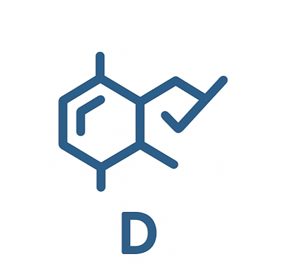

## Absorption

### 人体肠道吸收 (Human Intestinal Absorption, HIA), Hou et al.

**指标描述：**当口服药物时，它需要从人体胃肠系统吸收到人体的血液中。这种吸收能力被称为人体肠道吸收（HIA），它对药物输送到靶点至关重要。

**数值表示：**分类，预测 HIA 是能（1）还是否（0）

### 口服生物利用度 (Oral bioavailability), Ma et al.

**指标描述：**口服生物利用度被定义为“活性成分或活性部分从药品中吸收并在作用部位可用的速率和程度”。

**数值表示：**分类，预测口服生物利用度是高（1）还是低（0）

### 溶解度 (Solubility), AqSolDB

**指标描述：**水溶性测量药物在水中的溶解能力。水溶性差可能导致药物吸收缓慢、生物利用度不足，甚至引起毒性。超过40%的新化学物质是不溶的。

**数值表示：**回归，数值单位 log(mol/L)，logS > –1 非常易溶，通常吸收不受溶解度限制，–1 ≥ logS ≥ –3 许多口服小分子药物落在这一范围，–3 > logS ≥ –6 溶解性差，可能导致口服吸收受限，常见于疏水性药物（如大分子芳香族或高 LogP 化合物），需要特殊剂型（纳米粒、固体分散体、盐型化），logS < –6 极难溶，通常口服给药不可行

### 亲脂性 （Lipophilicity）, AstraZeneca

**指标描述：**亲脂性测量药物在脂质（如脂肪、油）环境中溶解的能力。高亲脂性通常会导致高代谢率、低溶解度、高转化率和低吸收率。

**数值表示：**回归，数值代表 log-ratio，低 logP/logD（<0）分子更亲水，但可能难以穿透细胞膜 → 口服吸收差，适中 logP/logD（0 ~ 3）一般是 理想范围（药物设计常推荐 logP ~2），偏高 logP/logD（>3 ~ 5）分子更亲脂，水溶解度差、代谢率高、非特异性结合增加。可能导致药代学问题（如清除过快、毒性）。极高 logP/logD（>5）过度疏水。通常难以开发成药（溶解度极差，吸收和分布不可预测）。药物化学中有 “Lipinski Rule of Five” → logP > 5 常被视为警示信号。

### 水合自由能 （Hydration Free Energy, HFE）, FreeSolv

**指标描述：**是指一个分子从真空（气相）转移到水溶液中时的自由能变化。反映了分子与水分子之间相互作用的强弱：

如果 ΔG_hydration < 0（负值），说明分子进入水溶液更稳定，水合过程是自发的 → 分子 亲水。

如果 ΔG_hydration > 0（正值），说明分子进入水中需要额外能量，过程不利 → 分子 疏水。

**数值表示：**回归，数值单位 kcal/mol，例如 -10 kcal/mol 代表该分子在水中非常容易溶解，但如果过于亲水，可能导致细胞膜穿透性差，-0.5 kcal/mol代表在水中的溶解度和在气相的稳定性差别不大，+5 kcal/mol 表示分子难以进入水中，更倾向于疏水环境，口服利用度可能差

### Caco-2 细胞有效渗透率 （Caco-2 Cell Effective Permeability）, Wang et al.

**指标描述：**人类结肠上皮癌症细胞系Caco-2被用作模拟人类肠道组织的体外模型。药物通过Caco-2细胞的速率的实验结果可以近似于药物渗透通过人体肠道组织的速率。结果用有效渗透系数 (Effective Permeability, P_app) 来表示

**数值表示：**回归，数值单位 log(10-6 cm/s)，> -5 通常表示药物能很好地通过小肠上皮 → 良好的口服吸收。-5 ~ -6 表示有一定吸收，< -6 表示药物难以透过细胞膜 → 口服吸收差

### 平行人工膜渗透性测定 （parallel artificial membrane permeability assay，PAMPA）, NCATS

**指标描述：**是一种常用的测定方法，用于评估药物在细胞膜上的渗透性。PAMPA是细胞模型的非细胞、低成本和高通量替代品。尽管PAMPA不能模拟主动和外排转运蛋白，但它仍然提供了对吸收预测有用的渗透性值，因为大多数药物是通过膜的被动扩散吸收的。

**数值表示：**分类，预测 PAMPA 测定中其渗透率是高（1）还是低至中等（0）

### Pgp 抑制剂 （P-glycoprotein Inhibition）, Broccatelli et al.

**指标描述：**P-糖蛋白（P-glycoprotein, Pgp）是一种ABC转运蛋白，参与肠道吸收、药物代谢和脑渗透，其抑制会严重改变药物的生物利用度和安全性。此外，Pgp 抑制剂可用于克服多药耐药性。如果药物是 Pgp 底物 → 可能被快速外排，导致疗效降低。如果药物是 Pgp 抑制剂 → 可能提升其他底物药物的暴露，但也可能引发药物-药物相互作用 (DDI)。

**数值表示：**分类，预测是（1）Pgp 抑制剂，对 Pgp 无抑制作用（0），抑制 Pgp 可以增强 CNS 药物暴露，但过强的 Pgp 抑制可能导致毒性增加（因药物过度积累）。

## Distribution

### 血脑屏障 （Blood-Brain Barrie, BBB）, Martins et al.

**指标描述：**血脑屏障（BBB）是由脑毛细血管内皮细胞形成的生理屏障，能够限制大多数药物和分子进入中枢神经系统 (CNS)。它对 药物发现至关重要，因为只有能够穿透 BBB 的分子才可能成为中枢作用药物（例如治疗阿尔茨海默病、抑郁症、癫痫等）。对于非中枢药物（如抗感染药、肿瘤药），有时候反而希望它们 不能穿过 BBB，以避免 CNS 副作用。

**数值表示：**分类，预测是（1）能够穿透 BBB，不能穿透 BBB（0），CNS 药物开发：需要 LogBB 高或预测为 BBB+。外周药物开发：需要 LogBB 低或预测为 BBB–，避免 CNS 副作用。

### 血浆蛋白结合率 （Plasma Protein Binding Rate, PPBR）, AstraZeneca

**指标描述：**人血浆蛋白结合率（PPBR）表示为药物与血液中血浆蛋白结合的百分比。该速率强烈影响药物的递送效率。药物的结合越少，它就越能有效地穿过并扩散到作用部位。

**数值表示：**回归，数值代表血浆蛋白结合率，高 PPBR（>90% 结合）表示大部分药物与蛋白结合，游离药物浓度低。活性部分少，药效可能受限，且不同药物之间可能存在 蛋白结合竞争，引发药物相互作用。中等 PPBR（40–90%）平衡状态，既有一定储库作用，又能保证有效药物浓度。低 PPBR（<40% 结合）药物大部分以游离形式存在，起效快，药效强，但也更容易被代谢或清除。

### 稳态分布容积 （Volumn of Distribution at steady state, VDss）, Lombardo et al.

**指标描述：**衡量了药物在身体组织中的浓度与血液中的浓度的对比程度。较高的VD表明组织中的分布较高，通常表明药物具有高脂溶性、低血浆蛋白结合率

**数值表示：**回归，数值单位 L/kg，小 VDss (< 0.6 L/kg, 接近血液或细胞外液体积)药物主要限制在血浆或细胞外液中，进入组织能力差。常见于 亲水性、极性强、蛋白结合高 的药物。中等 VDss (0.6 – 3 L/kg) 药物在血液和组织间分布比较平衡，是大多数常用药物的范围。大 VDss (> 3 L/kg)，药物主要分布在组织，血浆中浓度很低。常见于 高亲脂性、能穿透细胞膜 的药物。

## Metabolism

### CYP1A2 抑制 （CYP1A2 Inhibition）, Veith et al.

**指标描述：**细胞色素 P450 (CYP450) 酶系是一类重要的代谢酶，负责体内绝大部分药物的代谢。CYP1A2 是 CYP 家族中的一个亚型，主要存在于肝脏，参与代谢多种临床药物和外源性化合物，例如：咖啡因、茶碱（theophylline）、氯氮平（clozapine）、多环芳烃（环境致癌物）

**数值表示：**分类，预测有抑制作用（1），无抑制作用（0），一般来说希望候选分子不显著抑制 CYP1A2，避免产生药物代谢变慢、血药浓度升高、毒性增加等的问题

### CYP2C19 抑制 （CYP2C19 Inhibition）, Veith et al.

**指标描述：**CYP P450 基因在细胞内各种分子和化学物质的分解（代谢）中至关重要。一种可以抑制这些酶的药物意味着这种药物和其他药物的代谢不良，这可能会导致药物相互作用和不良反应。典型底物（需要通过 CYP2C19 代谢的药物）：质子泵抑制剂（如奥美拉唑、兰索拉唑）抗血小板药氯吡格雷（clopidogrel）抗抑郁药（如西酞普兰、阿米替林）

**数值表示：**分类，预测有抑制作用（1），无抑制作用（0），一般来说希望候选分子不显著抑制 CYP2C19，降低 DDI 风险。

### CYP2C9 抑制 （CYP2C9 Inhibition）, Veith et al.

**指标描述：**CYP P450基因参与细胞内各种分子和化学物质的形成和分解（代谢）。具体而言，CYP P450 2C9在外源性和内源性化合物的氧化中起着重要作用。典型底物：抗凝药 华法林 (warfarin) NSAIDs（如布洛芬、双氯芬酸）抗糖尿病药 格列本脲 (glibenclamide) 抗高血压药 氯沙坦 (losartan)

**数值表示：**分类，预测有抑制作用（1），无抑制作用（0），一般来说希望候选分子不显著抑制 CYP2C9，降低 DDI 风险。

### CYP2D6 抑制 （CYP2D6 Inhibition）, Veith et al.

**指标描述：**CYP P450基因参与细胞内各种分子和化学物质的形成和分解（代谢）。具体来说，CYP2D6主要在肝脏中表达。它也在中枢神经系统的区域高度表达，包括黑质。参与代谢的临床药物，包括抗抑郁药、β受体阻滞剂、阿片类止痛药等。

**数值表示：**分类，预测有抑制作用（1），无抑制作用（0），一般来说希望候选分子不显著抑制 CYP2D6，降低 DDI 风险。

### CYP3A4 抑制 （CYP3A4 Inhibition）, Veith et al.

**指标描述：**CYP P450基因参与细胞内各种分子和化学物质的形成和分解（代谢）。具体来说，CYP3A4是体内一种重要的酶，主要存在于肝脏和肠道中。它氧化小的外来有机分子（外源性物质），如毒素或药物，以便将其从体内清除。参与代谢的药物包括抗生素、抗癌药、免疫抑制剂、镇静剂等

**数值表示：**分类，预测有抑制作用（1），无抑制作用（0），一般来说希望候选分子不显著抑制 CYP3A4，降低 DDI 风险。参与较多，可以优先考虑

### CYP2C9 底物 （CYP2C9 Substrate）, Carbon-Mangels et al.

**指标描述：**CYP2C9 Substrate 指 某化合物是否作为 CYP2C9 的代谢底物。如果药物是 CYP2C9 的底物，其体内清除依赖该酶。临床上，若患者合并用药中含有 CYP2C9 抑制剂或诱导剂，会影响这些底物药物的血药浓度，造成疗效不足或毒性增加。

**数值表示：**分类，预测是底物（1），不是底物（0），需要与 CYP2C9 抑制作用共同考虑，若同时是 CYP2C9 抑制剂和 CYP2C9 底物将会提高用药风险，不依赖 CYP2C9 代谢 → 相互作用风险较低。

### CYP2D6 底物 （CYP2D6 Substrate）, Carbon-Mangels et al.

**指标描述：**CYP2D6 Substrate 指 某化合物是否作为 CYP2D6 的代谢底物。如果药物是 CYP2D6 的底物，其体内清除依赖该酶。临床上，若患者合并用药中含有 CYP2D6 抑制剂或诱导剂，会影响这些底物药物的血药浓度，造成疗效不足或毒性增加。

**数值表示：**分类，预测是底物（1），不是底物（0），需要与 CYP2D6 抑制作用共同考虑，若同时是 CYP2D6 抑制剂和 CYP2D6 底物将会提高用药风险，不依赖 CYP2D6 代谢 → 相互作用风险较低。

### CYP3A4 底物 （CYP3A4 Substrate）, Carbon-Mangels et al.

**指标描述：**CYP3A4 Substrate 指 某化合物是否作为 CYP3A4 的代谢底物。如果药物是 CYP3A4 的底物，其体内清除依赖该酶。临床上，若患者合并用药中含有 CYP3A4 抑制剂或诱导剂，会影响这些底物药物的血药浓度，造成疗效不足或毒性增加。

**数值表示：**分类，预测是底物（1），不是底物（0），需要与 CYP3A4 抑制作用共同考虑，若同时是 CYP3A4 抑制剂和 CYP3A4 底物将会提高用药风险，不依赖 CYP3A4 代谢 → 相互作用风险较低。

## Excretion

### 半衰期 （Half Life）, Obach et al.

**指标描述：**半衰期是指：药物在体内血浆浓度下降到原来一半所需的时间。它综合反映了 药物的分布 (Vd) 和 清除 (CL)。

**数值表示：**回归，数值单位 h，短半衰期药物 (t½ < 2h) 清除快，维持血药浓度需要 频繁给药。可能需要缓释剂型或持续输注。中等半衰期药物 (t½ = 4–12h) 每日 2–3 次给药即可维持疗效。长半衰期药物 (t½ > 24h) 在体内蓄积 → 给药频率低（如每天一次甚至更少）。但若产生不良反应，药物在体内消除也会更慢，风险更高。

### 药物清除率（肝细胞） （Drug Clearance (Hepatocyte)）, AstraZeneca

**指标描述：**药物清除率是指在特定时间段内清除药物的血浆体积，它测量了活性药物从体内清除的速率。

**数值表示：**回归，数值单位 uL/min/10^6 cells，高清除率 (CL 大) 药物被迅速代谢或排泄。半衰期短 → 药物维持时间不长，需要 频繁给药 或 缓释制剂。口服药物可能 首过效应严重（bioavailability ↓）。低清除率 (CL 小) 药物代谢/排泄慢，在体内停留时间长。半衰期长 → 可能导致 药物蓄积和毒性风险。但对口服药物有利（bioavailability ↑）。中等清除率 药物消除适中，既能维持一定的疗效时间，又不会过度蓄积。通常是研发中的理想范围。

### 药物清除率（微粒体） （Drug Clearance (Microsome)）, AstraZeneca

**指标描述：**药物清除率是指在特定时间段内清除药物的血浆体积，它测量了活性药物从体内清除的速率。

**数值表示：**回归，数值单位 uL/min/mg，高清除率 (CL 大) 药物被迅速代谢或排泄。半衰期短 → 药物维持时间不长，需要 频繁给药 或 缓释制剂。口服药物可能 首过效应严重（bioavailability ↓）。低清除率 (CL 小) 药物代谢/排泄慢，在体内停留时间长。半衰期长 → 可能导致 药物蓄积和毒性风险。但对口服药物有利（bioavailability ↑）。中等清除率 药物消除适中，既能维持一定的疗效时间，又不会过度蓄积。通常是研发中的理想范围。

## Toxicity

### hERG 阻断作用 （hERG blockers）

**指标描述：**人乙醚相关基因（hERG）对心脏跳动的协调至关重要。因此，如果一种药物阻断 hERG，可能会导致严重的不良反应。具体来说 hERG（human Ether-à-go-go-Related Gene）是一个基因，编码 Kv11.1 钾离子通道。该通道在 心脏动作电位复极化过程中起关键作用。如果化合物 阻断（block）hERG 通道，就会导致 动作电位延长（QT prolongation），从而可能引发 心律失常（如 Torsades de Pointes, TdP），这是药物研发中非常严重的安全性问题。

**数值表示：**分类，可能阻断 hERG，存在心脏毒性风险（1），不阻断 hERG，心脏毒性风险较低（0），在临床前实验中，强 hERG 阻断剂常常会导致候选药物被淘汰。

### 临床毒性 （ClinTox）

**指标描述：**ClinTox 数据集包括因毒性原因临床试验失败的药物，以及与成功试验相关的药物。预测是分子在临床上出现毒性的风险。

**数值表示：**分类，接近 0 → 结构类似安全药物，临床毒性风险低。接近 1 → 结构类似失败药物，临床毒性风险高。

### Ames 诱变性 （Ames Mutagenicity）, Ames

**指标描述：**诱变性是指药物诱导基因改变的能力。可能对DNA造成损伤的药物可能会导致细胞死亡或其他严重的不良反应。是评估化合物是否具有致突变性（mutagenicity）的金标准之一

**数值表示：**分类，预测该分子具有致突变性，可能引发 DNA 损伤或致癌风险（1）。预测该分子 不具致突变性，风险较低（0）。

### 药物性肝损伤 （Drug Induced Liver Injury, DILI）

**指标描述：**药物性肝损伤（DILI）是由药物引起的致命性肝病，在过去50年里，它一直是安全相关药物（如异丙肼、噻嗪酮、苯恶洛芬）退出市场的最常见原因。该数据集来自美国食品药品监督管理局国家毒理学研究中心。

**数值表示：**分类，预测为可能引起药物性肝损伤，高风险（1）。分子预测为低风险，较安全（0）。可以优先考虑

### 致癌物 （Carcinogens） 

**指标描述：**致癌物是指任何促进致癌、形成癌症的物质、放射性核素或辐射。

**数值表示：**分类，分子预测为可能具有致癌风险（1）。分子预测为无致癌风险，较安全（0）。

### 急性毒性 LD50 （Acute Toxicity LD50）

**指标描述：**Acute toxicity（急性毒性）是指化合物单次或短时间内暴露后对机体造成的毒性效应。LD₅₀ (Lethal Dose 50%) → 表示在实验动物中能导致 50% 个体死亡的剂量。

**数值表示：**回归，数值单位 log(1/(mol/kg))，一般情况下> 3.0 即 LD₅₀ < 0.001 mol/kg 表示高毒性（极低剂量即可致死），2.0 – 3.0 即 LD₅₀ 0.001–0.01 mol/kg 表示中等毒性 1.0 – 2.0	即 LD₅₀ 0.01–0.1 mol/kg	表示低毒性 < 1.0 即 LD₅₀ > 0.1 mol/kg 表示很低毒性 / 安全

### 皮肤反应 （Skin Reaction）

**指标描述：**反复接触化学试剂会在天生易感的个体中引起免疫反应，导致皮肤过敏等。

**数值表示：**分类，分子预测为可能引起皮肤刺激/过敏/腐蚀，风险高（1）。分子预测为无明显皮肤毒性，安全性高（0）。

### 21世纪毒理学 （Toxicology in the 21st Century, Tox21）

**包含：**Androgen Receptor，Aryl Hydrocarbon Receptor，Aromatase，Estrogen Receptor，Peroxisome Proliferator-Activated Receptor Gamma，Nrf2 / ARE，ATAD5，Heat Shock Factor Response Element，Mitochondrial Membrane Potential，Tumor Protein p53 

**指标描述：**Tox21（Toxicology in the 21st Century）是由美国 NIH（国家卫生研究院）、EPA（环境保护署）、FDA（食品药品监督管理局） 等联合开展的大规模毒理学项目。其目标是通过 高通量筛选（HTS, High-Throughput Screening） 方法，利用体外实验和计算模型预测化学物质的毒性，而不完全依赖动物实验。Tox21 项目主要评估化合物对 细胞信号通路、受体、转录因子和毒性机制 的影响，例如：氧化应激（oxidative stress）、线粒体功能损伤（mitochondrial toxicity）、DNA 损伤反应（DNA damage response）、核受体激活（NR activation, 如AhR、ER、AR等）

**数值表示：**分类，阳性（Toxic / 有毒性相关信号）（1）。阴性（Non-toxic / 无明显毒性信号）（0）。

## 参考

[tdcommons.ai](https://tdcommons.ai/single_pred_tasks/adme/)
