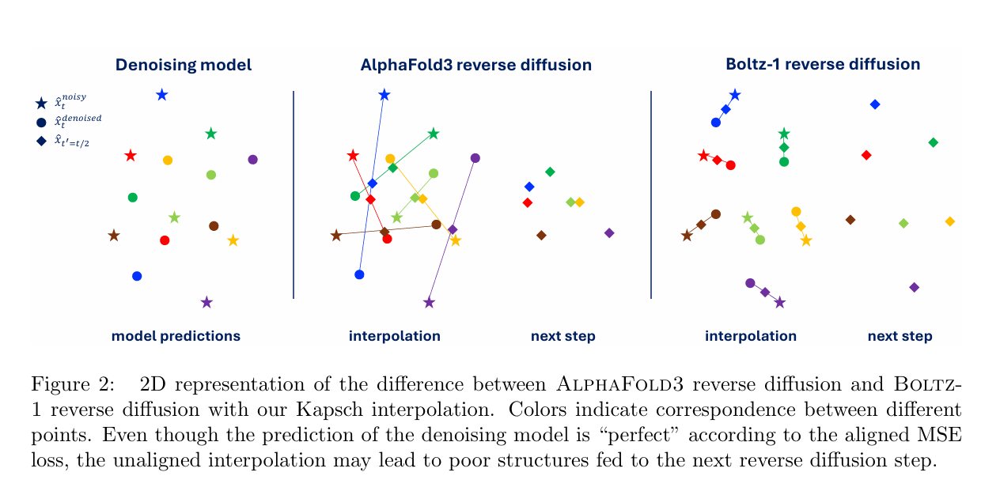
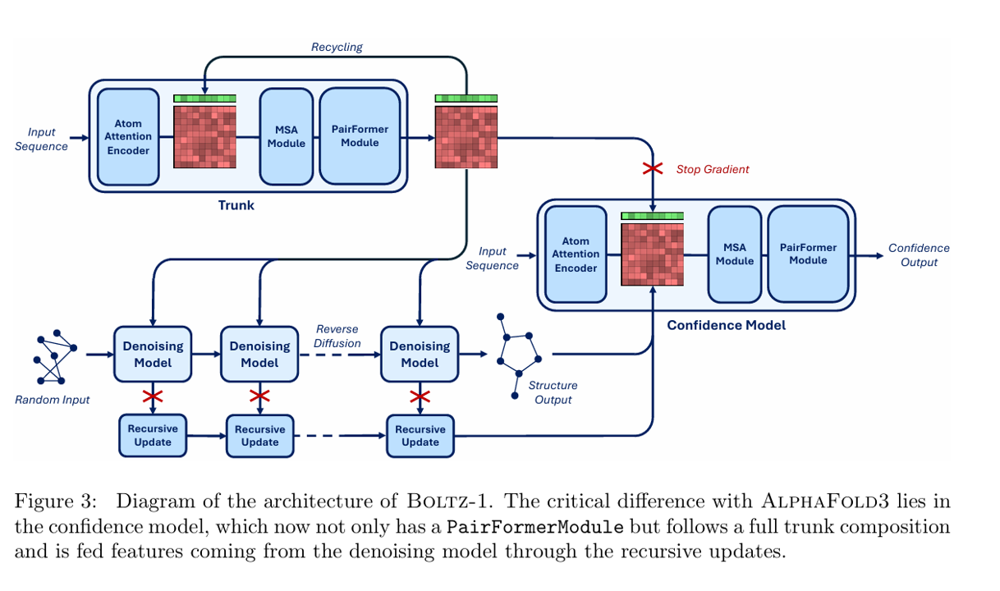
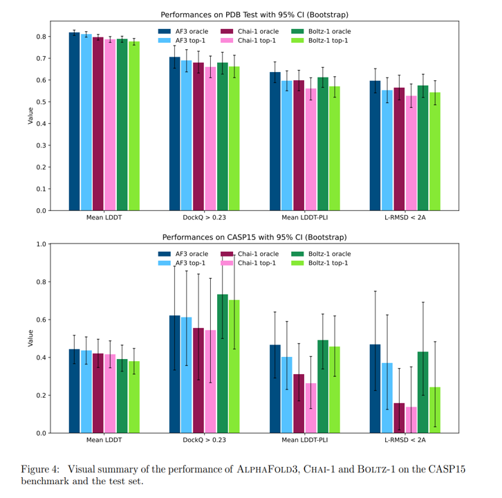
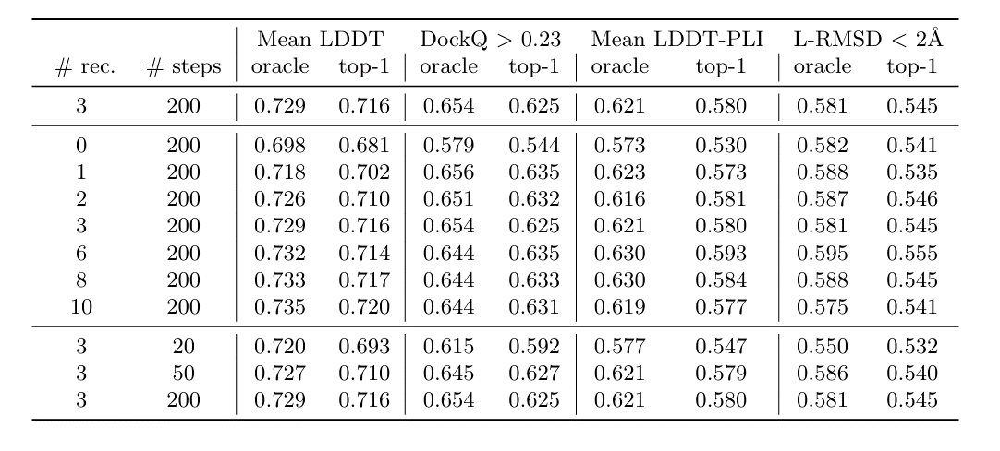
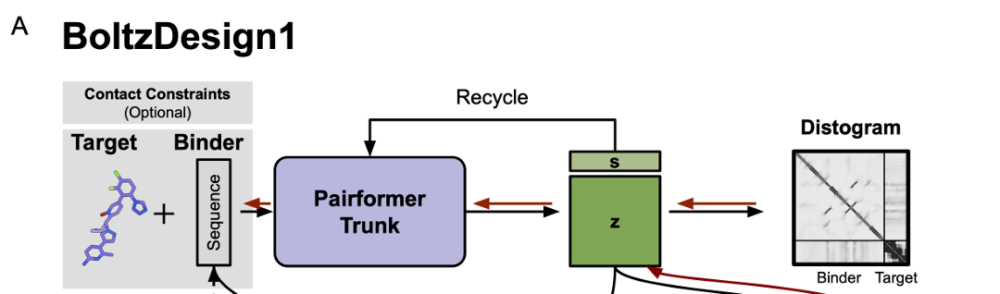
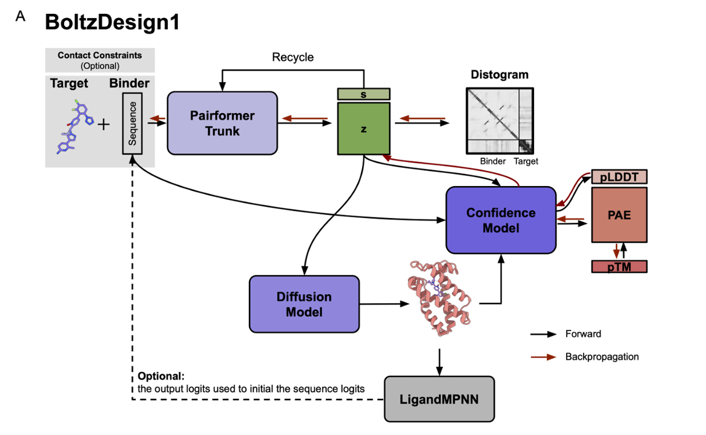
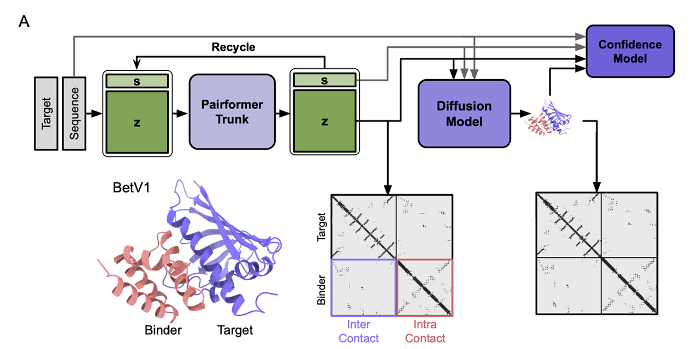
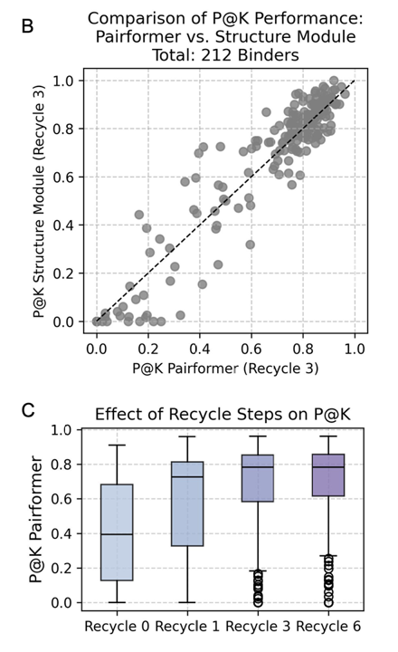
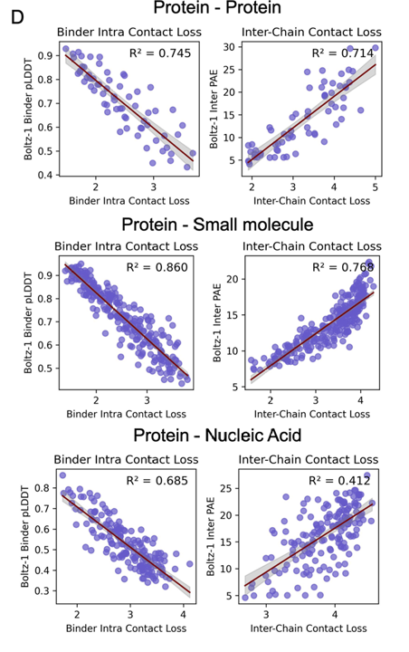

# BOLTZ-1

## 引言

`BOLTZ-1` 是第一个达到了 AlphaFold3 的准确度的完全商业化的开源模型，融合了模型架构、速度优化和数据处理方面的创新，在预测生物分子复合物的 3D 结构方面达到了 AlphaFold3 级别的精度, 在 PDB 数据集上有与 AF3 和 Chai-1 相当的性能，在 CASP15 上有接近或优于两者的性能。

## Overview

总体上还是采用 AF3 的架构，不过在以下几部分进行了优化：

1. 新的算法可以更高效、更稳健地进行多序列比对（MSA）配对，在训练时裁剪结构，并根据用户定义的结合口袋条件化预测；

2. 对架构中的表征传递流程以及扩散训练和推理过程进行了调整；

3. 对置信度模型进行了修订，包括其架构组件的优化，并将该任务重新定义为对模型主干层的微调。

## Data pipline

### 数据集和预处理

**PDB结构与数据：** 使用了 PDB 所有的日期在 2021-9-30 之前并且分辨率至少 9Å 的蛋白结构（和 AF3 的 cutoff 一样），从 mmCIF 文件中提取这些结构的"生物组装1"（Biological Assembly 1）数据。针对每条聚合物链，我们将其参考序列与结构中的实际残基进行比对。对于配体分子，我们使用 CCD（Chemical Component Dictionary）数据库来生成构象异构体，并与结构中的原子进行匹配。当满足以下条件时，我们会移除配体的脱离原子：(1) 配体以共价键形式结合；(2) 该原子未在PDB结构中明确出现。最终，我们遵循与AlphaFold3相同的数据清洗流程，包括配体排除列表筛选、最小解析残基数要求以及冲突链的移除等步骤。

**MSA与分子构象处理：** 使用 ColabFold_search_tool（基于MMseqs2算法）为所有PDB数据构建多序列比对（MSA），参数设置采用默认配置（版本：UniRef30_2302，ColabFold_envdb_202108）。随后，利用 UniProt 提供的分类学注释信息，为所有 UniRef 序列添加分类学标签。对于需要输入模型的初始分子构象，我们采用 RDKit 的 ETKDGv3 方法为所有CCD编码预先计算单一构象异构体。

**结构预测训练方案：** 结构预测模型共计训练68,000步，批次大小设为128。在前53,000次迭代中，设置384个token和3,456个原子的裁剪规模，并从PDB数据集和OpenFold蒸馏数据集（约27万个结构，使用其提供的MSA）中均衡抽取训练样本。最后15,000次迭代仅使用PDB结构数据，并将裁剪规模提升至512个token和4,608个原子。作为对比，AlphaFold3采用类似架构训练了约150,000步（批次大小256），其计算耗时约为本研究的四倍。我们认为这一显著的效率提升主要得益于本文后续章节将详细阐述的多项技术创新。

### 验证集和测试集构建

为解决全原子结构预测领域缺乏标准化基准的问题，发布了一套新的PDB数据集划分方案，旨在帮助研究社区建立可靠且一致的全原子结构预测基准：

:::note[Value]
验证集构建，最终得到 `553` 个验证集结构数据
:::

1. 首先使用 command ```mmseqs easy-cluster ... --min-seq-id 0.4``` 

2. 初步筛选，满足：
    - 发布时间 2021-09-30 - 2023-01-13
    - 分辨率优于 4.5Å
    - 所有蛋白链序列均未出现在训练集聚类中（即2021-09-30前的数据）
    - 不含小分子或所含小分子与训练集中任何小分子的 Tanimoto ≤ 0.8

3. 第二步完成后得到 1728 结构，进一步精炼：
    - 保留所有含RNA/DNA的结构（126个）
    - 迭代添加蛋白链属于新聚类的含小分子/离子的结构（330个）
    - 迭代添加蛋白链属于新聚类的多聚体结构，随机保留 50%（231个）
    - 迭代添加蛋白链属于新聚类的单体结构，随机保留 30%（57个）

4. 第三步完成后得到 744 结构，仅保留蛋白/RNA/DNA链≤1024个残基的结构，得到最终 553 个结构

:::note[Test]
测试集构建，最终得到 `593` 个测试集结构数据
:::

采用相同流程，但有以下区别：

- 蛋白/配体相似性排除时考虑2023-01-13前所有结构
- 仅选取2023-01-13后发布的结构
- 最终保留总残基数在100-2000之间的结构

### 创新算法

**密集MSA配对算法：** 一种基于分类学的MSA配对方法，该方法在保持MSA密度（关键因素，因为模型复杂度与MSA行数呈线性关系）的同时，平衡了配对序列信号与单链序列冗余度之间的权衡。

**统一裁剪算法：** 连续裁剪（选择生物分子序列中的连续残基）和空间裁剪（基于与中心token的空间距离选择）的中和算法，核心是"邻域"概念，定义以特定token为中心、固定长度的序列邻域，邻域大小设为0时退化为纯空间裁剪，设为最大token数一半时退化为连续裁剪，实际训练中，每个样本随机采样邻域大小（0-40个token均匀分布）

**鲁棒口袋条件化：** AlphaFold3曾探索通过微调模型实现口袋条件化生成，其方法是为所有口袋-配体对添加额外的token特征（将口袋定义为配体6Å范围内的所有含重原子残基）。虽然有效，但该设计存在若干局限：需要维护两个模型版本（条件化与非条件化），且假设6Å范围内的所有残基信息都已明确——这与实际场景常有不符，因为使用者可能仅掌握关键残基信息，而完整的相互作用残基集合往往取决于通常未知的配体构象。口袋条件化策略，旨在实现：
  - 保持单一统一模型架构
  - 确保对部分残基指定的鲁棒性
  - 支持蛋白质/核酸等聚合物结合位点的条件化指定

具体训练方法：
  - 在30%的训练迭代中随机选择结合分子进行条件化训练
  - 从几何分布中采样需要显示的（最大）口袋残基数量
  - 从结合分子6Å范围内的残基中随机选取指定数量的残基
  - 将这些信息编码为额外的one-hot token特征输入模型

## Modeling

首先完整复现了AlphaFold3的架构。AlphaFold3本质上是一个基于扩散模型的原子坐标去噪系统，其核心是一个多分辨率Transformer网络，即重原子级（heavy atoms）分辨率和 Token 级分辨率，其中蛋白质链以氨基酸为token，RNA/DNA以核酸碱基为token，其他分子/修饰残基以单个重原子为token，在去噪Transformer之上，AlphaFold3还采用了一个关键的主干架构（central trunk），该架构主要用于初始化token的表征，确定去噪Transformer的注意力偏置（attention pair bias），Boltz-1基于此架构做了以下改进

### 架构改进方案

1. ```MSAModule```（AlphaFold3 Algorithm 8）调整顺序，由 ```OuterProductMean```, ```PairWeightedAveraging```, ```MSATransition```, ```TriangleUpdates```, ```PairTransition```调整为：  

```PairWeightedAveraging```, ```MSATransition```, ```OuterProductMean```, ```TriangleUpdates```, ```PairTransition```

2. ```DiffusionTransformer```（AlphaFold3 Algorithm 23）添加了残差连接，即 ```a ← AttentionPairBias(a) + ConditionedTransitionBlock(a)``` 变为  

```a ← a + AttentionPairBias(a)```

```a ← a + ConditionedTransitionBlock(a)```

### 训练与推理优化

1. Kabsch扩散插值算法：骤中，在噪声结构&&x̂_noisy&&和去噪结构&&x̂_denoised&&插值前增加Kabsch刚性对齐，保证插值结构更接近去噪样本



2. 扩散损失加权方案：采用EDM加权策略：

$$
w(t) = \frac{\hat{t}^2 + \sigma_{\text{data}}^2}{(\hat{t} \cdot \sigma_{\text{data}})^2}
$$

而非原来 Alphafold3 的加权策略：

$$
w_{\text{AF3}}(t) = \frac{\hat{t}^2 + \sigma_{\text{data}}^2}{(\hat{t} + \sigma_{\text{data}})^2}
$$

### 置信度模型

AlphaFold3在训练置信度模型时，虽然将其与主干网络和去噪模型一起训练，但会切断从置信度任务到模型其余部分的梯度传播。相比之下，我们采用分别训练结构预测模型和置信度模型的方法，这使得我们能够对各个组件进行独立实验，并对置信度预测任务做出了若干重要改进。在AlphaFold3中，置信度模型的架构由四层PairFormer组成，这些层以主干网络最终的单体（single）和配对（pair）token表征，以及反向扩散预测的token间距离编码作为输入。在这四层之后，连接着用于预测以下指标的线性投影层：LDDT，PAE，PDE

1. 主干架构与初始化：置信度模型的输入输出组成与主干网络高度相似。主干网络同样通过循环机制接收自身的最终表征作为输入，并输出用于去噪模型的丰富表征。因此，受大型语言模型领域研究者通过微调预训练生成模型"主干"来训练奖励模型的启发，我们将置信度模型定义为包含主干网络所有组件的架构，并将其表征初始化为训练好的主干权重，此外，我们仍然将预测构象作为token间距离矩阵的编码进行整合，并在最终的PairFormer表征上通过线性层解码置信度

2. 扩散模型特征：我们不仅将主干网络产生的表征输入置信度模型，还将每个反向扩散步骤中最终token表征的学习聚合也作为输入。这些表征通过一个时间条件循环块在反向扩散轨迹上进行聚合，然后在置信度模型开始时与主干网络的token级特征进行拼接。我们进一步改进了token级特征输入配对表征的方式，增加了线性变换后的token级特征的逐元素相乘。

3. 整体流程与训练：



### 优化

1. 序列局部原子表征：在```AtomAttentionEncoder```和```AtomAttentionDecoder```中，实现了序列局部注意力机制将原子划分为32个原子的块单元，每个块仅关注序列空间中最邻近的128个原子，开发了GPU高效实现方案，在32×128的块中并行执行注意力计算

2. 注意力偏置共享与缓存：通过分析计算图，我们发现去噪模型中以下组件与输入结构和扩散时间步无关：所有Transformer层的注意力偏置（```AtomAttentionEncoder/Decoder/DiffusionTransformer```）以及```AtomAttentionEncoder```的中间原子表征，预计算以实现跨样本共享，内存换计算

3. 贪心对称性校正：针对对称链和原子的最优对齐问题，我们设计了分层贪心算法，分别采用链级匹配和原子级匹配

4. MSA模块与三角注意力的分块计算：采用OpenFold的三角注意力分块实现：转换层（```Transition layers```），配对加权平均层（```Pair-weighted average layers```），外积层（```Outer product layers```）

## Results

1. 数据集：自建PDB测试集，CASP15竞赛数据集

2. 测试配置：200次采样步长，10轮循环迭代，5个预测结果，相同的预计算MSA（最多16,384条序列），A100 80GB GPU

3. 指标：
  - 全局结构精度：全原子LDDT均值（衡量所有生物分子的局部结构准确性）
  - 蛋白质相互作用：DockQ成功率（DockQ>0.23的比例）
  - 蛋白质-配体界面：界面LDDT（CASP15官方配体评估指标），配体RMSD<2Å的比例（分子对接标准）



4. 消融实验：recycling rounds 和 sampling steps



## Conclusion

Boltz-1——首个实现AlphaFold3级别预测精度且完全开源可商用的生物分子复合体三维结构预测模型。通过系统复现并拓展AlphaFold3技术方案，我们在模型架构、数据工程、训练方法和推理流程等方面实现多项创新。打破商业模型的技术垄断，为学术机构和小型企业提供工业级建模工具，推动结构生物学、药物设计等领域的开放式创新

# BoltzDesign1

## 引言

`BoltzDesign1` —— 首个基于开源结构预测模型 Boltz-1的反向设计系统，实现了无需微调即可针对多样化分子靶标设计结合蛋白的创新方法。该方法仅使用Pairformer和Confidence模块，在显著降低计算成本的同时，实现了优异的计算机模拟成功率和结合剂生成的多样性。通过直接在距离矩阵上进行优化，我们能够塑造原子间距的概率分布，而非仅仅调整单一结构。这种方法能够引导设计过程产生具有明确能量最小值的稳健结构。得益于在大分子多样性数据上训练的全原子模型，我们可以生成具有柔性配体构象的多样化异质复合体——这是现有方法尚无法实现的能力。这项技术为设计新型蛋白质相互作用开辟了道路，在生物传感器、酶工程、治疗药物开发和生物技术创新等领域具有广阔的应用前景。

## 方法

Distogram 是一种表示原子间距离分布的概率图。因为 Pairformer 生成的距离矩阵(distogram)本质上是原子间距的概率分布表征，扩散模型后续正是基于这一分布进行采样。因此与其优化一个确定的三维结构，不如直接优化这个原子对之间距离的概率分布（distogram），因为这可以更高效地探索序列-结构空间，同时避免了每一步扩散采样都进行反向传播的计算开销。

:::note[基础方法]
仅使用 Pairformer 通过距离矩阵损失反向传播优化序列，输入序列 $$S_input$$ 被送入 Pairformer 模块，生成单序列表示：$$ŝ_trunk$$ 和原子对表示：$$ẑ_trunk$$，使用这些表示计算 distogram loss。反向传播仅通过 Pairformer，将损失传播到输入序列 S_input，以优化序列本身。
:::



:::note[增强方法]
在基础方法的基础上，添加了一个 Confidence Module 来评估结构的可信度。目标是联合优化：distogram loss 和 confidence score
:::

具体流程为

$$
ŝ_trunk, ẑ_trunk = Pairformer_Trunk(s_trunk, z_trunk, S_input)
xyz_atom = Structure_Module(ŝ_trunk, ẑ_trunk).stop_gradient
Confidence_score = Confidence_Module(ŝ_trunk, ẑ_trunk, xyz_atom, S_input)
$$

$$ŝ_trunk$$, $$ẑ_trunk$$：由 Pairformer 输出的特征，允许梯度传播；

$$xyz_atom$$：由结构模块生成的三维坐标，但应用了 `.stop_gradient`，阻断了反向传播，即扩散步骤不参与梯度传播；

Confidence Module：利用这些特征 + $$S_input$$ 生成一个 可信度分数，用作优化目标之一；

最终：损失函数通过 Confidence Module 和 Pairformer 向前传播，但不会进入 Structure Module 或扩散采样部分。



**蛋白质序列优化的四阶段流程**

本方法通过逐步过渡与控制梯度路径，在结构预测框架中优化蛋白质序列，最终获得具有高结构合理性和可信度的设计结果。

- 阶段一：连续序列空间中的初始探索（Warm-up）

  - 使用 softmax 分布初始化序列表示：

    ```python
    sequence = softmax(logits / temperature)
    ```

  - 初始温度设为 `temperature = 1.0`；
  - 避免直接从 logits 优化生成非现实结构；
  - 通过 softmax 保持分布的平滑性，帮助优化稳定启动。

- 阶段二：线性混合过渡（logits + softmax）

- 将 logits 与 softmax(logits / temperature) 进行线性混合：

    ```python
    λ = (step + 1) / iterations
    sequence = (1 - λ) * logits + λ * softmax(logits / temperature)
    ```

  - `temperature = 1.0` 保持 softmax 分布平滑；
  - 混合表示允许多个氨基酸同时被考虑，增强探索能力；
  - 随训练步数增加，逐渐过渡到 softmax 表示。

- 阶段三：温度退火的 Softmax 收敛

  - 完全使用 softmax 表示序列，温度随训练步数下降：

    ```python
    temperature = 1e-2 + (1 - 1e-2) * (1 - (step + 1) / iterations)**2
    sequence = softmax(logits / temperature)
    ```

  - 温度逐步减小，使得 softmax 更尖锐（趋向 one-hot）；
  - 与学习率衰减配合，提升稳定性；
  - 加快向确定性氨基酸分布的收敛。

- 阶段四：One-hot 序列空间中的优化（保持可微）

  - 使用如下方式在 one-hot 空间中优化序列，同时保持梯度路径：

    ```python
    one_hot_sequence = (argmax(softmax(logits)) - softmax(logits)).stop_gradient + softmax(logits)
    ```

  - 输入结构模块的是 one-hot 表示；
  - 梯度通过 softmax 保留，实现稳定优化；
  - 得到明确氨基酸类型的最终序列。

- 补充：使用 LigandMPNN 做结构精修

  - 初始序列（如由 BoltzDesign1 生成）可通过 LigandMPNN 进一步优化；
  - 可选优化策略包括：

    1. **固定界面（Fixed interface）**：在保持蛋白-配体界面的前提下优化周边区域；
    2. **整体序列重设计（Full redesign）**：基于复合物结构重新设计整个蛋白序列。

## 结果

### Pairformer 输出的 Distogram 能反映结构置信度

由于直接通过原子 3D 坐标进行反向传播计算开销高，我们评估 distogram 是否足以捕捉蛋白质序列之间的相互作用信息，并作为结构可信度的代理指标。

- 我们在不使用结构模块的前提下，评估 Pairformer 是否能通过 distogram 还原结构接触信息，对比三类接触信息：

  1. Pairformer 输出的 distogram contacts；
  2. 结构模块生成的预测结构的 contacts；
  3. AlphaFold2 预测的真实结构 contacts（图 A）；



- 76% 的设计中，Pairformer distogram 的 Precision@K (P@K) > 0.5（图 B）；
- Recycling（多次循环 Pairformer）最多可提升 P@K，超过 3 次回收无明显提升（图 C）；



### Distogram Contact Loss 与 pLDDT / inter-pAE 的相关性

我们采用经典的 hallucination loss 形式：

- **Residue contact entropy**：

  ```math
  p_{i,j} = - \sum_m q^*_{i,j,m} \cdot \log(q_{i,j,m})
  ```

- 其中：

  ```math
  q_{i,j,m} = \text{softmax}(dgram_{i,j,m})
  ```

  ```math
  q^*_{i,j,m} = \text{softmax}(dgram_{i,j,m} - 10^7 \cdot (1 - bins_{i,j,m}))
  ```

- bins 为掩码：

  ```text
  bins_{i,j,m} = 1 if bin distance < cutoff, else 0
  ```

Contact Loss 参数设置：

- **距离分箱（bins）**：共 64 个，范围 2–22Å；
- **Contact 定义**：

  - Inter-contact：距离 < 22Å；
  - Intra-contact：距离 < 14Å；
  - Intra-contact 忽略 i - j < 9 的对，避免模型生成螺旋而伪装为“高置信度”；
  
- 每个 residue i：

  - inter-contact：选取最低的 1 个 contact loss（k=1）；
  - intra-contact：选取最低的 2 个 contact loss（k=2）；
  - 最终对 binder 上所有 l 个 residue 平均以得最终 loss。

对比指标：

- **pLDDT**（预测的局部距离误差）；
- **inter-pAE**（预测的 aligned error）；

结论：

- 对于蛋白质/小分子结合：

  - inter/intra contact loss 与 inter-pLDDT、inter-pAE 呈显著负相关；
  - 说明 distogram loss 可以作为结构可信度的有效 proxy；

- 对于核酸结合：

  - inter-contact loss 与 inter-pAE 相关性较低（R² = 0.412）；
  - 需要额外借助结构模块或 confidence 模块进行置信评估；



| 类型             | Distogram Contact Loss 是否有效作为 Confidence Proxy | 建议 |
|------------------|-----------------------------------------------------|------|
| 蛋白-蛋白        | ✅ 高相关性                                          | 可仅用 distogram 优化 |
| 蛋白-小分子      | ✅ 高相关性                                          | 可仅用 distogram 优化 |
| 蛋白-DNA/RNA     | ⚠️ 相关性不足（R²≈0.4）                              | 推荐结合结构模块或信心模块 |

> 结论：Distogram 可有效提供结构信息，但在复杂对接任务中（如核酸对接），结构模块仍不可或缺。

其他的就是一些具体的例子，详见原文

## 结论

我们提出了 BoltzDesign1，这是一种无需对结构预测模型进行微调的蛋白设计方法，能够避免对计算资源密集的扩散模块进行反向传播，从而大幅提升效率。结果表明，BoltzDesign1 在 AlphaFold3 评估下具有更高的成功率和更丰富的结构多样性，尤其是在不使用重复回收步骤的情况下效果最佳。此外，它支持灵活的配体构象建模，提升了对复杂蛋白-配体相互作用的适应性。

使用 Pairformer 生成的 distogram 可以作为结构置信度的有效替代，显著减少计算开销。通过固定接口残基、重设计表面残基的方法也取得了更高的设计成功率，突显了 BoltzDesign1 在建模结合位点方面的优势。

不过，当前模型未整合模板信息或核酸 MSA，且设计与预测使用同一模型存在过拟合风险。未来将致力于开发更稳定的优化方法，推动序列与结构的联合设计，并扩展至灵活结构与多重修饰等更具挑战性的目标，助力药物设计、酶工程与分子诊断等领域的发展。

# 参考文献

[ Boltz-1 Democratizing Biomolecular Interaction Modeling, 2024-11](https://doi.org/10.1101/2024.11.19.624167)

[ Boltzdesign1: Inverting All-Atom Structure Prediction Model for Generalized Biomolecular Binder Design, 2025-04](https://doi.org/10.1101/2025.04.06.647261)