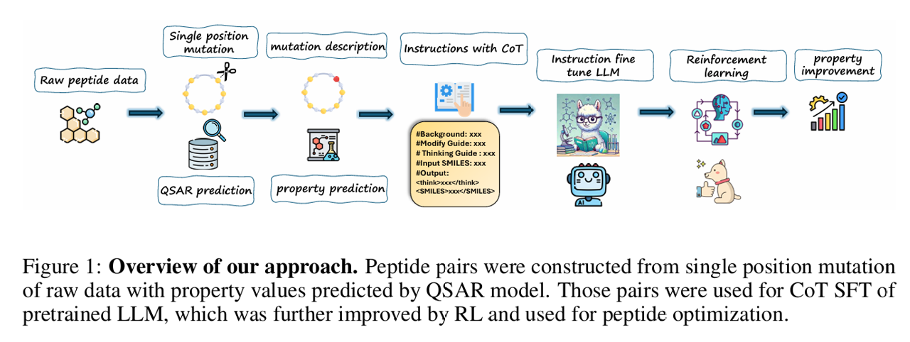
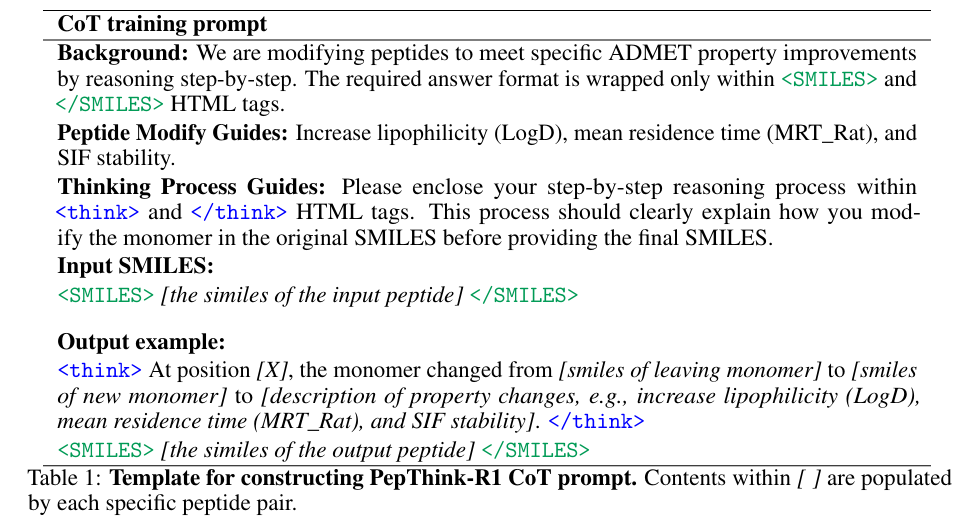
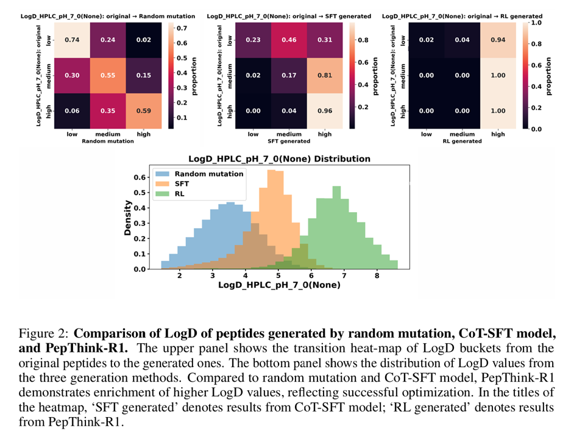
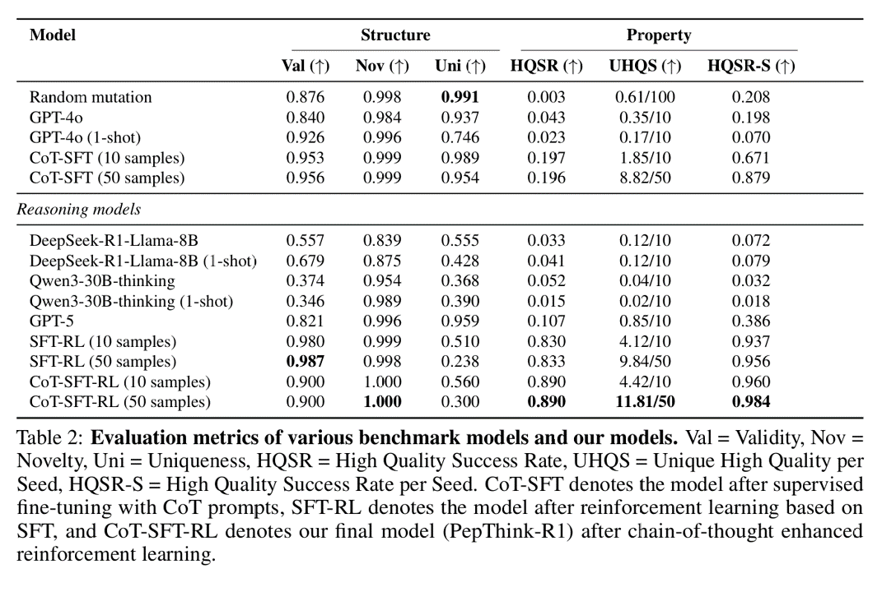
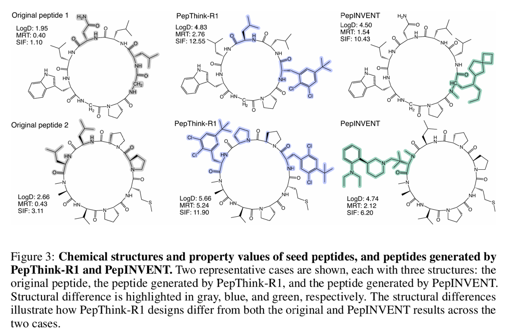
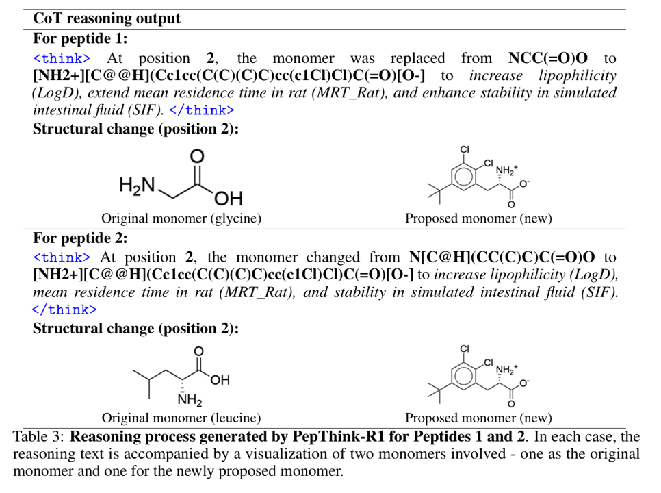
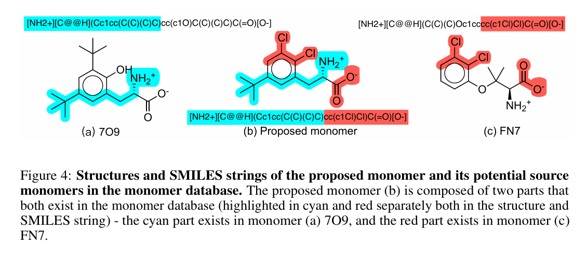

# 引言

设计具有定制特性的治疗性肽面临三大挑战：序列空间过于庞大、实验数据有限以及当前生成模型可解释性差。为应对这些挑战，我们推出PepThink-R1生成框架——该框架通过思维链（CoT）监督微调（SFT）与强化学习（RL）相结合的方式集成大语言模型（LLM）。与现有方法不同，PepThink-R1在序列生成过程中显式推理单体级修饰，在优化多种药理特性的同时实现可解释的设计选择。该模型通过平衡化学有效性与特性改进的定制奖励函数引导，自主探索多样化序列变体。证明PepThink-R1生成的环肽在亲脂性（LogD）、稳定性（平均保留时间，MRT）和暴露度（半衰期，SIF）方面显著提升，在优化成功率和可解释性上均优于现有通用大语言模型（如GPT-5）及领域专用基线模型。据我们所知，这是首个结合显式推理与强化学习驱动特性控制的基于大语言模型的肽设计框架，标志着向可靠、透明化的治疗性肽发现优化迈出了关键一步。

近年来，人工智能特别是生成模型在肽设计中取得了进展，例如 **PepTune**（基于离散扩散模型与 MCTS 的多目标优化）和 **PepINVENT**（扩展自 REINVENT 的掩码语言模型）。然而，现有方法普遍缺乏可解释性，难以揭示特定修饰为何能提升某种性质，从而影响模型在实际药物研发中的信任度与适应性。**PepThink** 的提出受到大语言模型（LLMs）推理能力进展的启发，首次将 链式推理（CoT）监督微调（SFT） 与 强化学习（RL） 融入环肽生成，目标是提升可解释的、性质可控的分子设计。其主要贡献包括：

:::note[1]
构建数据管道，将原始肽数据转化为带有推理标注的肽对，用于基于性质的监督微调。
:::

:::note[2]
设计简洁有效的 CoT 构造策略，将单体水平的修饰与性质改善对齐，提供语义化指导。
:::

:::note[3]
通过 SFT 使 LLM 内化化学相关的推理模式。
:::

:::note[4]
引入 RL 模块，在探索新肽序列时结合化学有效性和多性质优化的奖励函数，强化模型推理与生成能力。
:::

实验结果显示，PepThink 在性质满足率上显著优于现有方法，证明其在可解释性、性质可控性和迭代设计应用上具有潜力，为加速肽类药物研发提供了新思路。

# 相关工作

## 1. 肽生成（Peptide Generation）
- 功能性肽（尤其是环肽）的设计因序列空间庞大和性质需求复杂而具有挑战性。  
- 现有方法主要将肽表示为 **线性序列**：  
  - **HELM 表示**：如 HELM-GPT、AMP-Designer，基于 GPT，在单体层面进行生成。  
  - **SMILES 表示**：如 PepINVENT、PepTune，采用掩码语言模型进行多样化生成。  
- 部分研究结合不同表示形式，实现序列生成与结构评估的结合。  
- 总体上，这些工作证明了基于表示学习和生成模型的肽设计潜力。  

## 2. 强化学习在化学空间的多属性优化（RL for Multi-property Optimization in Chemical Space）
- 强化学习（RL）已被证明是 **多目标优化** 的有效策略，适用于小分子、肽、蛋白等多种药物实体。  
- 常见做法是结合生成模型与性质预测器反馈，优化细胞通透性、抗菌活性、结合力等。  
- 方法涵盖策略梯度、奖励塑形，以及基于搜索的策略（如蒙特卡洛树搜索），帮助模型在冲突的治疗目标间做平衡。  

## 3. 链式推理 SFT 在化学生成中的应用（Chain-of-Thought SFT for Chemical Generation）
- 链式推理（CoT）通过生成中间推理步骤提升 LLM 的推理能力，是增强现代 LLM 的关键技术。  
- 近期已有少量工作将 CoT 扩展到生物化学领域，如化学问答、蛋白互作预测、分子结构理解、性质预测。  
- 然而，**、、直接将 CoT 引入 LLM 的 SFT 以进行化学优化，目前尚未见报道**，这正是 PepThink 的切入点与创新空间。 

# 模型方法

## 数据集准备

**Raw data**  
- 数据来源：从 CycPeptMPDB 数据库提取 **5,530 条头尾环化肽序列**。  
- 预处理：通过 CycloPs 过滤不可处理的序列，保留 **3,778 条仅含天然 α-氨基酸 (AA) 的肽**。  
- 化学空间扩展：引入 Amarasinghe 等人开发的虚拟库中的非天然氨基酸 (NNAAs)（约 380,000 种可合成的 NNAAs），选择其中10,000 个代表性子集。  
- 最终词表：结合 CycPeptMPDB 中的 **385 种天然单体**，得到 **10,385 个独特单体的构建块词表**。  

**Data augmentation**  
- 使用 CycloPs 进行肽序列增强。  
- 对每条天然肽（3,778 条），在其 HELM 序列中进行 **100 次独立点突变**，突变位置随机选择（非末端）。  
- 每次突变时，用词表中随机采样的单体替换原残基。  
- 对每个突变结果，记录：突变后的肽序列、突变位置、突变前后单体。  
- 最终生成约 **380,000 条独特环肽**，每个突变肽与原始肽形成一个单体差异的肽对。  

**Property annotation**  
- 使用基于 **Chemprop 的多任务消息传递 QSAR 模型**进行性质预测，该模型在 ADMET 相关性质上经过训练。  
- 关注的三个终点：  
  1. **LogD**（LogD_HPLC_pH_7）：pH 7 下的亲脂性。  
  2. **MRT**（Rat_MRT(hrs)）：大鼠平均停留时间（小时）。  
  3. **SIF**（SIF_halflife_10mg_per_ml(hrs)）：模拟肠液中的半衰期（小时）。  

**Data categorization**  
- 将每个性质离散化为 **低、中、高** 三个水平（阈值基于数据分布）：  
  - LogD: 低 <3；中 3–4.2；高 >4.2  
  - MRT: 低 <0.56；中 0.56–1.63；高 >1.63  
  - SIF: 低 <3.4；中 3.4–10.1；高 >10.1  
- 每个肽对根据性质改善情况分类：  
  - 例如：LogD 和 SIF 提升到高水平，而 MRT 不变 → 标记为 *LogD up, SIF up*。  
- 按照性质改善数量分为 **单属性、双属性、三属性改善**类别。  
- 相比连续值变化，分类改善更符合实际药物研发的目标（如达到 ADMET 阈值比数值小幅提升更重要）。  

**Training and evaluation datasets**  
- **SFT 数据集**：保留所有 **三属性改善的肽**（多目标优化成功的代表），并从单/双属性改善组中各采样最多 4,000 条，丰富训练多样性。  
- **RL 训练集**：从 SFT 训练集随机选择 **600 条肽**作为初始训练池。  
- **测试集**：排除所有三属性改善的肽，得到 **1,880 条测试样本**，来源于低表现肽。  
- 目的：测试模型是否能将从高表现样本学到的优化策略泛化到低表现样本中。 

## CoT prompt 设计

**说明**:  
- 为了训练 PepThink-R1，设计了一个显式引导 LLM 的 prompt 模板，使其在推理单体级修改的基础上逐步改进肽。  
- 模板包含三部分：  
  1. **任务背景**  
  2. **修改目标**  
  3. **详细推理指南**  
- 模型需要逐步推理如何修改肽序列中的单体，然后输出被 `<SMILES>` 标签包裹的修改后 SMILES 字符串。  
- 设计目标：  
  - 将肽视为由单体组成的模块化序列。  
  - 将修改限制为 **单体替换**，避免过度或化学上不合理的突变。  
  - 提供更可解释、局部化的推理路径。  
- 此设计也有助于强化学习代理在探索新单体设计时保持结构化，鼓励创造性同时维持分子合理性。 

## 基于药理学意识奖励的强化学习

### Algorithm
- 在 RL 训练阶段，我们使用 **Group Relative Policy Optimization (GRPO)**  微调模型 πθ，以增强推理过程。  
- 训练样本格式：  
  - 输入 `x = (xs, xt)`，其中 `xs` 是需要编辑的 SMILES 序列，`xt` 是文本 prompt。  
  - 模型会从 πθ(y | x) 中采样一组候选输出 `{o(1), …, o(G)}`，每个输出包含推理轨迹和最终答案。  
- 自定义奖励函数对每个输出打分，得到相对分数 `{Ri}`，归一化为优势 `{Ai}`，并通过 GRPO 目标更新策略模型。  

**GRPO目标函数：**
$$
J_{\text{GRPO}}(\theta) = 
\mathbb{E}_{x \sim D, \{y_i\}_{i=1}^G \sim \pi_{\text{old}}(y|x)} 
\Bigg[ 
\frac{1}{G} \sum_{i=1}^G 
\Big( \min\big( r_i A_i, \; \text{clip}(r_i, 1-\epsilon, 1+\epsilon) A_i \big) 
- \beta D_{\text{KL}}(\pi_\theta \| \pi_{\text{ref}}) 
\Big) 
\Bigg]
$$

其中：  
- $r_i = \dfrac{\pi_\theta(y_i | x)}{\pi_{\text{old}}(y_i | x)}$  
- $A_i = \dfrac{R_i - \text{mean}(\{R_i\}_{i=1}^G)}{\text{std}(\{R_i\}_{i=1}^G)}$  
- $\epsilon, \beta$ 为超参数 
- $\pi_{\text{old}}$ 是 rollout 时使用的策略。 

### Reward Modeling
- 为了引导 RL 生成更具药理学意义的分子，我们设计了一个多目标奖励函数，在属性可取性、结构相似性和多样性控制之间进行平衡。  
- 奖励函数部分借鉴了 REINVENT ：  

**最终奖励：**
$$
R = \text{dupfac} \cdot \big( 0.8 \cdot \text{propsmooth} + 0.2 \cdot \text{simfac} \big)
\tag{2}
$$

**1. Property desirability**  
- 使用基于 Chemprop 的多任务 QSAR 模型预测 3 个 ADMET 性质：  
  - $$LogD$$
  - $$MRT$$  
  - $$SIF$$ 
- 使用平滑的 sigmoid 转换而非原始回归输出，判定预测值是否超过阈值：  

$$
\text{propsmooth} = \frac{1}{3} \sum_{i=1}^3 \sigma \left( \frac{x_i - t_i}{k_i} \right)
\tag{3}
$$

其中：  
- $x_i$ = 属性 i 的预测值  
- $t_i$ = 阈值（如 LogD > 4.2）  
- $k_i$ = 控制过渡陡峭度的缩放因子  
- $\sigma(\cdot)$ = logistic 函数  

该部分鼓励分子同时接近三个药代动力学目标。  

**2. Similarity factor**  
- 为保持与输入分子的结构相似性，计算原始与生成肽的 **Morgan 指纹 Tanimoto 相似度 s**：  

$$
\text{simfac} = \sigma \big( \alpha \cdot (s - s_0) \big)
\tag{4}
$$

其中：  
- $\alpha$ 控制奖励曲线的陡峭度  
- $s_0$ = 目标相似度中心（设为 0.6）  

该部分促进在化学空间中的局部探索。  

**3. Duplication penalty**  
- 为防止模式坍塌并鼓励多样性，使用基于频率的惩罚：  

$$
\text{dupfac} = \frac{1}{\big( \max(1, n+1) \big)^\gamma}
\tag{5}
$$

其中：  
- $n$ = 当前分子在生成历史中出现的次数（通过 LRU 缓存追踪）  
- $\gamma$ = 衰减指数  

## 评价指标

我们使用六个指标评估生成肽段的质量，这些指标反映了化学有效性、多样性、新颖性以及在三个属性端点上的优化性能。综合这些指标可以全面评估模型在受控条件下生成有效、新颖、多样且高性能肽段的能力。每个指标定义如下：

1. 化学有效性 (Validity)
衡量生成序列中通过 **RDKit** 化学有效性检查并被 QSAR 属性预测器成功预测的比例。  
分数越高表示无效或损坏分子越少。

2. 新颖性 (Novelty)
量化生成的分子中不在训练数据集中的比例，反映模型生成新颖化合物的能力。

3. 独特性 (Uniqueness)
反映所有生成样本中不同分子的比例，用于衡量多样性和冗余性。

4. 高质量成功率 (HQSR)
衡量同时满足三项属性阈值的生成肽段比例：高 LogD、高 MRT 和高 SIF 稳定性。  
设 $N$ 为生成分子总数，$x_i^{(j)} \in \{\text{LogD}, \text{MRT}, \text{SIF}\}$ 为第 $i$ 个分子在属性 $j$ 上的值，则：

$$
\text{HQSR} = \frac{1}{N} \sum_{i=1}^N \mathbf{1}\Big(x_i^{\text{LogD}} > \tau_{\text{LogD}} \;\wedge\; x_i^{\text{MRT}} > \tau_{\text{MRT}} \;\wedge\; x_i^{\text{SIF}} > \tau_{\text{SIF}} \Big)
\tag{6}
$$

其中，$\tau_{\text{LogD}}, \tau_{\text{MRT}}, \tau_{\text{SIF}}$ 分别为从训练数据分布中确定的高质量阈值（例如上三分位数），$\mathbf{1}\{\cdot\}$ 为指示函数。

5. 每个种子输入的唯一高质量数 (UHQS)
衡量每个输入肽段平均生成的高质量唯一分子数量。设 $S$ 为输入种子集合，$HQ_s$ 为种子 $s \in S$ 对应生成的高质量唯一分子集合，则：

$$
\text{UHQS} = \frac{1}{|S|} \sum_{s \in S} |HQ_s|
\tag{7}
$$

6. 每个种子的高质量成功率 (HQSR-S)
计算模型对每个输入种子至少生成一个高质量分子的比例。定义为：

$$
\text{HQSR-S} = \frac{1}{|S|} \sum_{s \in S} \mathbf{1}\{|HQ_s| \ge 1\}
$$

# 结果和讨论

我们提出了 **PepThink-R1**，一种面向环肽优化的推理感知生成框架，它将链式思维（Chain-of-Thought, CoT）监督微调与强化学习相结合。通过对单体级修改进行显式推理，并在药理感知奖励下探索序列空间，PepThink-R1 实现了可解释、可控且多目标的肽段设计。

实验结果表明，PepThink-R1 相较于通用 LLM、仅监督微调方法以及现有工具，表现出明显优势。然而，该方法仍存在一些局限性：
1. 属性提升依赖 QSAR 预测而非实验验证；
2. 训练数据主要为合成数据，由虚拟单体替换生成，而非实验测得的肽对；
3. 强化学习在增强属性控制的同时，降低了结构多样性。

未来工作将聚焦于：
- 将实验反馈整合到奖励循环中；
- 引入结构建模与对接（docking）评分；
- 扩展推理深度，以捕捉多位点或骨架级别的编辑。

# 参考文献

[ PepThink-R1: LLM for Interpretable Cyclic Peptide Optimization with CoT SFT and Reinforcement Learning, 2025-08](https://arxiv.org/abs/2508.14765v1)

