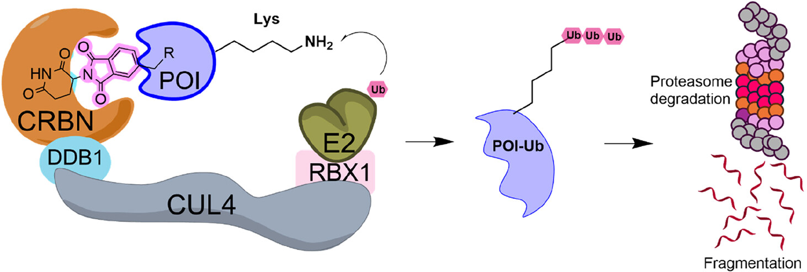
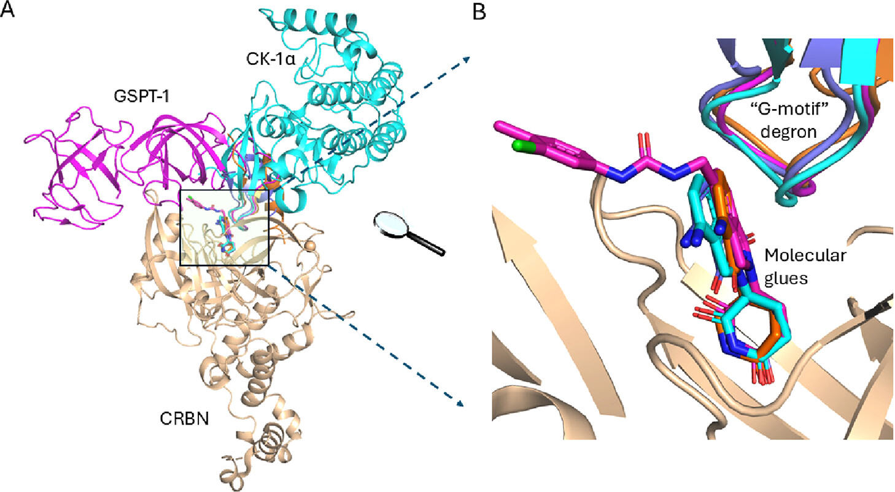

# 引言

**分子胶（Molecular Glue）**和**蛋白水解靶向嵌合体（PROTAC）**是近些年引领药物发现范式转变的新型治疗分子，
传统小分子通常通过阻断正构位点或变构位点来抑制靶蛋白功能发挥药效，而分子胶则通过促进E3连接酶与其底物蛋白之间的相互作用，
从而诱导靶蛋白降解，将某些曾经被广泛认知为“不可成药”的蛋白转化为“可成药”蛋白

# 方法

**传统方法**主要是筛选小分子化合物库，观察其是否能够在细胞实验中通过蛋白酶体依赖性途径诱导目标蛋白降解，
随后进行机制验证，以确认所涉及的E3连接酶和蛋白底物，带有一定偶然性，如`沙利度胺（thalidomide）`。

**目前方法**在传统方法的基础上，引入了冷冻电子显微镜（Cryo-EM），X射线晶体学（X-ray crystallography），
基于结构的药物设计（structure-based drug design），计算建模（computational modeling）以及人工智能辅助药物设计（AIDD）
的方法，预计这些方法将在未来加速新型分子胶的发现，并拓展其在多种疾病中的治疗潜力。

## 挑战

因为分子胶是通过诱导目标蛋白和E3泛素连接酶形成三元复合物结构，因此关键在于如何解析或精准预测三元复合物结构，并且
深入了解分子胶介导的蛋白-蛋白相互作用（PPI）以及分子胶在其中所发挥的作用（稳定两种蛋白的结合）

总结为以下六个挑战：

- **识别短暂或天然存在于靶蛋白与 E3 连接酶之间的 PPI**
这些相互作用界面通常高度多样，且难以通过传统小分子靶向，增加了设计难度。

- **筛选具有“胶样”骨架（glue-like scaffolds）的小分子库的选择受限**
由于缺乏关于有助于蛋白-蛋白相互作用的小分子化学空间的先验知识，筛选新的分子胶骨架变得困难。

- **开发高效的筛选方法以早期发现分子胶**
由于蛋白降解机制涉及全蛋白质组范围的相互作用以及蛋白酶体系统，筛选真正的“功能性分子胶”极具挑战。例如，纳米荧光素（Nanoluciferase）融合蛋白
和 NanoBiT 技术已成为高通量筛选（HTS）的重要平台，但由于 HiBiT 标记分子上的赖氨酸残基可能产生实验伪影，因此仍需优化更可靠的筛选技术。

- **鉴定新型 E3 连接酶-靶蛋白组合的分子胶难度较大**
由于分子胶的作用机制涉及复杂的生物化学、物理和结构特性分析，因此需要深入的实验表征来确定其分子作用方式。

- **分子胶的结合动力学（Kon）与解离动力学（Koff）对降解效率至关重要**
需要在稳定性和可逆性之间找到合适的平衡，以确保三元复合物能够有效形成并适时解离。

- **基于细胞的检测方法需区分蛋白水平变化的原因**
目前，许多实验采用蛋白印迹（Western blot）检测目标蛋白水平，但蛋白总量的变化可能既由降解影响，
也可能受到合成速率的调控。因此，在验证分子胶的靶向效应时，需要明确蛋白丰度下降是由于降解而非合成减少。

## 关键点

:::1
蛋白-蛋白相互作用（PPI）
:::

:::2
动力学和热力学特性
:::

:::3
优化筛选方法
:::

# 现有深度学习工具

[MASIF](https://doi.org/10.1038/s41592-019-0666-6)，预测小分子在蛋白表面的结合位点，
帮助研究人员发现潜在的 E3 连接酶-靶蛋白相互作用区域

[AlphaFold Multimer](https://doi.org/10.1101/2021.10.04.463034)，预测蛋白质二元或三元复合物的 3D 结构，
为 E3 连接酶-底物相互作用界面提供关键见解

[PPI-Miner](https://doi.org/10.1021/acs.jcim.2c01033?urlappend=%3Fref%3DPDF&jav=VoR&rel=cite-as)，预测蛋白-蛋白复合物的形成，
并帮助筛选潜在的分子胶结合位点

[Physics and FEP](https://doi.org/10.1101/2025.01.13.632817)，探索 E3 连接酶与靶蛋白之间的构象变化，
预测结合亲和力

# 补充

## 案例

分子胶如何在原子级高分辨率下促使E3连接酶与靶蛋白结合并诱导其降解，例如CRBN−glue−substrate复合物，CRBN E3连接酶的分子特征，特别是其对靶蛋白G-基序（G-motif）的识别，
在分子胶促进靶蛋白降解的过程中起到了至关重要的作用。G-基序通常由一段采用β-发夹（beta-hairpin）结构的氨基酸残基组成，并可被CRBN的配体结合口识别，
从而将靶蛋白招募到E3连接酶与分子胶结合形成的“新表面”（neosurface）。这一结合事件将 CRBN 连接酶桥接至靶蛋白，使 E3 连接酶能够对靶蛋白进行泛素化修饰，
并随后通过蛋白酶体降解。值得注意的是，G-基序（G-motif）的存在对于分子胶的特异性至关重要，因为分子胶与 CRBN 的结合有效地重新编程了该连接酶的底物特异性，
生成所谓的“新底物”（neosubstrate），即“降解靶”（degron）。这一分子相互作用突出了深入理解 E3 连接酶与底物之间相互作用的结构细节对于下一代分子胶设计的重要性。

## 深度学习方向展望

- 靶点鉴定（Target Identification）
- E3 连接酶与底物选择（E3 Ligase & Substrate Selection）
- 蛋白蛋白相互作用预测（PPI Prediction）
- 物理驱动的对接和分子动力学模拟（Physics Driven Docking & Molecular Dynamics Simulation）
- 自由能微扰模拟（FEP）
- 分子生成（Molecular Generation）

# 参考文献

[ Leveraging Structural and Computational Biology for Molecular Glue Discovery](https://pubs.acs.org/doi/10.1021/acs.jmedchem.5c00076?ref=pdf)
