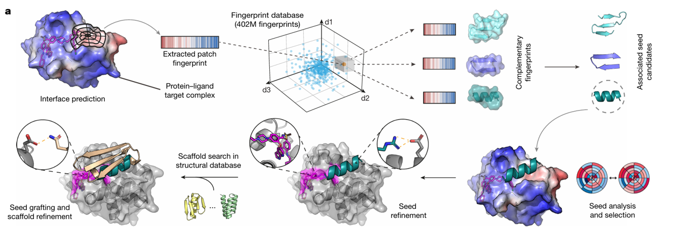
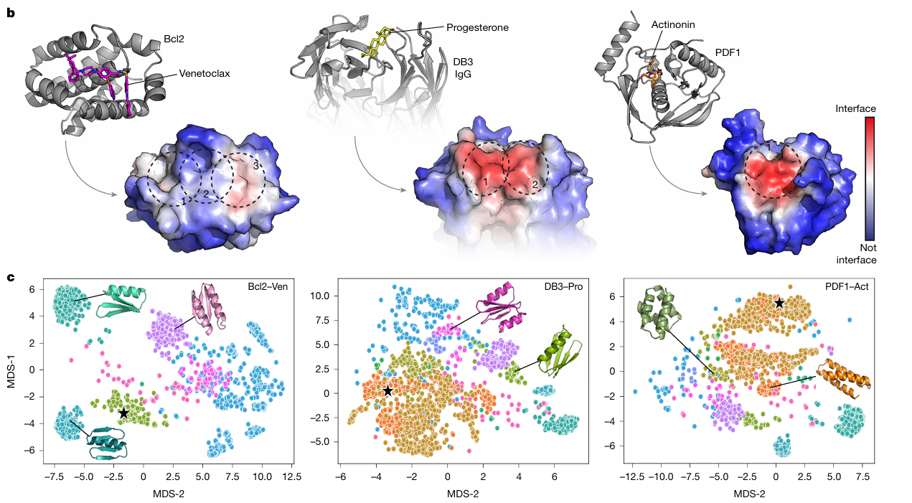

# 引言

蛋白质之间的分子识别事件驱动着生命系统中的生物过程，然而，更高水平的机制调控（蛋白质之间的相互作用取决于小分子）已经出现,
本文提出了一种靶向"新生表面"（即蛋白质-配体复合物形成时产生的新表面）的蛋白质计算设计策略**MaSIF (Molecular Surface Interaction Fingerprinting)**，即基于**分子表面表征学习**的深度学习框架，
并在实验上验证了其对三种药物结合蛋白复合物（Bcl2–venetoclax、DB3–progesterone 和 PDF1–actinonin）的结合能力。
预期此类化学诱导型蛋白质相互作用的设计将有望拓展工程化细胞的传感功能，并构建新型合成通路，为药物调控的细胞疗法创新提供技术支持

# 背景

## PPIs的重要性

蛋白质间的分子识别是生命系统中生物过程的核心驱动力。这些相互作用在细胞稳态中起关键作用，同时也与多种疾病相关。
传统研究主要聚焦于蛋白质间的直接相互作用，但近年研究发现，小分子可以通过调控蛋白质相互作用（如变构效应、翻译后修饰或直接配体结合）在更高层次上调节细胞活动。

## 小分子调控的兴起

小分子作为调控工具具有显著优势：易于给药、良好的生物分布、细胞通透性、安全性以及对靶标蛋白的高亲和力和特异性。
在合成生物学中，小分子诱导的蛋白质相互作用已被用于设计化学响应系统，实现对细胞活动的精确时空控制。例如，小分子触发器可以诱导或破坏蛋白质相互作用，从而作为工程化细胞功能的“开关”。

## 领域瓶颈

尽管化学诱导蛋白质相互作用（CID）在合成生物学和细胞治疗中具有巨大潜力，但设计针对蛋白质-配体复合物形成的“新表面”（neosurfaces）的高特异性结合蛋白仍面临挑战。
现有计算方法主要依赖于移植已知药物结合位点或对接现有蛋白质骨架，但这些方法存在局限性，如药物非依赖性二聚化风险、缺乏合适骨架蛋白或需要大量体外成熟技术。

# 数据和结构

## 数据

1. 数据来源

- **蛋白质-配体复合物结构**：从蛋白质数据库（PDB）中筛选出14个已知的配体诱导蛋白质复合物，生成28个独立的基准测试案例（每个复合物分为两个亚单位）。
- **负样本（decoys）**：从PDBbind数据库中选取8,879个与蛋白质-蛋白质相互作用（PPIs）相关的蛋白质作为负样本，用于构建大规模搜索空间。
- **小分子数据**：从Binding MOAD数据集中提取20,363个独特的小分子配体，并通过BRICS算法分解为9,362个独特片段，用于计算小分子的化学特征（如亲疏水性）。

2. 特征提取

- 几何特征：
    - **形状指数（Shape Index）**：通过计算表面点的曲率，描述局部几何形状。公式为：

    $$
    S = \frac{1}{2} - \frac{1}{\pi} \arctan\left(\frac{k_1 + k_2}{k_1 - k_2}\right)
    $$

    其中，$$ k_1 $$ 和 $$ k_2 $$ 是表面点的主曲率。

    - **距离依赖曲率（Distance-Dependent Curvature）**：通过计算表面点与其邻近点的曲率差异，捕捉局部几何变化。

- 化学特征

    - **Poisson-Boltzmann 静电势**：
    使用 APBS 软件计算分子表面的静电分布，支持 MOL2 格式的小分子输入。

    - **氢键供体/受体倾向**：
    基于小分子的几何结构，计算表面点的氢键形成能力。使用 RDKit 软件确定氢键的理想方向。根据角度偏差分配特征值。

    - **亲疏水性**：
    通过 Kyte-Doolittle 标度和小分子的 logP 值，计算分子表面的亲疏水性分布。使用非线性函数将 logP 值映射到 Kyte-Doolittle 标度：  

    $$
    \text{Kyte-Doolittle} = \text{clip} \left( -6.2786 + \exp(0.4772 \times \log P + 1.8491), \text{min} = -4.5, \text{max} = 4.5 \right)
    $$

3. 数据处理

- **分子表面生成**：使用MSMS程序对蛋白质-配体复合物进行三角网格化，生成分子表面。
- **表面分块**：将分子表面划分为 12 Å半径的重叠表面块（patches），每个块包含约200个顶点。
- **特征向量化**：将每个表面块的几何和化学特征向量化，生成表面指纹（fingerprints）。

## 模型结构

- **几何深度学习框架**

    - 输入层：每个表面块的几何和化学特征作为输入。

    - 卷积层：使用测地卷积层（Geodesic Convolutional Layers）提取表面块的局部特征。

    - 特征融合：将几何和化学特征融合，生成高维表面指纹。

- **表面指纹搜索与匹配**

    - 指纹数据库：包含约 640,000 个结构片段（seeds），对应 402 百万个表面指纹。

    - 互补性搜索：计算目标表面指纹与数据库中指纹的欧几里得距离，快速筛选出互补的表面块。

    - 三维对齐与评分：使用 RANSAC 算法对筛选出的表面块进行三维对齐。通过接口后对齐评分（IPA score）进一步优化选择。

- **结合蛋白设计流程**

    - 界面预测：使用 MaSIF-site 预测蛋白质-配体复合物的界面区域。

    - 种子筛选：从数据库中筛选出与目标界面互补的结构基序（binding seeds）。

    - 种子优化：通过 Rosetta 的 FastDesign 优化种子序列，提高结合能量。

    - 种子嫁接：将优化后的种子嫁接到合适的蛋白质骨架上，并通过序列设计进一步优化界面原子接触。

# 实验

## 基准测试

- **结合蛋白恢复率**：
    在 28 个基准测试案例 中，MaSIF-neosurf 成功恢复了70%以上的正确结合蛋白及其结合构象。
    该恢复率显著优于现有工具（如 RoseTTAFold All-Atom，仅恢复14%）。  

- **界面评分**：
    在配体存在的情况下，MaSIF-neosurf 生成的接口后对齐评分（IPA score）和描述符距离评分（Descriptor Distance Score）
    均显著高于无配体情况，表明其能够有效捕捉配体介导的蛋白质相互作用。  

## 设计成功率

- **初始设计成功率**：
    在 2,000 个设计中，成功筛选出 1 个高亲和力结合蛋白。

- **优化后成功率**：
    通过 LigandMPNN 序列优化，设计成功率提高了 4-52 倍。  
    最终成功筛选出 12 个新的结合蛋白。

## 结构验证

- **晶体结构解析**：
    通过 X 射线晶体学解析了 DBAct553_1 与 actinonin-bound PDF1 的复合物结构（PDB: 8S1X）。解析结果显示，计算模型与晶体结构的 Cα RMSD 为 2.33 Å，验证了设计结合模式的准确性。  

- **冷冻电镜结构解析**：
    通过冷冻电镜解析了 DBPro1156_2 与 progesterone-bound DB3 的复合物结构（PDB: 9FKD）。冷冻电镜结构的局部分辨率为 3.23 Å，进一步验证了设计结合模式的准确性。  

# 讨论

## 未来改进方向

1. 提高设计成功率

- **结合 AlphaFold**  
  将 AlphaFold 作为过滤步骤，提高设计蛋白的折叠成功率。实验表明，AlphaFold 预测与实验结构高度一致（Cα RMSD = 0.49 Å），未来可将其整合到设计流程中。

- **优化序列设计工具**  
  使用 LigandMPNN 等新型序列设计工具，优化设计蛋白的序列和折叠特性。实验表明，LigandMPNN 优化后的设计成功率提高了 4-52 倍。

2. 扩展应用范围

- **更多蛋白质-配体复合物**  
  探索更多具有临床意义的蛋白质-配体复合物，扩展模型的应用范围。

- **非天然氨基酸**  
  研究模型在包含非天然氨基酸的蛋白质设计中的潜力，推动蛋白质工程的进一步发展。

3. 提高模型泛化能力

- **更多训练数据**  
  通过整合更多蛋白质-配体复合物的结构数据，提高模型的泛化能力。

- **多任务学习**  
  将模型扩展到其他分子设计任务，如小分子药物设计和蛋白质-核酸相互作用设计。

# 参考文献

[ Targeting protein–ligand neosurfaces with a generalizable deep learning tool, 2025-01](https://www.nature.com/articles/s41586-024-08435-4)