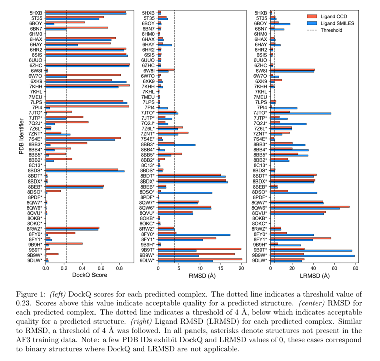
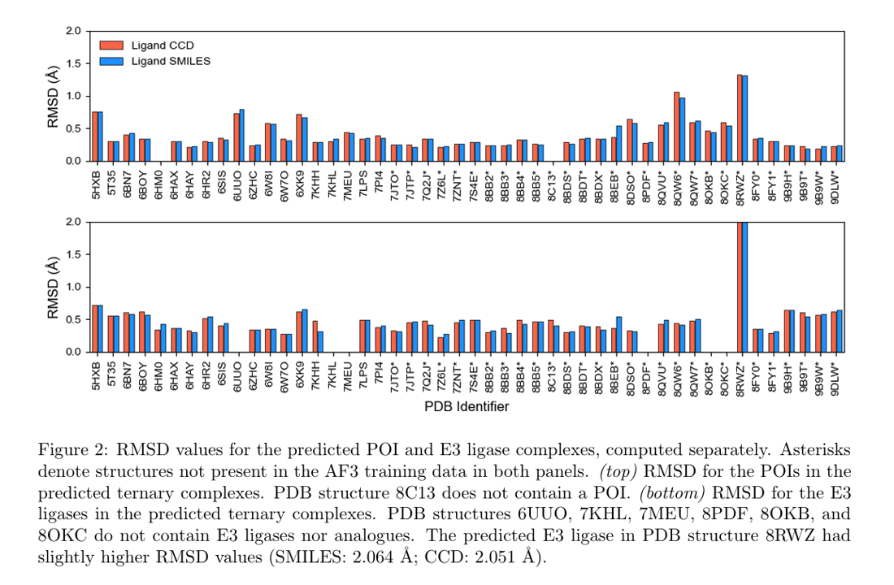
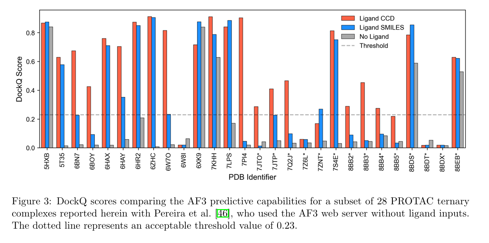
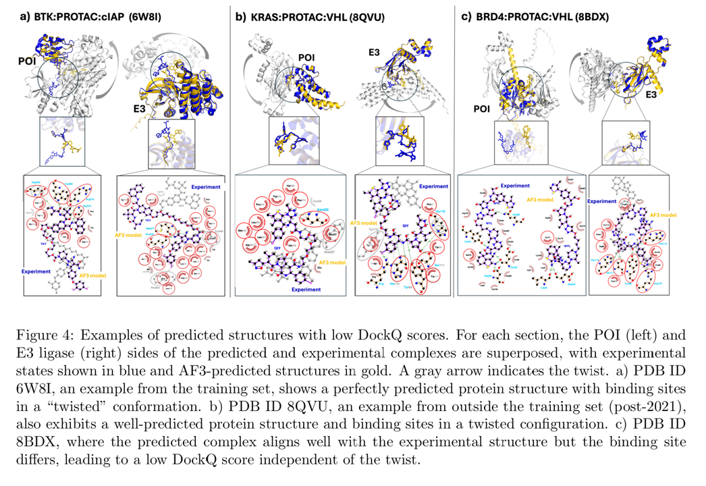
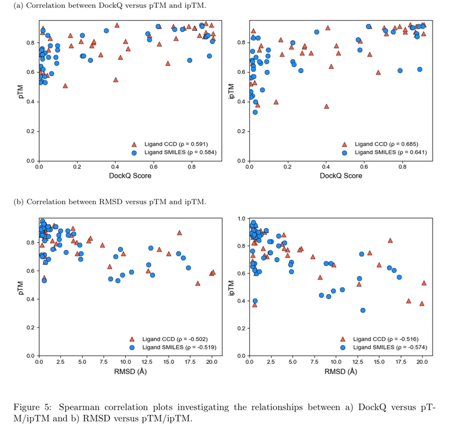
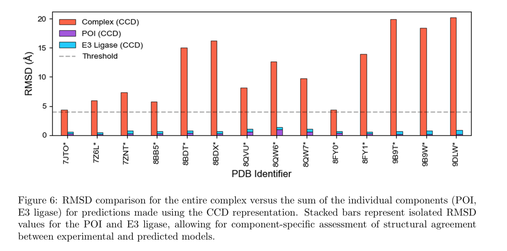
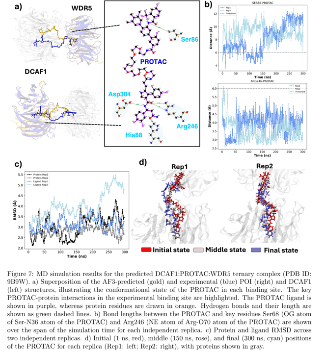

# 引言

靶向蛋白质降解技术，特别是 PROTAC（蛋白降解靶向嵌合体），为传统“不可成药”靶点提供了革命性的治疗策略。然而，PROTAC 分子的大尺寸、高柔性以及介导三元复合物（靶蛋白-PROTAC-E3连接酶）形成的复杂性，给其结构预测和理性设计带来了巨大挑战。AlphaFold 3（AF3）作为新一代蛋白质结构预测工具，能否准确建模这类动态复合物仍缺乏系统评估。本研究首次全面测试了 AF 3在48个实验解析的 PROTAC 相关复合物上的预测性能，通过对比不同配体输入策略（SMILES字符串与3D坐标）对结构精度（RMSD/pTM/DockQ）的影响，揭示了 AF3 在 PROTAC 介导的三元复合物建模中的优势与局限。结果表明，在提供配体信息的情况下，AF3即使对训练集外的结构仍能实现高精度预测，为PROTAC的计算机辅助设计提供了新工具。

# 三元复合物预测研究进展

目前三元复合物预测方法主要可分为三大类：

1. 基于结构的对接和采样方法

- 代表性工作：
  - [Drummond](https://doi.org/10.1021/acs.jcim.0c00897) 等开发的约束对接方法（通过结构限制提升精度）
  - [PRosettaC](https://doi.org/10.1021/acs.jcim.0c00589) 的迭代采样策略（交替优化蛋白-蛋白与配体构象）
  - [Ignatov](https://doi.org/10.1021/jacs.2c09387) 等的"静默卷积"算法（有效过滤不利连接构象）

- 优势：计算效率高，适合初期建模

- 局限：依赖静态结构假设，对柔性连接区处理不足

2. 分子动力学（MD）模拟方法

- 代表性工作：
  - [Li](https://doi.org/10.1021/acs.jcim.1c01150)等建立的基于 MD 的 MM/GBSA 计算（实现结合自由能与实验解离常数的关联，并且提出基于 MD 的重打分方法显著提升天然结构排名）

- 优势：能捕捉动态结合过程与诱导契合效应

- 局限：计算成本高，需要长时间模拟收敛

3. 人工智能驱动的新方法

- 代表性工作：
  - [Pereira](https://doi.org/10.1093/bioadv/vbaf056)等尝试用 AF3 服务器建模（受限于配体处理功能）
  - [Bai](https://doi.org/10.1016/j.jbc.2022.101653)等的功能分类框架（关联复合物结构与泛素化效率）
  - [Haloi](https://www.biorxiv.org/content/early/2025/02/25/2025.02.10.637508)等证实SMILES输入可提升AF3变体的配体结合预测（[Chai-1](https://www.biorxiv.org/content/early/2024/10/15/2024.10.10.615955)）

- 优势：计算效率高，适合初期建模

- 局限：依赖静态结构假设，对柔性连接区处理不足

# 材料和方法

## 数据收集与标准化

48个三元复合物（2016-2024年报道），19个结构在 AF3 训练集中（截止2021-09-30），29个为训练集外新结构，保留三元复合物核心组分（靶蛋白/E3连接酶/PROTAC），移除辅助蛋白（如 Elongin-C/B）和非相关分子，获取规范异构SMILES（使用 OpenEye OEToolkits 2.0.7 生成），下载 PDB 中的 CCD 结构文件，（components.cif），通过 FASTA 序列半自动提取蛋白信息，为每个复合物生成两种JSON输入文件：SMILES 字符串表示，CCD 标识符表示

## AF3 结构预测流程

使用 Docker 容器化部署本地 AF3 v3.0.1，在单卡 A100 上固定随机种子 42 进行单结构预测，输出五个预测结构，采用 PyMOL 进行 align，用 DockQ v2 分析 PPI 界面，仅选用 PDB 中有实验结构的复合物进行预测。

Example Input File：

```json
{
  "name": "5HXB_ccd",
  "sequences": [
    {
      "protein": {
        "id": "A",
        "sequence": "GSGPIRLPIV...AIGKVLKLVP"
      }
    },
    {
      "protein": {
        "id": "C",
        "sequence": "GSMEAKKPNI...ISPDKVILCL"
      }
    },
    {
      "ligand": {
        "id": "H",
        "ccdCodes": ["85C"]
      }
    }
  ],
  "modelSeeds": [42],
  "dialect": "alphafold3",
  "version": 1
}
```

## 评估指标

| 指标名称 | 计算方式 | 评估范围 | 理想阈值 | 应用特点 |
|----------|---------|---------|---------|---------|
| RMSD | Cα 原子对齐后的均方根偏差 | 整体结构/配体 | <4Å (好结构) | 原子级精度但对异常值敏感 |
| LRMSD | 配体原子位置偏差 | PROTAC 分子 | <1Å（近天然） | 评估配体结合位点准确性 |
| pTM | 预测的模板建模得分 | 整体复合物 | >0.5 | 全局折叠可靠性评估 |
| ipTM | 界面区域模板建模得分 | 蛋白相互作用面 | 0.4-0.8 | 特异性评估结合界面质量 |
| DockQ | PPI 综合指标 | 综合考虑 | >0.8 | 全面反映对接的空间精确度和界面正确性 |

## 分子动力学模拟

研究对象：选取 AF3 预测的 9B9W 复合物（WDR5-A1ANN-DCAF1，POI-PROTAC-E3），基于 CCD 格式输入的 AF3 预测构象，具体参数以及约束见文章 `3.4`

可视化使用 PyMOL 和 VMD

# 结果

在明确提供配体信息时，AF3 对 PROTAC 三元复合物展现出高预测精度，48个复合物中：23个 RMSD<1Å（近原子级精度），34个 RMSD<4Å（达到结构生物学应用标准），10个低 DockQ 评分案例经分析为 PROTAC 柔性连接区导致的替代结合构象










对9B9W复合物进行300ns MD模拟证实结构稳定性，识别出48个复合物中关键的 PROTAC 结合残基




对训练集外结构（29个）保持高精度预测，pTM/ipTM 置信度评分与 RMSD/DockQ 显著相关（p<0.01）









# 未来研究方向

1. 开发AF3-MD混合工作流：短期MD模拟（<50ns）优化界面，增强采样技术（如 Metadynamics）捕捉稀有构象

2. 建立"动态评分"体系：构象熵贡献计算，瞬态相互作用识别

3. 实验验证体系：建立专项计划解析高分辨率冷冻电镜结构，时间分辨晶体学数据，重点覆盖 KRAS 等难预测靶点以及不同连接区长度的 PROTACs

4. 转化应用方向：建立结构-降解活性 QSAR 模型，开发界面稳定性评分算法，基于预测结果的连接区优化，协同结合残基的理性突变

# 参考文献

[ Enhancing PROTAC Ternary Complex Prediction with Ligand Information in AlphaFold 3, 2025-03](https://doi.org/10.26434/chemrxiv-2025-gfd6c)

