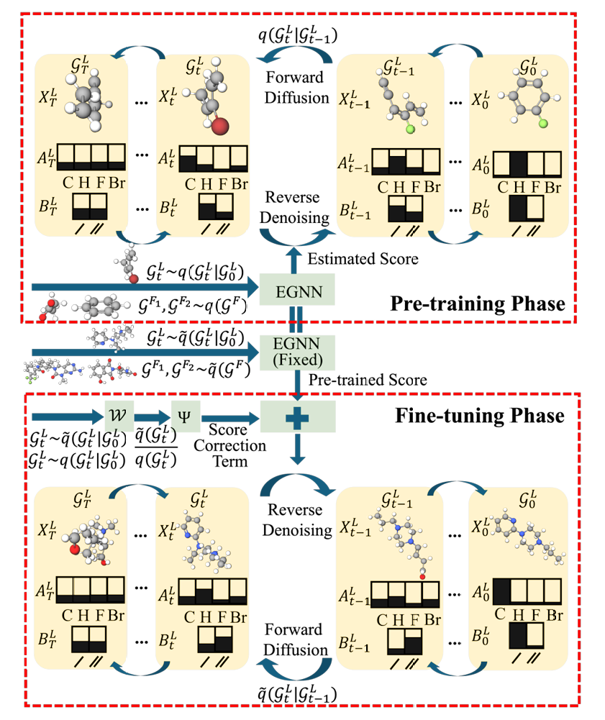
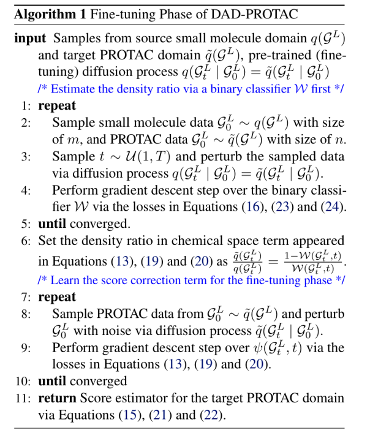
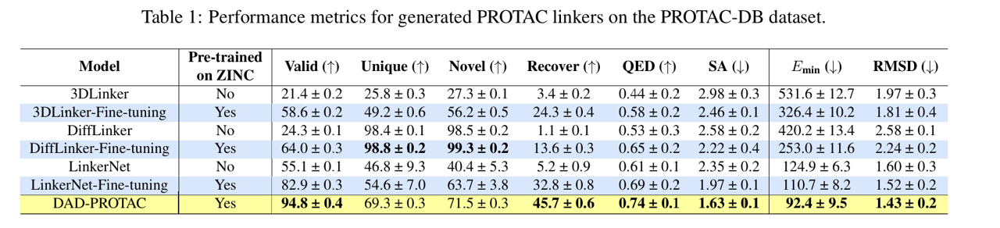
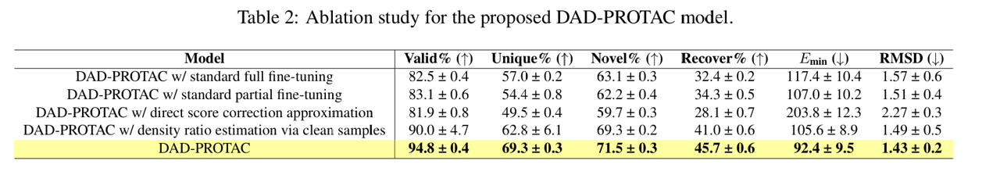
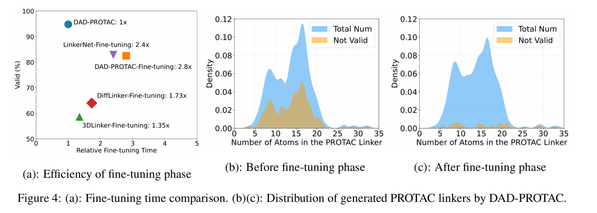
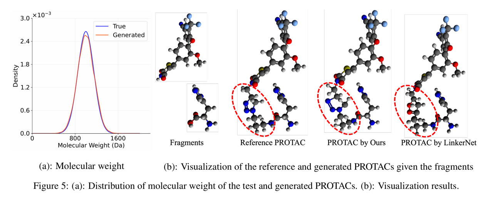

# 引言

蛋白水解靶向嵌合体（PROTAC）是一项用于靶向蛋白降解的突破性技术，但如何设计有效的连接子（linker）以连接两个分子片段形成具有药物潜力的 PROTAC 分子，仍然是一个关键挑战。尽管扩散模型在分子生成领域展现出巨大潜力，但当前用于 PROTAC 连接子设计的扩散模型通常基于小分子数据集进行训练，这会导致小分子与目标 PROTAC 在化学空间上的分布不匹配。直接在有限的 PROTAC 数据集上微调往往会造成过拟合并带来较差的泛化能力。

在本研究中，我们提出了 DAD-PROTAC，这是一种用于 PROTAC 连接子设计的领域自适应扩散模型。该方法通过密度比估计（density ratio estimation）来弥合小分子域与 PROTAC 域之间的化学空间差异。我们将目标评分器（target score estimator）分解为一个预训练的评分函数和一个轻量级的评分校正项，从而实现无需完全重新训练即可进行高效微调。实验结果表明，DAD-PROTAC 在生成高质量的 PROTAC 连接子方面展现出卓越性能。

# 模型

## Pre-training Phase

首先在 ZINC 数据集上对小分子进行预训练，采用的方法还是一样的对原子坐标，原子类型，键类型分别进行扩散，具体方法跟之前 EDM，Difflinker 之类的模型一样，主要看下面 Fine-tuning 阶段

## Fine-tuning Phase

一种直接的方法是以预训练权重为初始化，对模型进行整体再训练。然而，这种朴素的做法往往导致过拟合问题，而非学习对 PROTAC 设计至关重要的高层领域特异性特征。此外，对评分网络的全部参数进行完全微调还会带来巨大的计算开销，并显著延长收敛时间。虽然冻结 EGNN 去噪网络的前几层可以在一定程度上降低计算成本并缓解过拟合，但这种方法仍然无法显式学习具有理论保证的高层领域特异性特征，因此在 PROTAC 连接子设计任务上适应性有限。

可以证明：在微调阶段，目标 PROTAC 领域中的最优得分估计器与小分子领域的预训练得分之间，相差一个刻画两个领域在化学空间中密度比的修正项。该修正项确保模型能够有效适应 PROTAC linker 的独特特性。

**定理 2.1.** 设 $$q(G^L)$$ 与 $$\tilde{q}(G^L)$$ 分别表示小分子领域与 PROTAC 领域中 linker 在化学空间中的分布。假设两个领域的前向扩散过程相同，即：

$$
q(G^L_t \mid G^L_0) = \tilde{q}(G^L_t \mid G^L_0). \tag{10}
$$

则目标 PROTAC 领域中微调阶段的得分估计器 $$\tilde{s}_{\phi^\*}(X^L_t, t)$$ 可以分解为：

$$
\tilde{s}_{\phi^\*}(X^L_t, t) =
\underbrace{\nabla_{X^L_t} \log q(X^L_t)}_{\text{预训练得分函数}} +
\underbrace{\nabla_{X^L_t} \log \mathbb{E}_{q(X^L_0 \mid X^L_t)}\left[\frac{\tilde{q}(X^L_0)}{q(X^L_0)}\right]}_{\text{修正得分项}}. \tag{11}
$$

同理，目标 PROTAC 领域中的 concrete score 估计器 $$\tilde{c}_{\phi^\*}(A^L_t, t)$$ 可表示为：

$$
\tilde{c}_{\phi^\*}(A^L_t, t) =
\underbrace{c_q(A^L_t)(A^L_t)}_{\text{预训练 concrete score 函数}} +
\underbrace{c_q(A^L_t)\,\mathbb{E}_{q(A^L_0 \mid A^L_t)}\left[\frac{\tilde{q}(A^L_0)}{q(A^L_0)}\right]}_{\text{concrete score 修正项}}. \tag{12}
$$

定理 2.1 强调了密度比 $$\frac{\tilde{q}(G^L)}{q(G^L)}$$ 在化学空间中对于有效适配预训练模型至 PROTAC linker 设计的重要作用。该密度比作为修正项 $$\nabla_{X^L_t} \log \mathbb{E}_{q(X^L_0 \mid X^L_t)}\left[\frac{\tilde{q}(X^L_0)}{q(X^L_0)}\right]$$（或 $$c_q(A^L_t)\,\mathbb{E}_{q(A^L_0 \mid A^L_t)}\left[\frac{\tilde{q}(A^L_0)}{q(A^L_0)}\right]$$），使得 **DAD-PROTAC** 模型能够基于预训练模型对得分函数 $$\nabla_{X^L_t} \log q(X^L_t)$$（或 $$c_q(A^L_t)(A^L_t)$$）进行再校准，从而准确捕捉两个领域的分布差异。

将得分估计器按照定理 2.1 分解为两项具有以下两点关键优势：

1. 不同于传统微调方法，该方法无需在目标 PROTAC 领域上直接微调预训练模型。预训练阶段已学得基础得分估计器，我们只需输入新的 PROTAC 训练样本，即可获得固定基底得分 $$\nabla_{X^L_t} \log q(X^L_t)$$（或 $$c_q(A^L_t)(A^L_t)$$）。计算负担被转移为训练一个额外的神经网络以近似密度比项。

2. 密度修正项显式引入了 PROTAC 与小分子在化学空间中的密度差异。通过利用该密度比，我们能够以理论指导的方式对预训练模型进行最优微调，同时保留两领域在高层分布结构上的差异表达。

接下来，我们旨在计算公式 (11) 和公式 (12) 中的（concrete）得分修正项。本节重点讨论 $$\tilde{s}_{\phi^\*}(X^L_t, t)$$ 的情形，而 $$\tilde{c}_{\phi^\*}(A^L_t, t)$$ 的推导与此类似，详见附录 B.4。

假设密度比 $$\frac{\tilde{q}(X^L_0)}{q(X^L_0)}$$ 已知，我们可以通过蒙特卡洛采样估计期望项 $$\mathbb{E}_{q(X^L_0 \mid X^L_t)}\left[\frac{\tilde{q}(X^L_0)}{q(X^L_0)}\right]$$，但在微调过程中，很难直接从小分子领域的条件分布 $$q(X^L_0 \mid X^L_t)$$ 中采样。因此，借鉴 (Ouyang et al., 2024; Lu et al., 2023) 的方法，我们将其等价为目标 PROTAC 领域 $$\tilde{q}(G^L)$$ 中更易采样的另一种得分修正形式。

**定理 2.2.** 若构建一个带参数的神经网络模型 $$\psi(X^L_t, t)$$，其输入为目标 PROTAC 领域中带噪声的 $$X^L_t$$，并使用如下损失函数进行训练：

$$
\mathcal{L}_{\psi^X}
=
\mathbb{E}_{\tilde{q}(X^L_0, X^L_t)}
\left[
 \left(
   \psi(X^L_t, t) - \frac{\tilde{q}(X^L_t)}{q(X^L_t)}
 \right)^2
\right],
\tag{13}
$$

则有：

$$
\psi^\*(X^L_t, t)
=
\arg\min \mathcal{L}_{\psi^X}
=
\mathbb{E}_{q(X^L_0 \mid X^L_t)}
\left[
 \frac{\tilde{q}(X^L_0)}{q(X^L_0)}
\right].
\tag{14}
$$

由定理 2.2，我们可以通过最小化损失函数 $$\mathcal{L}_{\psi^X}$$ 来训练神经网络 $$\psi(X^L_t, t)$$ 以估计 $$\mathbb{E}_{q(X^L_0 \mid X^L_t)}\left[\frac{\tilde{q}(X^L_0)}{q(X^L_0)}\right]$$，而该损失只需从目标 PROTAC 领域中的联合分布 $$\tilde{q}(X^L_0, X^L_t)$$ 中采样即可完成。与仅依赖有限的 PROTAC 样本 $$\tilde{q}(X^L_0)$$ 不同，我们进一步利用生成的带噪声样本 $$\tilde{q}(X^L_t)$$ 来增强得分修正项的估计。

因此，目标 PROTAC 领域的最终得分估计器可表示为：

$$
\tilde{s}_{\phi^\*}(X^L_t, t)
=
\nabla_{X^L_t} \log q(X^L_t)
+
\nabla_{X^L_t} \log \psi^\*(X^L_t, t).
\tag{15}
$$

为了训练公式 (13) 中的 $$\psi(X^L_t, t)$$，我们仍需预先估计在时刻 $$t$$ 被扰动后的边缘分布 $$\tilde{q}(X^L_t)$$ 与 $$q(X^L_t)$$ 之间的密度比 $$\frac{\tilde{q}(X^L_t)}{q(X^L_t)}$$。因此，我们需构建另一个二分类器 $$W(X^L_t, t)$$，并通过如下交叉熵损失训练，以判断带噪声样本来自小分子领域 $$q(X^L_t)$$ 还是来自 PROTAC 领域 $$\tilde{q}(X^L_t)$$：

$$
\mathcal{L}_{W^X}
=
-\frac{1}{m}
\!\!\!\!
\mathbb{E}_{X^L_0 \sim \tilde{q}(X^L_0),\, X^L_t \sim \tilde{q}(X^L_t \mid X^L_0)}
\!\!\!\!
\log W(X^L_t, t)
-
\frac{1}{n}
\!\!\!\!
\mathbb{E}_{X^L_0 \sim q(X^L_0),\, X^L_t \sim q(X^L_t \mid X^L_0)}
\!\!\!\!
\log (1 - W(X^L_t, t)).
\tag{16}
$$

密度比可近似为：

$$
\frac{\tilde{q}(X^L_t)}{q(X^L_t)}
=
\frac{1 - W(X^L_t, t)}{W(X^L_t, t)}.
$$

DAD-PROTAC 的整体微调流程如算法 1 所总结。其包含两个核心步骤：**密度比估计** 与 **得分修正学习**，从而在理论指导下高效实现小分子领域向 PROTAC 领域的知识迁移。

# 结果

# 总结

在本研究中，我们提出了 DAD-PROTAC，一种面向 PROTAC 连接子设计的 领域自适应扩散模型。针对小分子与 PROTAC 之间分布差异较大的问题，DAD-PROTAC 将目标域的 score 估计拆分为：预训练得到的基础 score + 基于化学空间密度比的轻量级校正项，从而在保持生成能力的前提下实现高效微调并缓解过拟合。

尽管 DAD-PROTAC 具有理论性与效率优势，但仍存在以下局限：其一，当前模型仍需预先指定连接子原子数，这在实际应用中并不现实；其二，预训练阶段尚未显式建模片段旋转或蛋白环境信息。未来可考虑引入更强的三维生成模型或蛋白互作建模机制来进一步提升模型泛化性与实用性。

# 参考文献

[ Domain-Adapted Diffusion Model for PROTAC Linker Design Through the Lens of Density Ratio in Chemical Space, 2025-05](https://openreview.net/forum?id=jkyUbkNJyH)