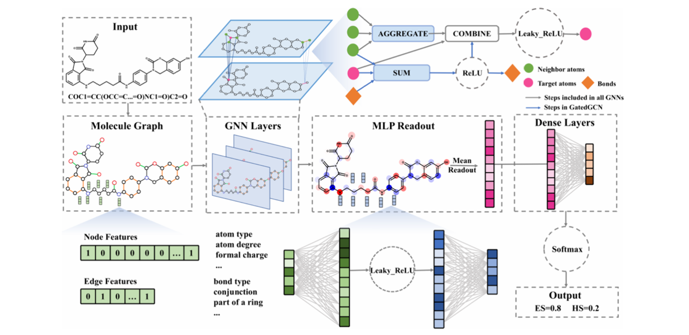
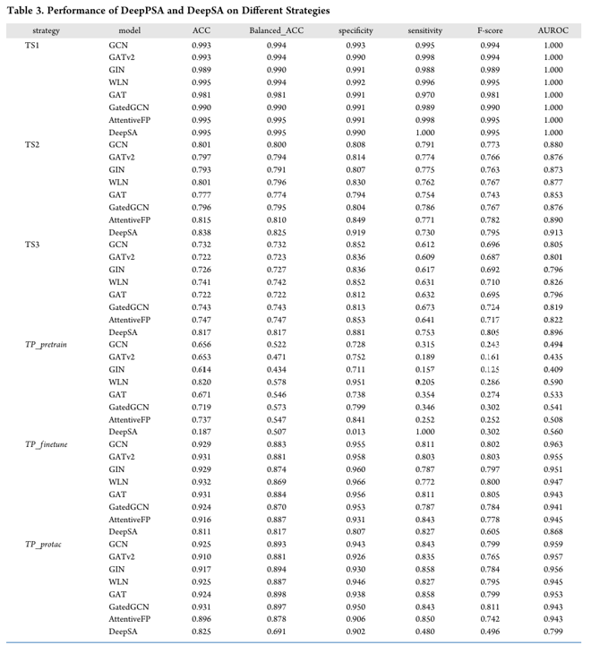
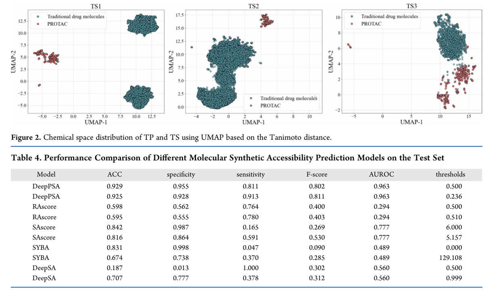
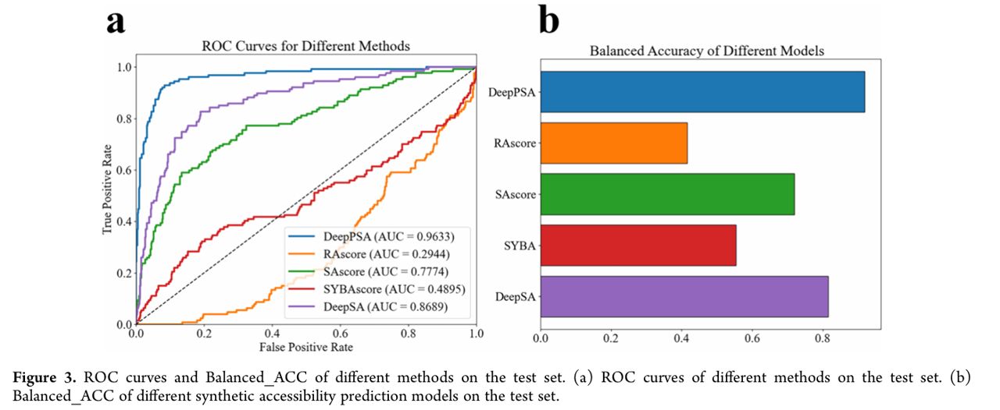
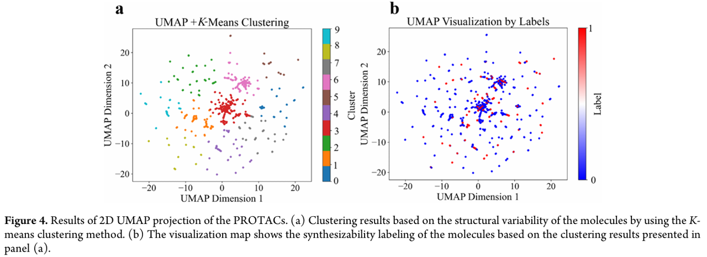
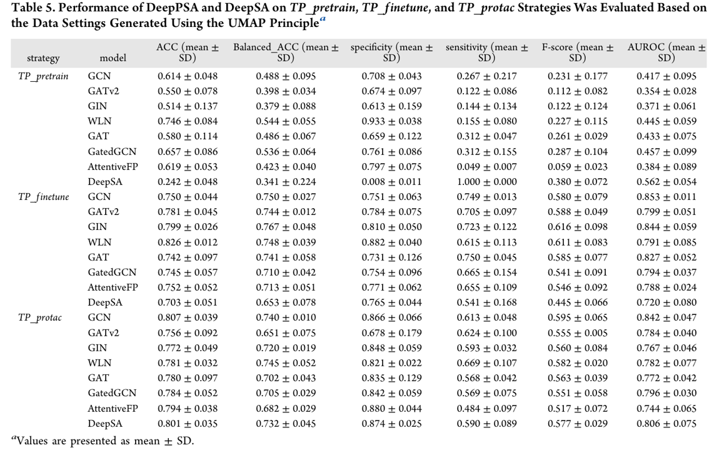
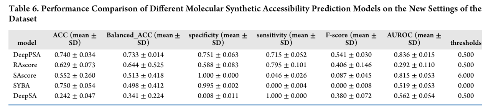
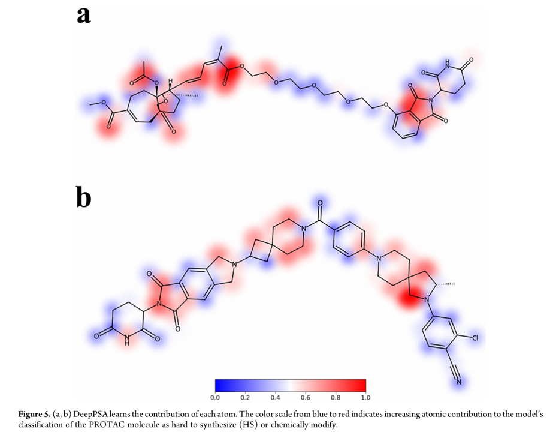
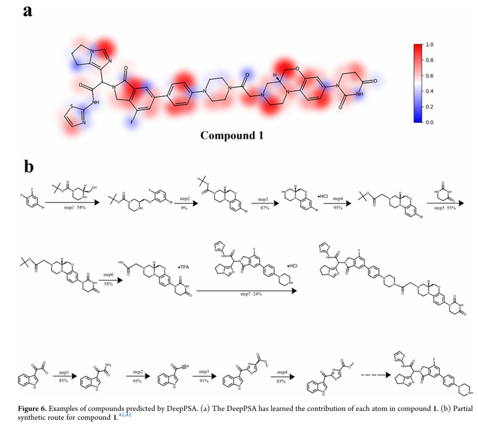

# 引言

Proteolysis-targeting chimeras（PROTACs） 因其能够通过泛素-蛋白酶体系统（ubiquitin−proteasome system）诱导目标蛋白降解，在药物设计中引起了广泛关注。然而，PROTAC 分子的合成过程仍然充满挑战，需要综合考虑其化学复杂性和合成可行性。随着生成式人工智能的发展，已经出现了多个用于 PROTAC 生成的模型，但对这些分子的合成可行性进行评估的工具仍然相对欠缺。为了解决这一问题，我们提出了一个基于深度学习的计算模型 —— DeepPSA（Deep learning-based PROTAC Synthetic Accessibility），用于预测 PROTAC 分子的合成可行性。

## 传统合成可行性评价

除降解效率外，合成可行性评估是 PROTAC 开发的重要步骤。现有的合成可行性评分方法主要适用于小分子，例如：

- **SAscore**：基于已合成化合物的历史经验，考虑结构复杂度
- **SCScore**：基于 Reaxys 数据库中 1200 万反应训练的反应复杂度评分
- **RAscore**：基于 ChEMBL 数据集，进行逆合成可行性分类预测
- **SYBA**：使用贝叶斯概率建模的片段评分
- **GASA**：图注意力机制识别合成关键片段
- **FSScore**：融合人类反馈，用于特定化学空间微调

然而，这些方法大多数并未专为大型、柔性的 PROTAC 分子设计。例如 FSScore 虽尝试在 PROTAC 数据集上微调，但表现不佳。

## DeepPSA 的特点：

- 专为 PROTAC 设计，能准确区分不同结构的可合成性；
- 模型具有良好的可解释性；
- 支持高通量预测，可辅助研究者优先选择更容易合成的候选分子；
- 为机制研究与药物开发节省时间与资源。

# 模型

## 数据集

训练数据集是使用了一个自己整理的 PROTAC 数据集（3644），采用 [Retro*](https://github.com/binghong-ml/retro_star) 方法将预测为十步以内能够合成的标记为容易合成（ES），十步以上的标记为难合成（HS），然后训练一个二分类任务就行了 (微调)

为了跟其他模型对比，采用了同样的模型架构在小分子数据上进行训练（800000），测试在 TS1, TS2, TS3 三个测试集（预训练）

评估采用了 ACC，Specificty，F-score，AUROC 以及 Balanced_ACC 五个指标

## 模型

模型方面的话感觉比较的简单，就是输入 SMILES，然后使用 DGLLifesci library 这个库把 SMILES 转化为图表示，然后还是利用这个库里的各种 GNN 模型提取特征训练，最后过一个 MLP 转化成一个二分类的头就行，先在 800000 小分子上预训练，然后用 PROTAC 分子进行微调就得到了 DeepPSA 模型

# 结果

## 数据上的结果

## 案例分析

这个实验验证还是比较有说服力，也比较有意思的

# 参考文献

[ TDeepPSA: A Geometric Deep Learning Model for PROTAC Synthetic Accessibility Prediction, 2025-06](https://doi.org/10.1021/acs.jcim.5c00366)