# 引言

蛋白水解靶向嵌合体（PROTAC）是双功能分子，通过与靶蛋白（感兴趣的蛋白质，POI）和E3泛素连接酶形成三元复合物来诱导蛋白质降解。最常用的降解剂设计策略从已知的POI和E3粘合剂开始，然后替换不同的连接体。基于结构的连接体设计很有前景，但使用三元复合物结构指导连接体设计的成功案例仍然很少，这主要是由于复合物固有的灵活性和构象多样性。这一挑战因两个关键限制而加剧：第一，获得高质量的POI-egrader-E3三元复合晶体结构面临重大技术障碍；第二，PDB中现有的晶体结构只捕获这些动态变化系统的静态快照，有些甚至受到晶体堆积的影响。尽管迄今为止已经开发了许多用于三元复杂建模的计算工具，但它们的准确性仍有待提高。目前，评估三元络合物模型的常用方法都依赖于与晶体结构的比较，而忽略了可能存在的潜在问题。因此，有必要开发新的建模和评估方法来指导降解器的设计。在这项研究中，从三元复合物的多个平行MD轨迹中提取的构象分布被用作参考，我们提出了一个由新的建模协议和评分组成的框架，用于生成和评估三元复合体系综。5个测试案例的结果表明，我们的方案产生的复合物可以覆盖或至少接近MD轨迹的高密度区域。该框架特别适用于POI-degrader-E3系统，该系统具有多种可能的稳定构象和PPI。

# 背景

1. 当前三元复合物结构预测模型大多不够准确，例如 AF3 的预测成功率 5/28

2. 评价指标主要是 RMSD 和少数的 PPI 比较单一

3. 对新型结构的预测能力较差，不同 linker 对于构象的影响较大，静态模型无法考虑构象变化的影响

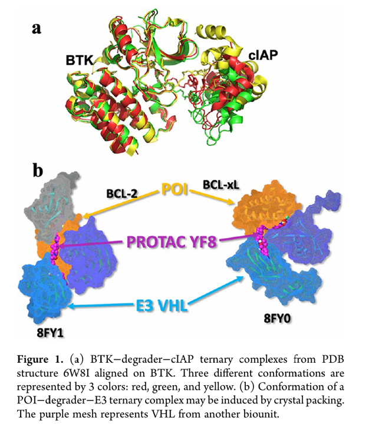

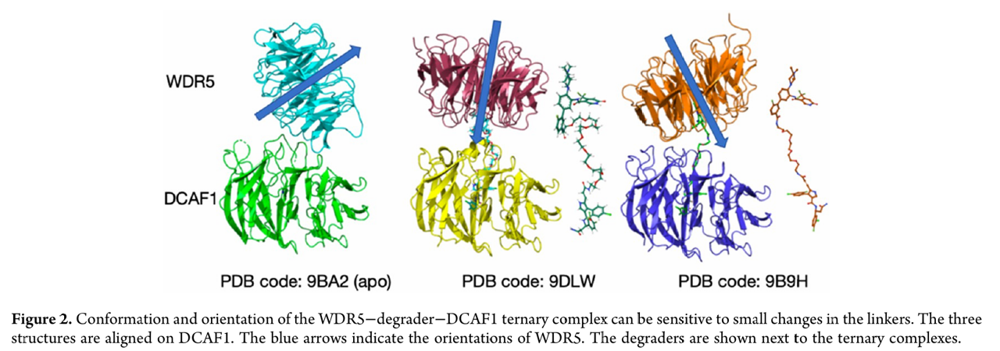

# 方法

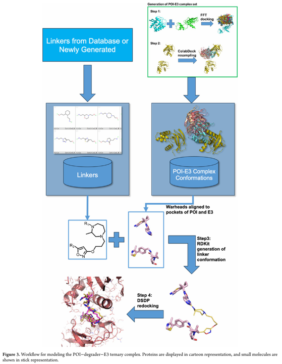

1. 使用 FFT 以及调整打分函数（在经典的打分函数的基础上调整了各项前的参数）进行蛋白-蛋白对接，同时采用 ColabDock 强化采样

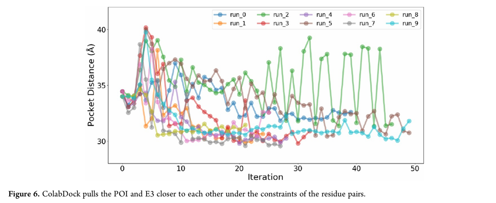

2. 用 RDKit 采样 degrader 构象之后用 DSDP 重对接

3. 使用对接得分和 RMSD 来评价三元复合物结构进行最终的筛选

4. 进行分子动力学模拟，对生成的轨迹做 PCA 降维到二维，计算分布概率评价

# 结果和讨论

截止到 2025.10 PDB数据库大约有 61 个完整的三元复合物结构，大多数少于十个紧密接触位点且相互作用表面是小于 500 $Å^2$

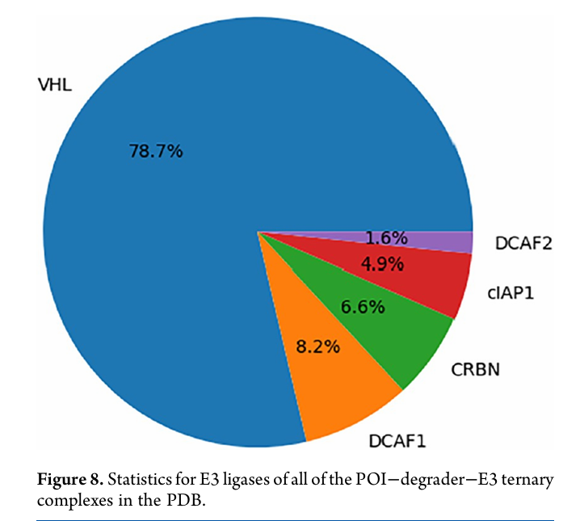

MD 轨迹以及小分子

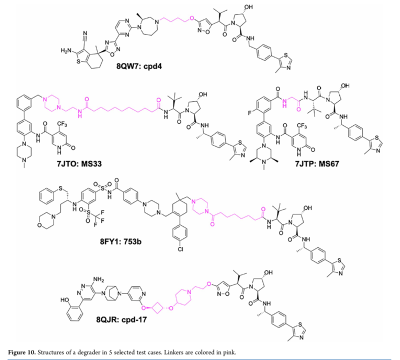

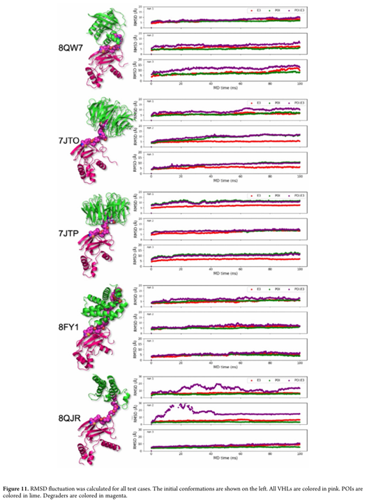

五个系统下的 contact count 和 BSA / 2

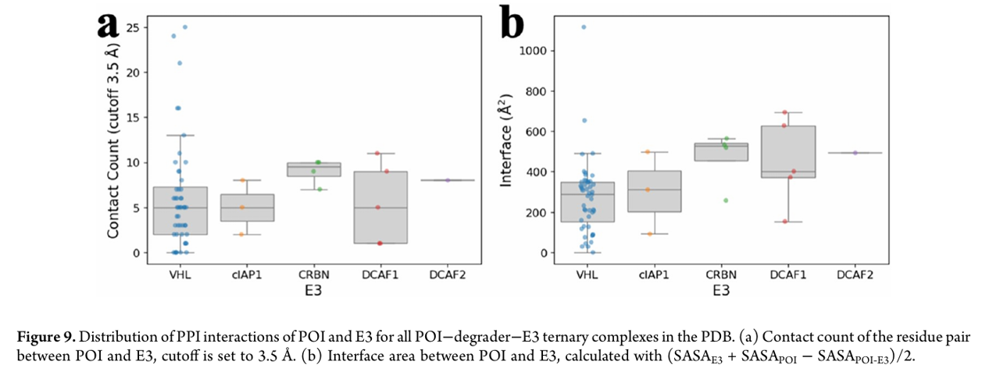

三部分距离

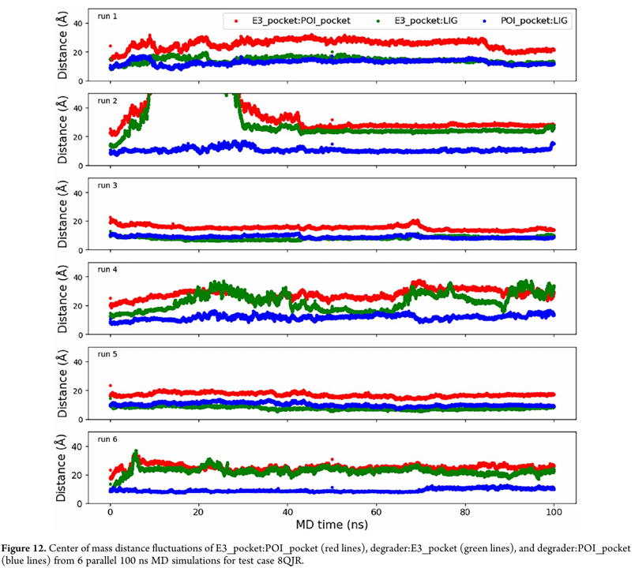

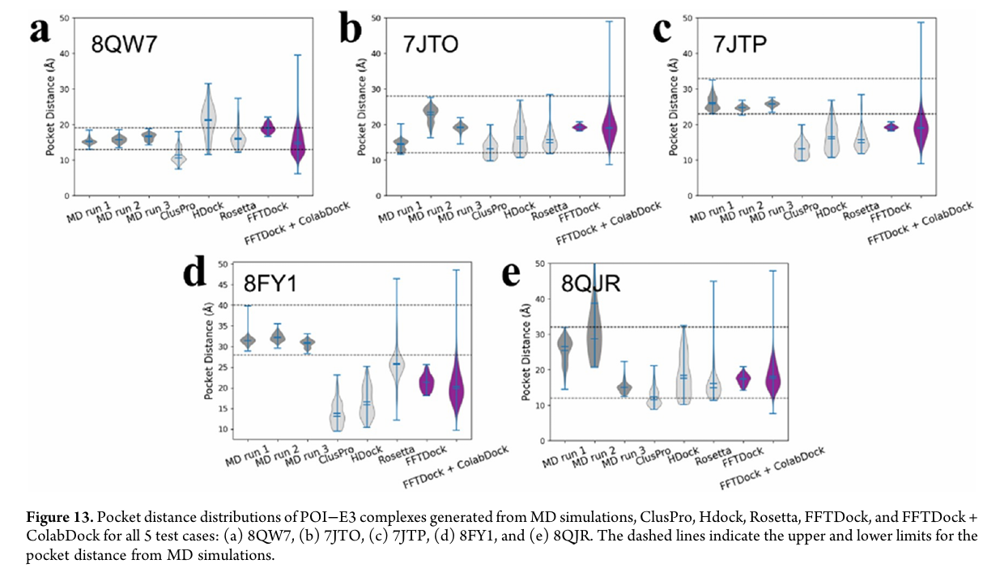

对接打分

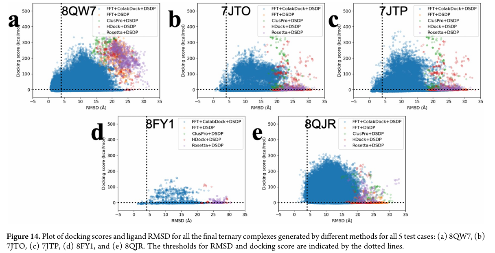

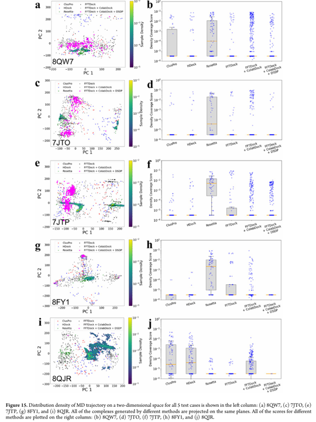

总体来讲，这篇文章的主旨就是通过 FFTDock + ColabDock + DSDP 的方法进行三元复合物的建模，然后用 MD 方法验证了排名靠前的三元复合物在模拟轨迹中以很高的发生概率覆盖了构象空间

:::tip
感觉总体上这篇文章稍微有些粗糙，而且也没有跟现在的一些主流模型如 AF3 和 Boltz2 等进行对比，这套流程看下来效率可能也不是很高，还是需要完善一下吧
:::

# 参考文献

[ Domain-Adapted Diffusion Model for PROTAC Linker Design Through the Lens of Density Ratio in Chemical Space, 2025-05](https://openreview.net/forum?id=jkyUbkNJyH)