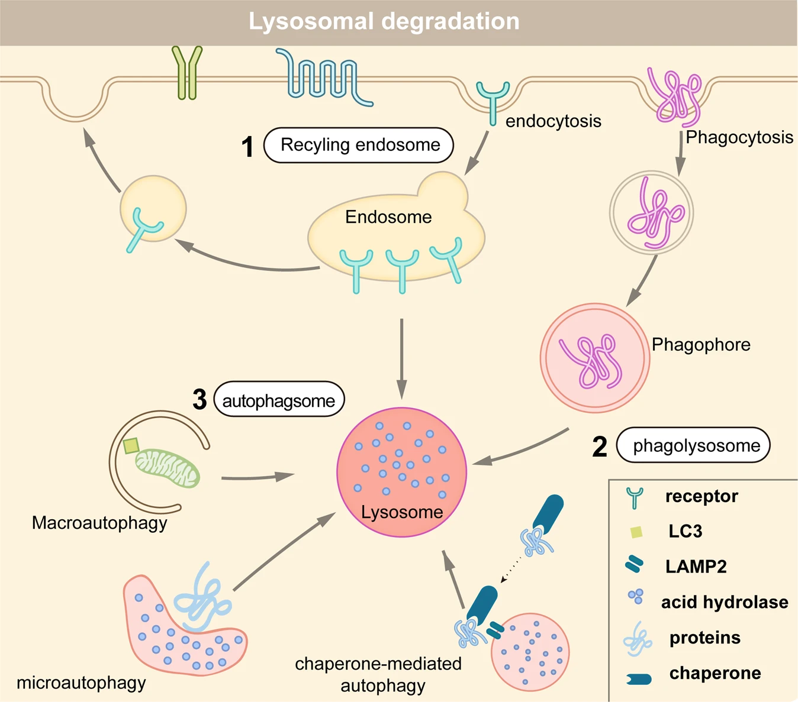

# 引言

传统药物研发主要聚焦于直接调控蛋白质活性，其中以蛋白质活性调节剂（尤其是抑制剂）的开发与应用为主流。近年来，蛋白降解靶向嵌合体（PROTAC）技术通过利用细胞自身的降解机制特异性清除疾病相关蛋白，已成为最具前景的治疗策略之一。除PROTAC外，分子胶、溶酶体靶向嵌合体（LYTAC）、抗体PROTAC（AbTAC）等多种靶向蛋白质降解（TPD）技术不断涌现。这些技术不仅极大拓展了TPD的应用范围，更为药物研发提供了全新视角。本文系统综述了主要TPD技术的最新进展，探讨了其潜在应用前景，旨在为这一蓬勃发展的领域的研究人员提供有益参考。

TPD开发中的代表性事件。紫色：与基于UPS的技术相关的技术；浅蓝色：与内体溶酶体途径相关的技术；深蓝：与自噬溶酶体途径相关的技术

# 维持蛋白质稳态的两大降解系统

蛋白质稳态（proteostasis）是指细胞通过高度复杂且相互关联的调控网络维持蛋白质浓度、构象及亚细胞定位的生物学过程。该体系包含控制蛋白质合成、折叠、转运及降解的多重通路。在真核细胞中，受损蛋白质或细胞器可通过蛋白酶体或溶酶体途径清除——这两大降解系统既相互独立又存在交叉调控。通常情况下，蛋白酶体通过泛素-蛋白酶体系统（UPS）降解短寿命蛋白质与可溶性错误折叠蛋白；而溶酶体则通过内吞作用、吞噬作用或自噬途径负责长寿命蛋白、不溶性蛋白聚集体乃至整个细胞器、大分子化合物及胞内寄生体（如某些细菌）的降解。

## Proteasomal Degradation

作为UPS系统的核心组分，蛋白酶体专门降解损伤、未折叠及功能丧失的蛋白质。UPS系统还包含多种泛素连接酶和去泛素化酶（DUBs）。76个氨基酸组成的泛素蛋白通过三步级联反应以翻译后修饰形式经异肽键与靶蛋白连接：首先泛素激活酶（E1）以ATP依赖方式结合泛素分子，随后将其转移至泛素结合酶（E2），最终由泛素连接酶（E3）催化泛素从E2向底物的转移。这三种酶的循环作用导致底物发生多聚泛素化修饰。根据泛素分子连接位点的不同（7个赖氨酸残基：K6/K11/K27/K29/K33/K48/K63及1个甲硫氨酸残基），可形成8种多聚泛素链。其中K48与K63连接形式在哺乳动物细胞中占比达80%：K48连接的泛素链通常标记靶蛋白至蛋白酶体降解；而K63链虽不介导蛋白酶体降解，但在调控溶酶体功能与炎症反应中发挥关键作用。

### PROTAC

1. 2001年，Crews和Deshaies研究团队开发了首个PROTAC分子[1](https://doi.org/10.1073/pnas.141230798)。该蛋白靶向嵌合分子1（Protac-1）被设计用于将靶蛋白蛋氨酸氨基肽酶-2（MetAP-2）招募至Skp1-Cullin-F-box（SCF）泛素连接酶复合体，从而实现降解。Protac-1包含两个结构域：一个结构域由IκBα衍生的磷酸肽（IPP）组成，用于结合SCF；另一个结构域由卵泡抑素（ovalicin）组成，用于与MetAP-2相互作用。随后，该团队证明由IκB磷酸肽和小分子组成的嵌合分子可用于降解雌激素受体（ER）和雄激素受体（AR），这两种受体分别促进乳腺癌和前列腺癌的生长。

2. 2008年，Crews团队报道了首个基于小分子的PROTAC实例[2](https://doi.org/10.1016/j.bmcl.2008.07.114)。该PROTAC由非甾体雄激素受体配体（SARM）、靶向泛素连接酶小鼠双微体2（MDM2）的MDM2配体以及基于PEG的连接链组成，用于降解雄激素受体（AR）。与基于多肽的PROTAC相比，小分子PROTAC更易被细胞吸收，也更有可能开发成药物。除MDM2外，PROTAC技术还利用了多种其他E3连接酶，包括cereblon（CRBN）、Von-Hippel-Lindau（VHL）和细胞凋亡抑制蛋白（cIAP）。

与传统小分子抑制剂相比，PROTAC具有多重优势。
- 首先，PROTAC极大地扩展了可成药蛋白的范围。目前已发现4000多种疾病相关蛋白，其中仅有约400种蛋白被成功应用于现有疗法中。由于结构复杂性、脱靶效应等原因，许多蛋白无法被传统抑制剂靶向。
- 其次，传统抑制剂仅能阻断蛋白的部分功能，而PROTAC通过降解蛋白彻底消除其所有功能。
- 第三，传统激酶抑制剂常因药物靶点的突变或过表达导致耐药性，而PROTAC通过降解靶蛋白可最大限度地减少长期选择压力带来的耐药性。
- 最后，PROTAC以亚化学计量和催化方式发挥作用，使其在低浓度下即可生效，从而降低潜在的毒副作用。

### Molecular glue

分子胶通过形成三元复合物促进两个蛋白质的二聚化或共定位。这类分子能够调控多种生物学过程，包括转录、染色质调控、蛋白质折叠、定位及降解等。分子胶降解剂能诱导泛素连接酶与靶蛋白（POI）相互作用，导致POI泛素化及后续降解。虽然分子胶和PROTAC都利用UPS系统实现蛋白降解，但二者存在重要区别（图4）。首先，PROTAC是同时结合E3连接酶和POI的双功能降解剂；而分子胶降解剂通常仅与连接酶（更常见）或POI结合，通过诱导/稳定二者的相互作用发挥作用。其次，分子胶不含 linker，因此分子量更小，具有更好的口服生物利用度和细胞渗透性。最后，分子胶的设计难度更大，尽管目前已有一些理性设计策略正在兴起。

最早的分子胶实例是免疫抑制剂环孢素A（CsA）和FK506。[3](https://doi.org/10.1126/science.aao5902),[4](https://doi.org/10.1038/s41589-020-0469-1)机制研究表明，CsA和FK506分别诱导形成亲环蛋白-CsA-钙调磷酸酶和FKBP12-FK506-钙调磷酸酶复合物，由此产生了"分子胶"这一术语。随后，另一种免疫抑制剂雷帕霉素也被发现可作为分子胶，通过稳定FKBP12-雷帕霉素-FRB（mTOR）三元复合物发挥作用。除免疫抑制外，雷帕霉素及其类似物还具有抗真菌、抗肿瘤和抗衰老活性。

分子胶降解剂的典型代表包括沙利度胺、来那度胺和泊马度胺。有趣的是，这些化合物早在作用机制阐明之前就已获得FDA批准用于治疗多种肿瘤。多年后发现，这类化合物是通过作为分子胶发挥抗肿瘤活性的。它们能诱导E3连接酶cereblon与其转录因子底物IKZF1/3相互作用，从而导致IKZF1/3降解。由于具有更理想的药物特性，分子胶必将获得学术界和制药界越来越多的关注。

### Double-mechanism degrader

复杂疾病（如癌症）的治疗往往需要靶向多个靶点。Yang等人报道了一种能同时靶向布鲁顿酪氨酸激酶（BTK）和G1至S期转化蛋白1（GSPT1）的小分子化合物GBD-9[5](https://doi.org/10.1038/s41422-021-00533-6)。BTK作为酪氨酸激酶和BCR（B细胞受体）信号通路的关键调控因子，在多种淋巴瘤细胞中过度表达；而GSPT1作为翻译终止因子，参与调控哺乳动物细胞生长。值得注意的是，GBD-9兼具PROTAC和分子胶的双重特性：研究者通过调节BTK-PROTAC连接链长度，巧妙平衡了两种降解模式的活性。实验表明，GBD-9既能作为PROTAC促进BTK降解，又可作为分子胶诱导GSPT1降解。因此，相较于BTK小分子抑制剂伊布替尼，GBD-9在多种癌细胞系中展现出更强的抗增殖效应。未来研究需进一步阐明GBD-9的作用机制。鉴于PROTAC和分子胶各具优势与局限，开发更多能整合两种策略优势的降解剂将极具前景。

## Lysosomal Degradation

溶酶体作为细胞的核心降解区室，通过内吞作用、吞噬作用或自噬途径接收降解底物。在内吞过程中，部分细胞表面蛋白可被回收至质膜或其他细胞器，而另一些则被标记K63连接型泛素链，进而分选进入运输所需内体分选复合体（ESCRT）的降解通路。吞噬作用作为内吞的特殊形式，能使细胞吞噬病原微生物等大型颗粒物。自噬则是进化保守的溶酶体依赖过程：待降解的细胞器或蛋白质被包裹于双层膜结构的自噬体中，最终通过自噬体-溶酶体融合实现内容物分解。

蛋白质通过三种不同的溶酶体途径降解：（1）`内吞-溶酶体途径`：细胞表面蛋白经内吞作用进入内体后，可被溶酶体降解，或回收至质膜及其他细胞器；（2）`吞噬-溶酶体途径`：细胞通过吞噬作用将病原体等大型胞外颗粒内化，最终由溶酶体降解；（3）`自噬-溶酶体途径`：错误折叠蛋白、受损细胞器及胞内病原体通过该途径清除。根据作用机制差异，自噬可分为三类：巨自噬、微自噬和分子伴侣介导的自噬。自噬途径存在三种形式：巨自噬、微自噬和分子伴侣介导的自噬（CMA）。在巨自噬过程中，功能异常的蛋白质或细胞器被自噬受体识别，并选择性地包裹在自噬体中。随后自噬体与溶酶体融合，其内容物被降解。在微自噬中，溶酶体直接吞噬自噬底物并导致其降解。而在CMA中，蛋白质被分子伴侣选择性地靶向至溶酶体，并直接跨膜转运进入溶酶体降解。CMA具有两个独特特征：第一，CMA仅降解特定蛋白质而不作用于细胞器；第二，CMA过程不需要形成自噬体

随着对内体-溶酶体和自噬体-溶酶体降解途径的深入研究，近年来基于溶酶体途径的靶向蛋白降解（TPD）策略不断涌现，包括LYTAC、AbTAC、ATTEC、AUTAC、双特异性适配体嵌合体和AUTOTAC等。与仅能降解某些细胞内蛋白质的基于蛋白酶体的TPD相比，基于溶酶体的TPD技术具有清除蛋白质聚集体、受损或多余的细胞器、膜蛋白以及细胞外蛋白质的潜力。

LYTAC及其他通过溶酶体途径的降解技术工作原理以及各技术作用机制：

### LYTAC

LYTAC（溶酶体靶向嵌合体）是一种通过内吞-溶酶体途径降解胞外蛋白和膜蛋白的新兴技术。鉴于胞外蛋白和膜蛋白占编码蛋白总量的40%，且在神经退行性疾病、自身免疫疾病和癌症中起关键作用，LYTAC技术对PROTAC形成了重要补充。LYTAC分子能同时结合以下两种靶标：
1）膜蛋白的胞外结构域或游离的胞外蛋白
2）细胞表面的溶酶体靶向受体`（LTR）`
三元复合物的形成会引发网格蛋白介导的内吞作用，最终导致靶蛋白被溶酶体降解。

首个报道的LYTAC分子基于阳离子非依赖性甘露糖-6-磷酸受体（CI-MPR，亦称IGF2R）构建。CI-MPR负责介导溶酶体酶的胞内运输——这些酶携带经甘露糖-6-磷酸（M6P）修饰的N-聚糖。在内体酸性环境下，溶酶体酶与CI-MPR发生解离：前者被靶向至溶酶体降解，而CI-MPR则返回高尔基体或细胞膜循环利用。研究者利用这一天然机制，通过将小分子/抗体与人工合成的CI-MPR配体（poly-M6Pn）偶联，成功开发出首批LYTAC分子。例如：
• 将poly-M6Pn与EGFR抗体西妥昔单抗偶联，可在多种细胞系中特异性降解EGFR
• poly-M6Pn与抗PD-L1抗体结合后，能显著降低细胞表面PD-L1水平

虽然CI-MPR普遍表达于各类组织，但某些LTR具有组织特异性。靶向这类受体的LYTAC分子可实现组织特异性蛋白降解。例如：
基于肝特异性LTR——去唾液酸糖蛋白受体（ASGPR）设计的LYTAC分子，通过抗体与N-乙酰半乳糖胺（GalNAc）融合实现靶向。共培养实验证实，该技术仅选择性作用于表达ASGPR的细胞。随着CI-MPR和ASGPR-LYTAC的成功应用，发掘新型LTR已成为该领域的重要方向。

### Bispecific aptamer chimera

双特异性适配体嵌合体（Bispecific Aptamer Chimera）与LYTAC类似，同样通过内吞-溶酶体途径介导靶蛋白（POI）的降解。与LYTAC不同的是，该技术利用DNA适配体分别靶向CI-MPR和跨膜靶蛋白。韩团队设计了首个双特异性适配体嵌合体分子A1-L-A2，其中：A1和A2分别特异性结合CI-MPR和靶蛋白，L代表连接DNA序列，实验表明，这类适配体嵌合体能够引导膜蛋白（如受体酪氨酸激酶MET和PTK-7）进入溶酶体降解途径，同时对非靶向蛋白的水平没有显著影响。总体而言，该方法为诱导膜蛋白降解提供了一个强大、高效且多功能的平台。与抗体相比，核酸适配体具有诸多优势，包括制备简单、合成精确以及稳定性高等特点。

### AbTAC

抗体PROTAC（AbTAC）是另一种新兴的靶向蛋白降解技术，可诱导细胞外和膜蛋白的降解。与传统PROTAC相比，AbTAC能够靶向膜蛋白，从而极大扩展了当前TPD策略的潜在底物范围。虽然名为"PROTAC"，但AbTAC与LYTAC的技术原理更为接近。AbTAC采用双特异性抗体设计：

一个结合臂靶向细胞表面靶蛋白（POI）

另一个结合臂靶向跨膜E3连接酶（如RNF43）

AbTAC分子的加入会诱导复合体内化，并导致靶蛋白在溶酶体中降解。与LYTAC类似，AbTAC同样通过内体-溶酶体途径介导细胞表面靶蛋白的降解。然而，AbTAC的作用机制较LYTAC更为复杂，目前存在以下关键科学问题亟待解决：靶蛋白内化前其胞内结构域是否发生泛素化修饰？若存在泛素化，该修饰如何影响复合体内化过程？RNF43是否能像LYTAC受体（CI-MPR和ASGPR）一样被循环利用？

### GlueTAC

近期开发的GlueTAC技术为细胞表面蛋白降解提供了全新解决方案。该技术通过三大核心技术实现高效降解：首先采用纳米抗体替代传统抗体，显著提升细胞穿透能力；其次在纳米抗体与抗原间引入共价结合，有效克服低亲和力问题并降低脱靶风险；最后通过连接细胞穿透肽与溶酶体分选序列（CPP-LSS），促进靶蛋白的内化和溶酶体定向降解。研究团队以PD-L1为模型靶点验证GlueTAC效果，结果显示：相比FDA已批准的PD-L1抗体阿特珠单抗，GlueTAC分子能更显著降低细胞内PD-L1水平，并在免疫缺陷小鼠模型中表现出更强的肿瘤抑制效果。然而GlueTAC技术仍需解决两大关键问题：一是安全性问题，由于采用非天然氨基酸构建的纳米抗体与抗原形成共价键，其生物安全性需全面评估；二是药代动力学问题，纳米抗体缺乏重链结构导致无法结合FcRn，其体内半衰期特性有待深入研究。

### AUTAC

除了内吞-溶酶体途径外，自噬-溶酶体通路为靶向蛋白降解（TPD）提供了另一条重要途径。`8-硝基环磷酸鸟苷（8-nitro-cGMP）`作为细胞内关键信号分子，能够介导自噬体的募集。基于这一特性，研究人员开发了自噬靶向嵌合体（AUTAC）技术。AUTAC分子由三部分组成：
1）基于cGMP的降解标签 2）连接链 3）靶向特定蛋白或细胞器的小分子配体, 其作用机制是通过诱导K63连接型多聚泛素化，进而引发溶酶体介导的降解。这与PROTAC分子诱导K48连接型多聚泛素化并通过蛋白酶体降解的机制形成鲜明对比。

AUTAC技术的独特优势在于不仅能降解胞质蛋白，还可清除线粒体等细胞器。研究表明，线粒体功能障碍与多种衰老相关疾病密切相关，而清除功能异常或受损的线粒体可能改善这些疾病。Takahashi团队开发的AUTAC4分子通过使用2-苯基吲哚衍生物（线粒体外膜转运蛋白配体）作为线粒体结合域，成功促进了碎片化线粒体的自噬清除。实验证明，AUTAC4处理能够恢复线粒体膜电位和ATP生成。

### ATTEC

类似于基于自噬的AUTAC技术，自噬体栓系化合物（ATTEC）通过将靶蛋白与自噬体栓系来实现降解功能。与AUTAC招募自噬体进行降解不同，ATTEC直接结合自噬体关键蛋白LC3。Lu及其团队发现了一类能同时结合LC3蛋白和致病性突变亨廷顿蛋白的小分子化合物。值得注意的是，这些分子能区分野生型和突变型亨廷顿蛋白，尽管两者仅在多聚谷氨酰胺（polyQ）延伸长度上存在差异。突变型亨廷顿蛋白含有至少36个谷氨酰胺重复序列，且polyQ延伸越长，症状通常出现得越早。研究人员提出，这些分子通过识别突变蛋白中扩展的polyQ构象来区分突变型与野生型蛋白。ATTEC对突变亨廷顿蛋白的特异性识别为亨廷顿舞蹈症的治疗提供了新思路。此外，这些ATTEC分子是否也能应用于其他polyQ疾病，如齿状核红核苍白球路易体萎缩症和马查多-约瑟夫病，将是一个值得探讨的问题。

最近，Lu团队进一步拓展了ATTEC的应用，开发出靶向细胞内脂肪储存细胞器脂滴的LD-ATTEC小分子。这些化合物在微摩尔浓度下既能结合LC3蛋白又能结合脂滴，可有效减少脂滴数量，并在两种独立的小鼠模型中成功改善脂滴相关表型。这些研究共同表明，ATTEC技术能够利用自噬-溶酶体途径实现蛋白质和非蛋白质物质的降解。

### AUTOTAC

自噬货物受体p62/SQSTM1在连接多聚泛素化货物与自噬体过程中起关键作用。当多聚泛素化货物与p62的UBA结构域结合后，会引起p62构象变化，暴露出其LIR基序，从而促进与自噬膜上LC3蛋白的相互作用。Ji等人开发的AUTOTAC（自噬靶向嵌合体）平台创新性地绕过了对泛素化的依赖。该分子由两个功能模块组成：一个与p62的ZZ结构域相互作用，另一个特异性结合靶蛋白（POI）。AUTOTAC分子能够在不依赖靶蛋白泛素化修饰的情况下，直接桥接靶蛋白与p62，并通过促进p62寡聚化和激活，最终引导靶蛋白通过自噬-溶酶体途径降解。

AUTOTAC技术的独特优势在于不仅能降解单体蛋白，还可有效清除易聚集蛋白。Ji团队在表达人类病理性tau突变体的小鼠模型中发现，AUTOTAC能高效清除错误折叠的tau蛋白，而基于蛋白酶体的PROTAC和分子胶技术对此类蛋白通常无效。除tau蛋白外，AUTOTAC还能有效降解多种致癌蛋白，如雄激素受体（AR）。这些发现表明AUTOTAC技术在神经退行性疾病和肿瘤治疗领域具有重要应用价值。

### CMA-based degrader

分子伴侣介导的自噬（CMA）中，热休克蛋白70（HSC70）能够识别含有KFERQ序列的可溶性蛋白底物。随后，HSC70-底物复合物与溶酶体膜上的溶酶体相关膜蛋白2A（LAMP2）结合，最终将底物转运至溶酶体腔内降解。基于这一机制，研究人员设计了含有KFERQ序列和靶蛋白结合序列的嵌合肽，用于降解致病性或错误折叠蛋白。CMA降解剂包含三个关键功能域：细胞膜穿透序列、靶蛋白结合序列和CMA靶向基序。当加入细胞后，CMA降解剂首先穿透细胞膜，随后通过靶蛋白结合序列与目标蛋白结合，最终将复合物转运至溶酶体完成降解。实验证明，该策略可有效降低突变亨廷顿蛋白、PSD-95、死亡相关蛋白激酶1（DAPK1）以及α-突触核蛋白的水平。然而，CMA降解剂要成为有效的治疗策略仍需解决两个主要问题：首先是降解剂的稳定性问题，其次是递送效率问题。总体而言，虽然CMA降解剂为靶向蛋白降解提供了新方法，但与PROTAC和LYTAC等其他技术相比，它面临着独特的开发挑战。

# 靶向蛋白降解在疾病治疗中的应用

## Cancer

雌激素受体（ER）作为基因表达的主要调控因子，在乳腺癌发生发展中起关键作用。Arvinas公司开发的ER靶向PROTAC分子ARV-471在临床前实验中能有效降解ER，显著减轻移植瘤模型的肿瘤负荷。目前处于II期临床试验阶段的ARV-471既可单药使用，也可与CDK4/6抑制剂联用，临床数据显示其具有良好口服生物利用度和耐受性。

另一款进入II期临床试验的PROTAC分子ARV-110选择性靶向雄激素受体（AR），被开发用于治疗男性第二大常见恶性肿瘤——前列腺癌。值得注意的是，ARV-110对携带AR T878X/H875Y突变且对现有AR靶向治疗耐药的患者表现出显著疗效，这凸显了靶向蛋白降解技术在攻克"不可成药"靶点方面的独特优势。

持续激活的STAT3蛋白与多种人类癌症密切相关。虽然靶向STAT3 SH2结构域的小分子抑制剂存在选择性差、临床活性有限等问题，但近期开发的STAT3 PROTAC降解剂SD-36在白血病和淋巴瘤细胞系中能高效快速降解STAT3蛋白。该分子对所有STAT蛋白家族成员表现出高度选择性，并在多种移植瘤小鼠模型中实现持久稳定的STAT3降解。

BCL-2家族成员BCL-XL通过抑制程序性细胞死亡促进肿瘤存活。尽管已开发出ABT263等BCL-2/BCL-XL双重抑制剂，但其严重副作用限制了临床应用。最新研究的BCL-XL PROTAC分子DT2216通过将ABT263与VHL配体偶联，不仅能有效降解肿瘤细胞中BCL-XL，还因血小板中VHL低表达而显著降低毒副作用。有趣的是，虽然DT2216对BCL-XL和BCL-2具有相似结合力，但仅诱导BCL-XL的降解。

## Neurodegenerative diseases

神经退行性疾病（NDs）是一组以进行性运动或认知功能障碍为特征的疾病，包括阿尔茨海默病（AD）、帕金森病（PD）和亨廷顿病（HD）等。这类疾病与蛋白质错误折叠形成的不溶性聚集体密切相关，这些错误折叠蛋白往往表现出与正常功能无关的特殊蛋白-蛋白相互作用（PPIs）。传统药物研发主要基于调控靶蛋白功能，因此迫切需要开发像靶向蛋白降解（TPD）这样的新策略来治疗神经退行性疾病。

2016年，陈和李课题组首次尝试将PROTAC技术应用于神经退行性疾病治疗，报道了靶向tau蛋白的PROTAC分子。他们设计的PROTAC分子是由tau蛋白结合肽、连接链、VHL结合肽和细胞穿透肽组成的嵌合体，能显著降解tau蛋白并降低Aβ的神经毒性。随后，江等人开发了另一种针对AD的多肽PROTAC，采用CRLKeap1结合序列，也成功实现了tau蛋白的降解。这些研究为神经退行性疾病的治疗提供了新思路。

## Inflammatory diseases

除了癌症和神经退行性疾病外，靶向蛋白降解（TPD）技术的应用已扩展至炎症性疾病和免疫肿瘤学领域。白介素-1受体相关激酶4（IRAK-4）作为IRAK激酶家族成员，参与Toll样受体（TLR）和IL-1R信号通路传导。当TLR激活时，IRAK-4被募集形成Myddosome复合体，进而磷酸化IRAK1和IRAK2等其他家族成员。值得注意的是，IRAK-4除激酶活性外，其在TLR信号中的支架作用也已被证实。相比传统抑制剂，IRAK-4降解剂通过同时消除其酶活性和非酶功能展现出显著优势。目前已有多个靶向IRAK-4的PROTAC分子被开发，其中一款已进入治疗自身免疫性疾病的I期临床试验。

布鲁顿酪氨酸激酶（BTK）是炎症和肿瘤治疗的经典靶点。虽然BTK抑制剂已获批用于治疗白血病等血液系统恶性肿瘤，但BTK突变导致的耐药性限制了其疗效。BTK降解剂可同时降解野生型和突变型BTK蛋白，为这一难题提供了解决方案。目前有两款BTK PROTAC分子正在开展针对B细胞恶性肿瘤和自身免疫性疾病的I期临床试验。

## Viral infection

病毒感染对全球公共卫生构成重大挑战，其中SARS-CoV-2（新冠病毒）已导致全球超过4亿人感染、570万人死亡。靶向蛋白降解（TPD）技术为抗病毒治疗提供了新思路。首个成功案例是针对丙型肝炎病毒（HCV）NS3/4A蛋白酶的降解——de Wispelaere团队基于蛋白酶抑制剂特拉匹韦（telaprevir）设计的PROTAC分子，在细胞感染模型中显示出抗HCV活性。除PROTAC外，基于自噬-溶酶体通路的AUTAC和ATTEC等技术也可用于清除关键病毒蛋白，为抗病毒治疗提供更多选择。

# 总结和展望

过去二十年见证了靶向蛋白降解（TPD）技术的诞生与蓬勃发展。其中，基于泛素-蛋白酶体系统的PROTAC和分子胶技术最为成熟，主要用于细胞内蛋白的降解。近五年来，利用细胞第二降解通路的新技术快速崛起，根据作用机制可分为两大类：一类是通过内体-溶酶体途径降解胞外和膜蛋白的LYTAC、双特异性适配体嵌合体、AbTAC和GlueTAC；另一类是通过自噬-溶酶体途径清除错误折叠蛋白、蛋白聚集体或受损细胞器的AUTAC、ATTEC、AUTOTAC和CMA嵌合体技术。

尽管包括抗癌候选药物ARV-110和ARV-471在内的多个PROTAC分子在临床试验中表现优异，但该技术仍面临三大挑战：首先，由于分子量较大，PROTAC存在细胞渗透性和口服生物利用度等成药性问题，而分子胶虽具有分子量优势却难以理性设计；其次，目前仅开发利用了人类600多种E3泛素连接酶中的少数几种（如VHL、CRBN、IAPs和MDM2）；再者，PROTAC可能因完全降解靶蛋白（而非单纯抑制）导致更显著的毒性风险。

相较而言，基于溶酶体的TPD技术尚处发展初期。我们仍需深入探究各技术的具体机制——溶酶体作为重要细胞器，除蛋白降解外还调控代谢和稳态等生理功能，"劫持"其降解通路可能产生的系统性影响尚不明确。当前LYTAC技术仅依赖CI-MPR和ASGPR两种受体，亟需拓展溶酶体靶向受体库。对AUTAC、ATTEC和AUTOTAC分子仍需开展结构-活性关系研究及作用机制解析，以推动自噬降解技术达到PROTAC的普适性水平。虽然CMA降解剂目前受限于细胞膜穿透性和稳定性，但小分子化可能突破这些瓶颈。尽管存在挑战，TPD技术不仅将为生物医学研究提供强大工具，更将在未来药物研发中展现巨大潜力。可以预见，基于溶酶体的技术通过极大拓展PROTAC和分子胶的靶标范围，必将引发该领域的研究热潮。

# 参考文献

[ Targeted protein degradation: mechanisms, strategies and application, 2022-04](https://doi.org/10.1038/s41392-022-00966-4)