# 引言

靶向蛋白降解（TPD）技术经过二十余年的发展，已从最初的概念验证演变为现代药物发现领域中极具吸引力的发展方向¹。在众多TPD策略中，基于嵌合小分子的降解方式备受关注。其中，蛋白酶体靶向嵌合体（PROTAC）已取得显著进展，目前已有超过20个候选分子进入临床试验阶段²。在此基础上，研究者进一步拓展了PROTAC的设计理念，发展出更广泛的TACs（Targeting Chimeras）体系，包括溶酶体靶向嵌合体（LYTAC）、自噬靶向嵌合体（AUTAC）、自噬小体桥接化合物（ATTEC）以及分子胶降解剂等³。这些创新策略将降解机制从经典的泛素-蛋白酶体系统（UPS）扩展至溶酶体和自噬相关途径（Fig.1），极大地拓宽了可成药靶点范围，尤其适用于膜蛋白及非酶类蛋白⁴。

与传统小分子抑制剂相比，TAC类药物具有显著优势，例如可降解过去被视为“不可成药”的蛋白，并能克服由靶点突变引起的耐药性⁵⁻⁶。这些独特特性使其成为治疗癌症、神经退行性疾病及自身免疫疾病的极具前景的策略。

本综述将基于连接子的化学与生物特性进行分类，系统总结其在不同TAC设计中的代表性案例，并重点讨论当前的发展趋势、策略与挑战。通过典型实例分析不同类型连接子对药效的影响，希望为该领域研究提供清晰框架，揭示潜在机遇，并为未来TAC类药物的开发提供指导。

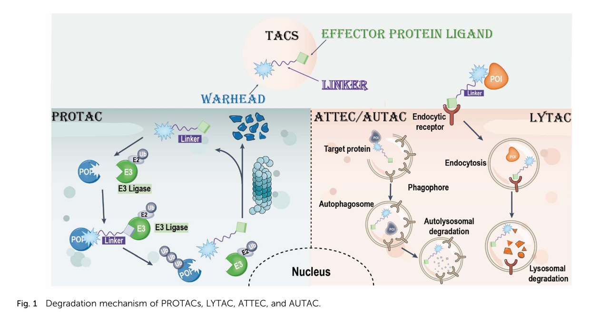

# Linker Types in TACs

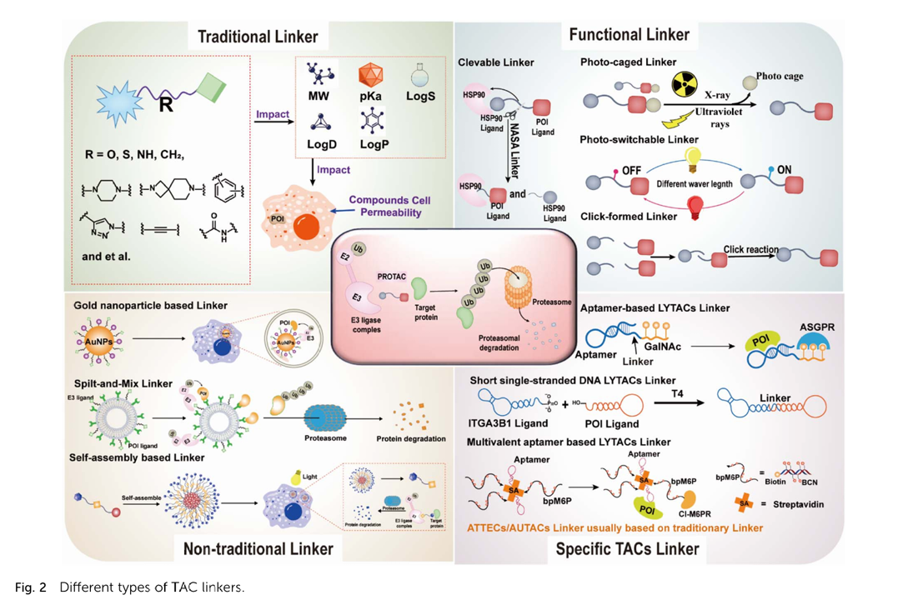

可以大致分为四类，即传统连接子，功能化连接子，非传统连接子 和特殊连接子

传统连接子包括柔性与相对刚性两种类型。柔性连接子主要由烷基链（alkyl-based）、聚乙二醇（PEG-based）以及酰胺结构（amide-based）构成；而刚性连接子则多采用环烷烃（cycloalkane-based）、螺环结构（spiro-based）及芳香族骨架（aryl-based）。这些连接子能够调控分子的分子量（MW）、pKa、logS、log D和logP等理化参数，从而决定TACs的整体成药性特征。

功能化连接子则包括可切割型（cleavable）、光笼型（photocaged）、光开关型（photoswitchable）以及点击化学型（click-based）连接子。与传统连接子不同，功能化连接子不仅可以促进细胞摄取和膜通透性，还能实现TAC分子的时空精确激活，从而降低脱靶结合与毒性。

此外，近年来也出现了一系列非传统连接子，例如金纳米颗粒（gold nanoparticle-based）连接子、split-and-mix系统、自组装（self-assembly-based）型连接子等。这类连接子常用于提高膜通透性，并支持特定组织或器官的靶向递送。

最后，还有一些特特殊连接子被陆续报道，包括适配体（aptamer-based）连接子、短单链DNA连接子以及多价适配体构型（multivalent aptamer constructs）。值得注意的是，在ATTEC与AUTAC类降解剂中，多数连接子仍是基于传统连接子框架进行改造而来。

## 传统连接子

### 2.1.1 传统脂肪族与芳香族连接子

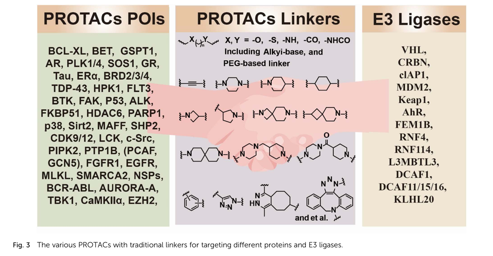

最常用的连接子类型包括：
- PEG 基连接子；
- 烷基类连接子；
- 环烷烃类连接子；
- 螺环类连接子；
- 芳香族连接子。

这些连接子通常通过以下官能团与配体偶联：胺、酰胺、单键或多重 C–C 键等。传统连接子往往结合了疏水结构片段（如线性或环状烷烃）和亲水结构片段（如 PEG、哌啶、哌嗪、酰胺等），以平衡关键的类药性质，例如 pKa、logS、logD、logP 以及整体成药性。

此外，芳香族连接子（如苯基衍生物和三唑）还具有以下优势：
- 更高的化学稳定性；
- 更强的分子刚性；
- 改善的细胞通透性。

因此，成功设计高效 PROTAC 分子的重要关键在于**优化连接子的长度、极性以及连接化学方式**，这些因素共同影响 PROTAC 的效率与选择性。

### 2.1.2 三价 Y 型连接子 PROTAC

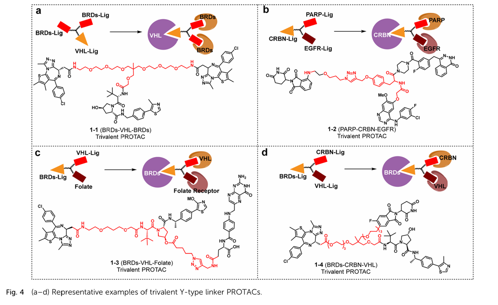

传统 PROTAC 通常为双价分子，通过两个不同的配体同时结合 E3 连接酶与 靶蛋白（POI）。为了进一步提升降解效率，研究人员提出了一种聚合策略，即引入三功能 Y 型核心连接子，将独立抑制剂与 E3 配体连接在一起。

Imaide 等人提出，提高 PROTAC 的结合价数可能增强降解效率，因此他们设计了三价 PROTAC，由双价 BRD 抑制剂与 E3 配体通过 Y 型连接子连接。与传统双价 PROTAC 相比，化合物 1-1 表现出更强且更持久的降解活性，从而带来更好的抗癌效果。

Zheng 等人采用另一种策略，合成了双靶点三价 PROTAC，可同时降解 EGFR 与 PARP。他们以 gefitinib、olaparib 与 CRBN 配体为基元，并以三功能天然氨基酸为核心连接子。

叶酸受体 α（FOLR1）是一种常用于癌症靶向递送的受体，具有肿瘤组织过表达而正常组织低表达的特性。*Liu 等人通过将叶酸基团与 VHL 配体偶联，设计了三价 PROTAC，可在 FOLR1 阳性癌细胞中特异性降解 BRD 蛋白，而不影响正常细胞。

此外，三价 PROTAC 还展现出双 E3 配体招募能力。Bond 等人构建了包含 CRBN、VHL 与 BET 蛋白配体的异源三价，通过对野生型 / 单连接酶敲除 / 双连接酶敲除细胞的实验验证发现，其降解活性由 CRBN 与 VHL 共同贡献，证明了双连接酶招募策略的可行性。

## 2.2 功能化连接子

### 2.2.1 基于点击化学的连接子

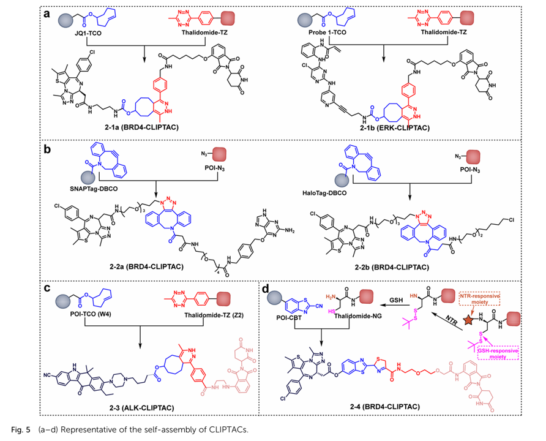

点击化学由 K. Barry Sharpless 于 2001 年首次提出，是一类高效、选择性强且具有生物正交性的化学反应。凭借其高效性与良好的生物兼容性，Click 化学广泛应用于药物研发、生物标记与靶向治疗中。近年来，研究人员基于 Click 化学原理开发了多种可在体内或体外组装的 PROTAC 分子。

Lebraud 等人首次报道了细胞内 Click 组装型 PROTAC（CLIPTAC，见图 5a）。其核心策略是将 PROTAC 分子拆分为两个带有正交反应基团的片段：带有 tetrazine（TZ）的来那度胺衍生物，以及带有 trans-cyclooctene（TCO）的 BRD4 或 ERK1/2 配体。这两部分在细胞内通过 Click 反应自发偶联生成完整的 PROTAC（2-1a 和 2-1b），并成功诱导靶蛋白降解。该模块化策略具有以下优势：

- 降低传统 PROTAC 分子量过大的问题；
- 提高水溶性与细胞通透性。

但其仍局限于体外实验，尚未验证体内效果。

Teng 等人进一步提出 ClickRNA-PROTAC 系统（图 5b），其利用 mRNA 表达 SNAP-tag（2-2a）与 HaloTag（2-2b）融合蛋白，随后通过 Click 化学连接形成完整的降解分子。该系统可通过更换 warhead 部分实现对 BRD4、KRAS 与 NF-κB 等多种靶点的降解，并采用肿瘤特异性 mRNA 翻译策略实现癌细胞选择性。其在肾上腺皮质癌异种移植模型中表现出显著抗肿瘤活性。

Xie 等人开发了可用于体内外应用的纳米 Click PROTAC（Nano-CLIPTAC，见图 5c）。该策略将 PROTAC 分子拆分为两个小片段（W4 与 Z2），并分别封装于带有环状 RGDfC 肽修饰的脂质体中，实现肿瘤靶向递送与原位 Click 自组装，生成完整的 Nano-CLIPTAC（2-3）。其以 EML4-ALK 为靶点、CRBN 为 E3 连接酶，实现了高效降解，并解决了传统 PROTAC 的脱靶效应与“hook effect”问题。

Do 等人提出酶响应型 Click PROTAC（ENCTAC，图 5d），其在缺氧肿瘤环境中特异性激活。该分子通过 NTR（硝基还原酶）与 GSH（谷胱甘肽）双响应机制分别释放胺基与巯基，使带有 2-cyanobenzothiazole（CBT）结构的 POI 配体自组装形成完整 PROTAC（2-4）。该体系实现了空间与环境可控降解，为精准靶向治疗提供了新策略。

### 2.2.2 光开关连接子

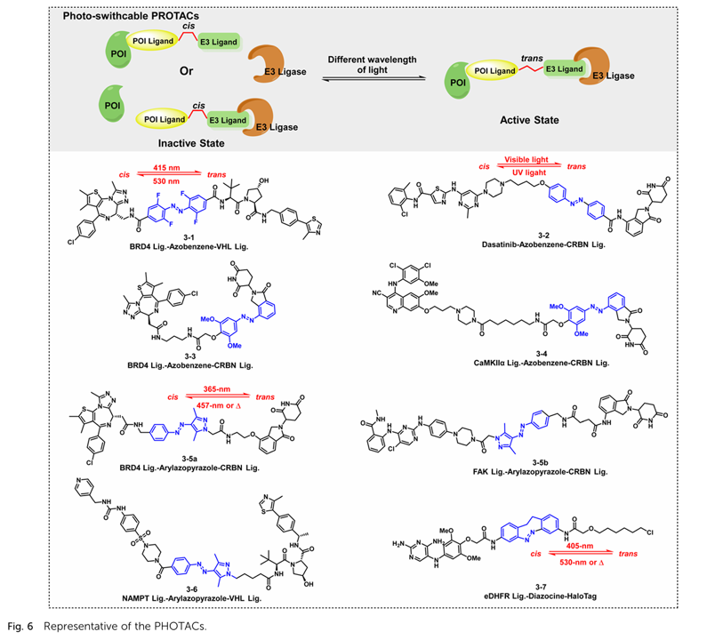

光开关连接子通过引入可逆构象变化的光响应结构（如偶氮苯、二芳乙烯等），实现对 PROTAC 分子活性的可控调节。其核心原理是依靠光照诱导的构象转变（如 *trans–cis* 异构化）调节 PROTAC 的空间构象，从而影响其三元复合物的形成能力。

Reynders 等人首次提出光控 PROTAC（PHOTAC）概念（图 6a），利用偶氮苯结构作为可控开关，使 PROTAC 在接受特定波长光照时打开或关闭其降解活性。PHOTAC 可在紫外/可见光照射下实现可逆调控，使目标蛋白的降解具备时间与空间分辨率，为精准治疗提供了新的可能性。

Pfaff 等人进一步开发了光响应型 BET 蛋白降解剂（图 6b），其采用改良偶氮苯单元，使光响应波长红移至更具组织穿透力的可见光区域。该设计不仅提高了应用的生物兼容性，还降低了紫外光可能带来的毒性风险。

尽管光开关型连接子具备高可控性和良好的可逆性，但其应用仍存在一定挑战：

- 光穿透深度有限，难以作用于深层组织；
- 需要精确光源控制设备，临床可操作性较弱；
- 异构化效率与结构稳定性需进一步优化。

未来，通过引入近红外（NIR）或双光子响应结构，有望显著提升其生物应用潜力。

### 2.2.3 光笼型连接子（Photo-Caged Linkers）

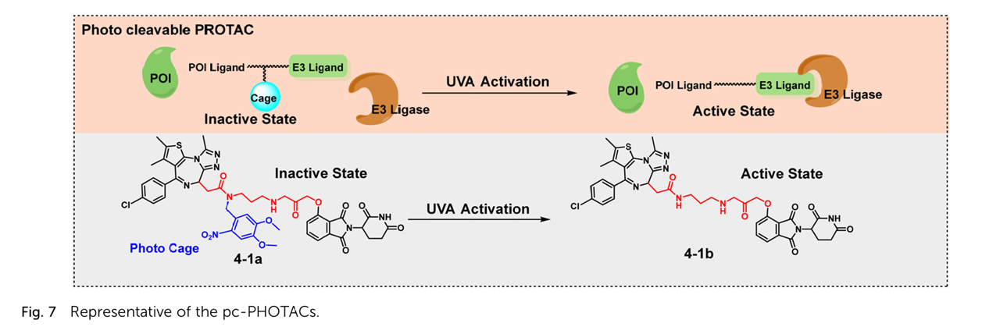

光笼型连接子通过在关键化学位点引入可光解保护基，使 PROTAC 在黑暗条件下保持失活状态，仅在特定波长光照下释放活性结构单元，从而实现高度可控的降解启动。与光开关连接子不同，光笼型结构通常为“不可逆激活”，即光照触发后 PROTAC 永久转化为活性形式。

常见的光笼基团包括邻硝基苯乙基（NPPOC）、二苯甲酮衍生物等，其在紫外或可见光照射下可迅速断裂，释放连接子或关键结合基团。该策略具有以下优点：

- 背景活性低，可显著降低系统性毒性；
- 激活条件明确，适用于特定组织或体外操作；
- 结构设计灵活，可作用于 POI 配体、E3 连接子或核心骨架。

然而，其应用仍面临一些挑战，例如光毒性、激发波长有限，以及激活后的扩散不均问题。未来的发展方向可能包括使用近红外可切割结构或通过上转换纳米材料实现深层组织激活。

### 2.2.4 可切割连接子（Cleavable Linkers）

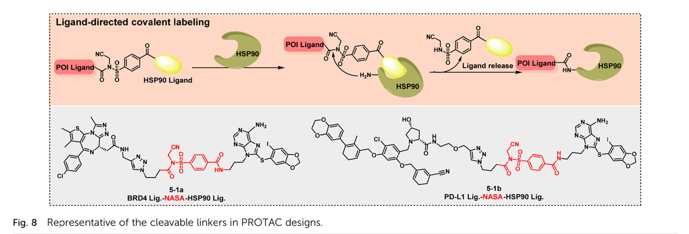

可切割连接子通过对特定化学环境（如 pH、氧化还原状态、酶活性）敏感的键型，实现 PROTAC 在特定细胞或亚细胞环境中的自动激活。常见的切割机制包括：

- pH 敏感键（如腙键、缩醛结构），适用于溶酶体或肿瘤微环境；
- 还原敏感二硫键，可在细胞内高谷胱甘肽浓度条件下断裂；
- 酶切敏感结构，例如 MMP、Cathepsin B 或组织特异性蛋白酶识别单元。

该类连接子的优势在于：

- 无需外源刺激即可激活，适合体内应用；
- 具备细胞或器官选择性，有助于避免全身性副作用；
- 可调控释放速率，实现持续性降解效应。

不过，切割速率的不确定性以及不同组织的生理差异可能导致降解效率波动。因此，可切割连接子的设计需结合目标适应症的组织代谢特性，并与药代动力学模型联合优化。

## 2.3 非传统连接子

### 2.3.1 分体混合型连接子

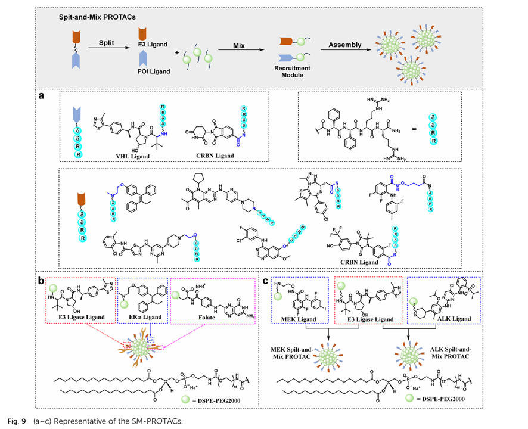

与传统 PROTAC 需要将 POI 配体与 E3 连接子共价连接为同一分子不同，Split-and-Mix PROTAC（SM-PROTAC）提出了一种“拆分（Split）+自组装（Mix）”的新策略：POI 配体与 E3 配体分别被修饰为带有自组装结构单元的独立分子，它们无需化学键直接连接，而是在体外或细胞内通过自发聚集形成功能性降解复合体。

SM-PROTAC 的优势在于：

- 模块化搭建，可快速筛选不同配体组合；
- 多价效应，可根据混合比例调控 E3 与 POI 的结合能力；
- 适用于难以直接连接的配体结构。

2023 年，Yang 等人基于二苯甘氨酸肽（ddRR）构建了首批可自组装 SM-PROTAC。研究者分别将雌激素受体（ERα）、CDK4/6、AR、MEK1/2、BRD2/4 和 BCR-ABL 的配体，以及 CRBN 和 VHL 的连接子分别修饰为 ddRR 片段，通过简单混合即可形成多种 SM-PROTAC 组合，并在体外验证了其有效降解能力。

同年，Song 等人提出脂质体自组装型 SM-PROTAC 平台。研究者使用 FA（叶酸）、Tam（他莫昔芬）和 VHL 配体，分别与 DSPE-PEG2000 偶联后混合形成三价结构，该体系能够在 FR+ 细胞中高效进入并选择性降解 ERα，且所需剂量显著降低。进一步研究中，他们将该策略拓展至 MEK 和 ALK 降解，表现出良好肿瘤抑制与生物相容性。

### 2.3.2 自组装型 Nano-TAC 连接子

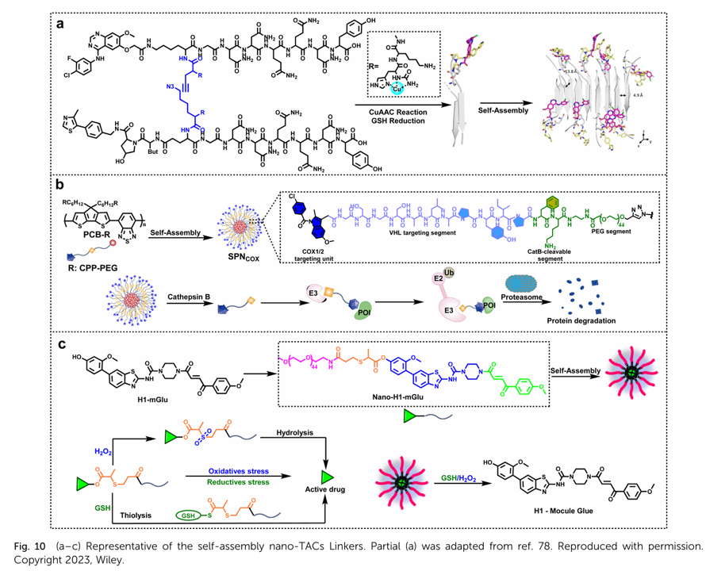

在 SM-PROTAC 策略基础上，Zhang 等人提出 Nano-PROTAC 系统，通过“胞内自组装”实现持续且剂量可调的降解效应。该体系由两种带有叠氮或炔基的亲水肽构成，分别连接 POI 和 E3 配体，在细胞高 GSH 条件下发生点击反应生成单体，并进一步组装为 β-折叠纳米结构，实现对 EGFR 与 AR 的高效降解。

此外，Zhang 等人还开发了可光控的智能 Nano-PROTAC（SPN），用于 COX-1/2 的免疫治疗。该体系利用 Cathepsin B 可切割连接子，实现肿瘤微环境特异释放，并在光激活后进一步增强免疫抑瘤效果。

Sun 等人在 2024 年提出了自组装型纳米分子胶（nano-mGlu），通过对 Bcr-Abl 分子胶 H1-mGlu 增加 PEG 自组装片段，使其在高 GSH 或 H₂O₂ 条件下释活，最终在 K562 癌症模型中实现显著抑瘤效果。

### 2.3.3 金纳米颗粒多头连接子

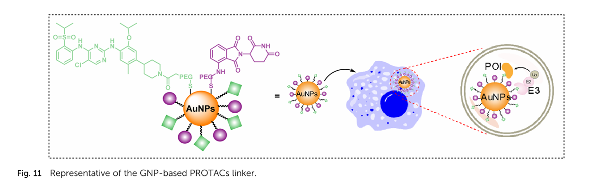

除了可逆自组装策略，Wang 等人提出利用金纳米颗粒（GNP）作为“多头连接子”核心，将 ALK 配体 Ceritinib 与 E3 配体 Pomalidomide 分别通过 PEG-SH 锚定至 GNP 表面，形成具备多价效应的 GNP-PROTAC。这种多头结构可促进 POI 与 E3 的多向聚集，显著提高降解效率，并减少对结构优化的依赖。

## 2.4 特殊连接子

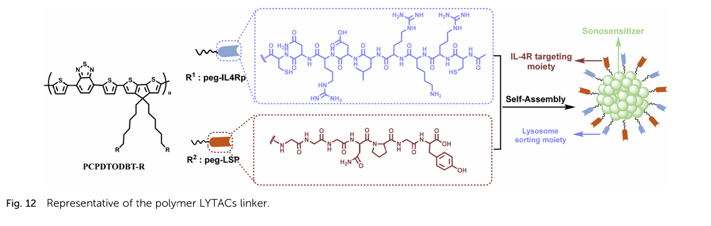

TACs类降解剂的核心原理是通过小分子或嵌合结构，将目标蛋白招募至细胞内的降解途径中。例如：

- LYTACs 通过与跨膜受体（如 CI-M6PR 或 ASGPR）结合，引导目标蛋白进入溶酶体降解路径。
- AUTACs 和 ATTECs 则依赖泛素化或自噬机制清除特定蛋白或蛋白聚集体。

与传统 PROTAC 相比，这些新型 TAC 降解剂在靶点选择性、细胞内动力学和降解机制上具有独特优势，尤其适用于细胞外蛋白、蛋白聚集体以及传统“不可成药”靶点。在这些体系中，连接子的设计尤为关键，直接影响体内药效。

### 2.4.1 LYTACs 连接子

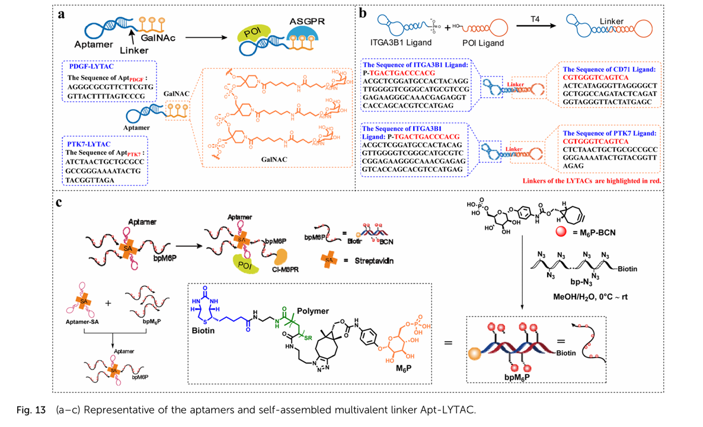

- Xu 等人开发了半导体聚合物纳米-LYTAC（SPNly），其主链为 PCPDTODBT，并通过 PEG 链连接 IL-4R 靶向肽（IL4Rp）和溶酶体定位肽（LSP）。在超声激活下，实现免疫死亡 + 受体内吞 + 溶酶体降解的联合治疗。
- Wu 等人提出了首个适配体基 LYTAC（Apt-LYTAC），将适配体与三半乳糖胺（tri-GalNAc）偶联，实现肝细胞特异性降解 PDGF 和 PTK7 等蛋白。
- Sun 等人进一步开发了双特异性适配体嵌合体（ITGBACs），通过同时识别 ITGA3B1 与膜蛋白POI，实现精准溶酶体降解，并显著抑制肿瘤增殖。
- Duan 等人利用生物素-链霉亲和素组装构建多价 Apt-LYTAC 平台，系统研究 适配体价数对降解效率的影响，发现多价偶联可显著提高膜蛋白降解效率。

### 2.4.2 AUTACs 与 ATTECs 连接子

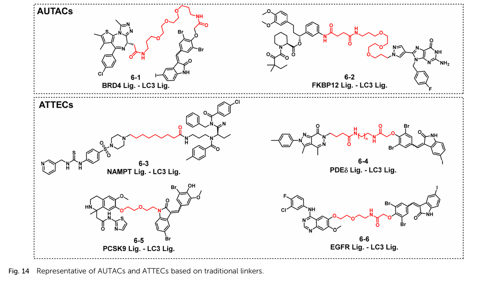

- AUTACs 由靶向配体 + 鸟嘌呤基降解标签 + 连接子 组成，引导靶蛋白进入自噬溶酶体降解路径。
- ATTECs 更类似于分子胶（Molecular Glue），通过连接靶蛋白与 LC3 自噬蛋白实现降解，有时甚至可以不需要连接子。

代表性工作：

- Pei 等人使用 PEG 连接子构建 BRD4 靶向 AUTAC，展现显著细胞抑制活性。
- Takahashi 等人提出 烷基鸟嘌呤降解标签，用于 FKBP12 降解。
- Dong 等人开发 NAMPT 靶向 ATTEC，通过柔性连接子连接 NAMPT 抑制剂 + LC3 配体，展现强效抗肿瘤活性。
- Bao 等人提出 PDEδ 靶向 ATTEC（化合物 6-4），无需改变 mRNA 即可诱导高效降解。
- Ouyang 等人构建 PCSK9 靶向 ATTEC**，其 PEG 连接子结构显著降低 LDL-C 水平，优于他汀类药物。
- Zhu 等人开发 EGFR 靶向 ATTEC（化合物 6-6），在 HCC827 细胞和小鼠模型中均表现出优秀疗效。

# 挑战与未来机遇

虽然TACs技术发展迅速，但如何设计理想的连接子（用于将靶标结合基团与招募配体，如E3连接酶配体或溶酶体靶向配体连接起来）仍然是一个重大挑战。连接子会显著影响TACs的理化性质、生物活性、选择性以及药代动力学。实现兼具稳定性、生物利用度、药代动力学和效力的最佳连接子，需要创新性的策略和跨学科合作。

此外，还需综合考虑连接子柔性与刚性之间的平衡、代谢稳定性的提升，以及在不同TAC平台上的药代动力学优化等问题。与传统药物开发不同，当前针对不同类型TACs的连接子设计缺乏系统性的设计原则，导致连接子性质难以准确预测。同时，连接子的多步合成与结构多样化通常耗时且成本高，进一步增加了开发难度。

尽管存在这些挑战，连接子设计仍存在广阔的创新空间。例如，结合分子动力学模拟、AI预测模型和三元复合物对接等方法的计算建模驱动设计，具有巨大潜力。此外，多功能连接子（如可点击、光开关或可切割连接子）值得进一步探索。未来，一个极具前景的方向是将DNA编码文库或基于片段的策略生成的大型连接子库进行高通量筛选（HTS），并结合机器学习技术识别最佳TAC连接子。

# 结论与展望

包括PROTACs、LYTACs、AUTACs和ATTECs在内的TPD技术，通过选择性降解疾病相关蛋白（包括传统意义上“不可成药”靶点），已经彻底改变了药物发现模式。随着连接子设计的进步，如点击化学、光开关、可切割和自组装型连接子的引入，这些降解剂的适用性、特异性和治疗效果得到了显著提升。这些平台还通过可控的蛋白清除机制，引入了调控生物通路的新策略。

然而，在连接子设计方面仍存在诸多挑战。如何实现兼具柔韧性、稳定性、药代动力学与效力的最优连接子仍是一大难题。缺乏系统性的设计规则以及连接子多步合成的复杂性，也阻碍了TAC类疗法的快速发展。

综上所述，未来应着重发展高效且可预测的连接子设计策略，结合计算建模、机器学习与高通量筛选技术。同时，持续探索具有可点击或光响应等功能的多功能连接子，将进一步提升TAC平台的多样性与精准性。随着研究与创新的不断推进，TPD技术有望拓展治疗版图，覆盖更广泛的疾病类型。

# 参考文献

[ Rational design of the linkers in targeting chimeras, 2025-09](https://doi.org/10.1039/D5SC04859A)