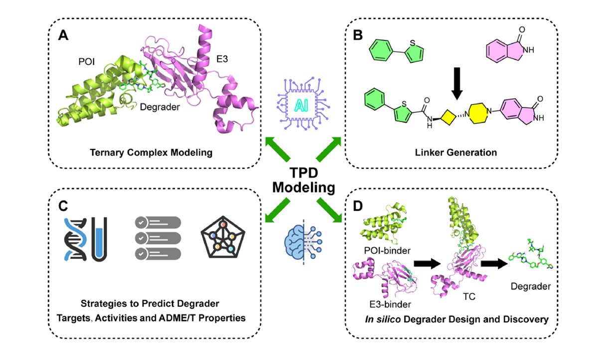
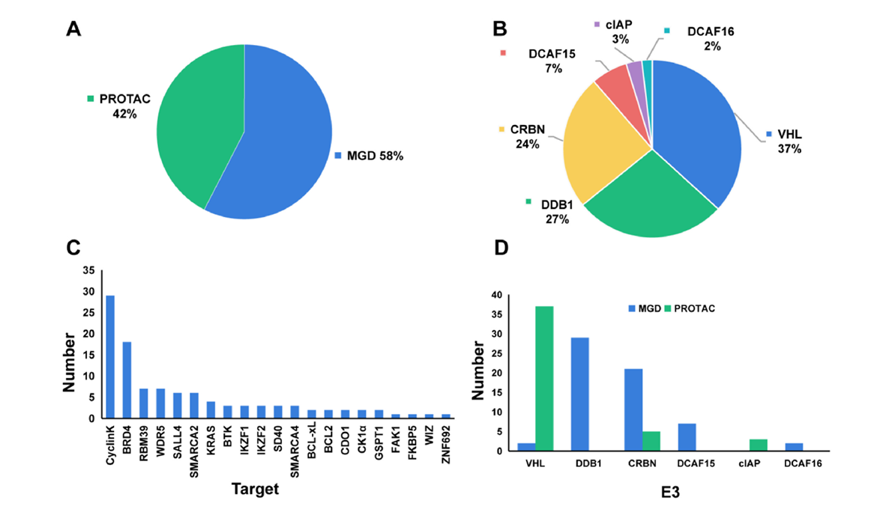
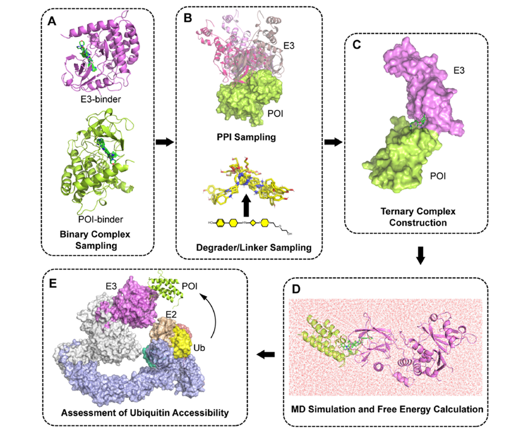
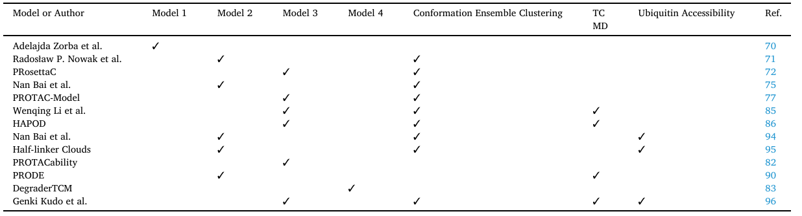
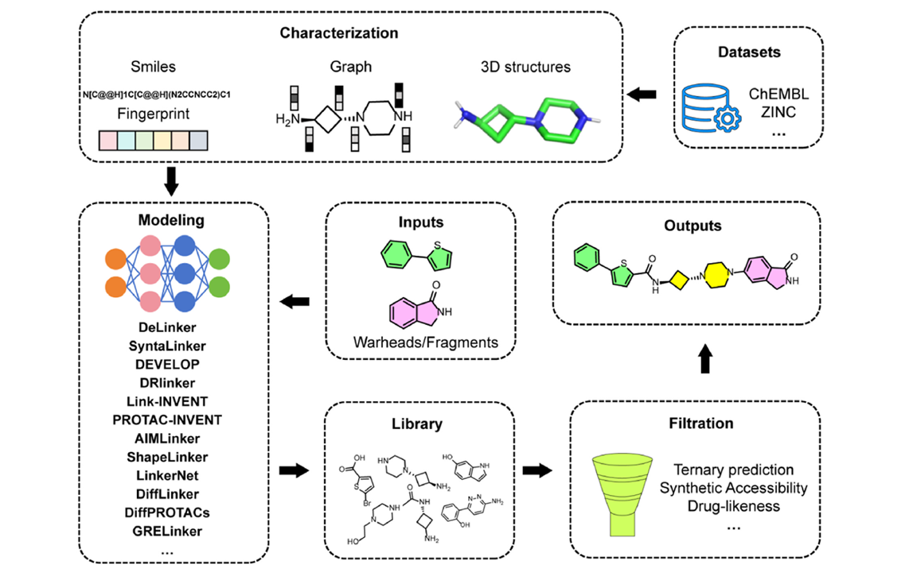
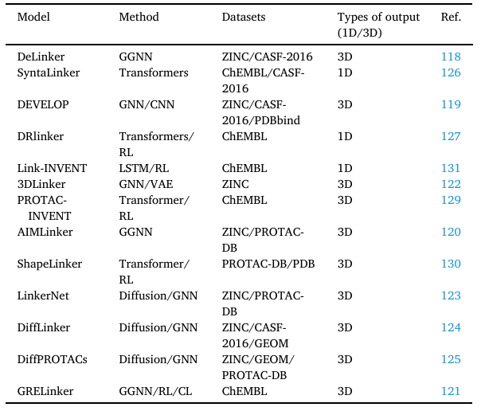
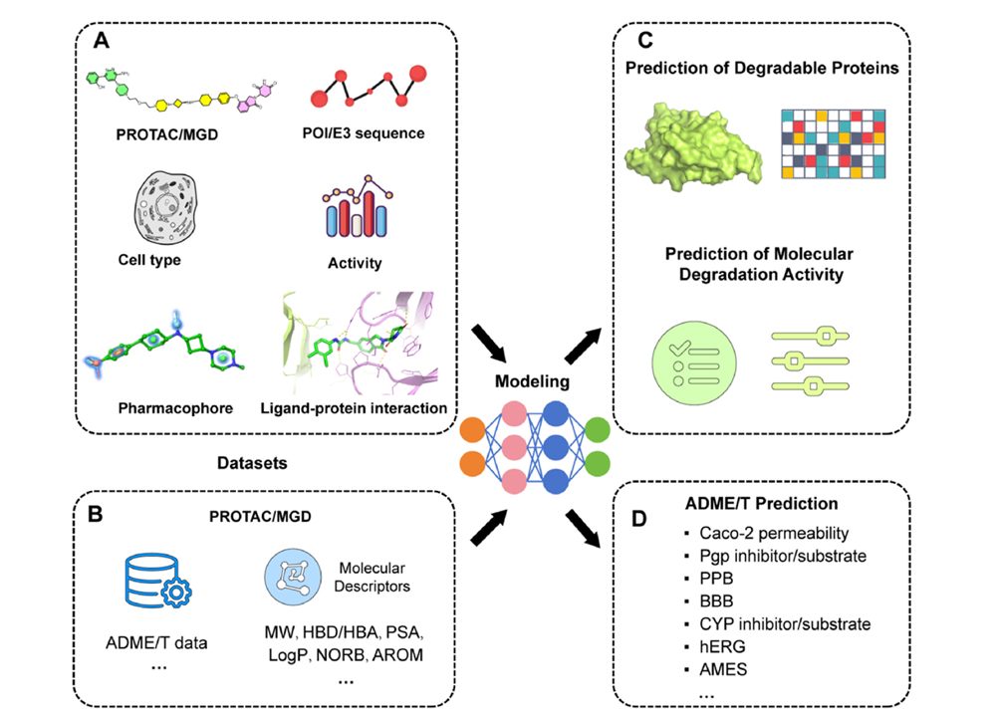
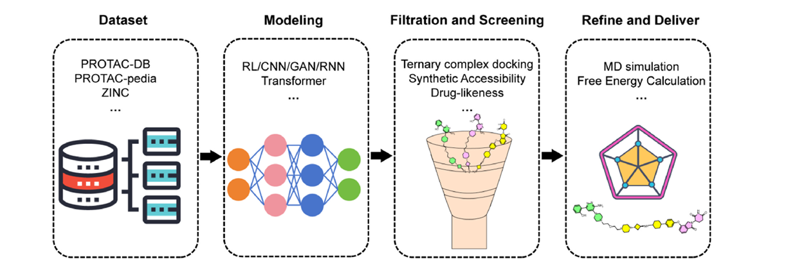
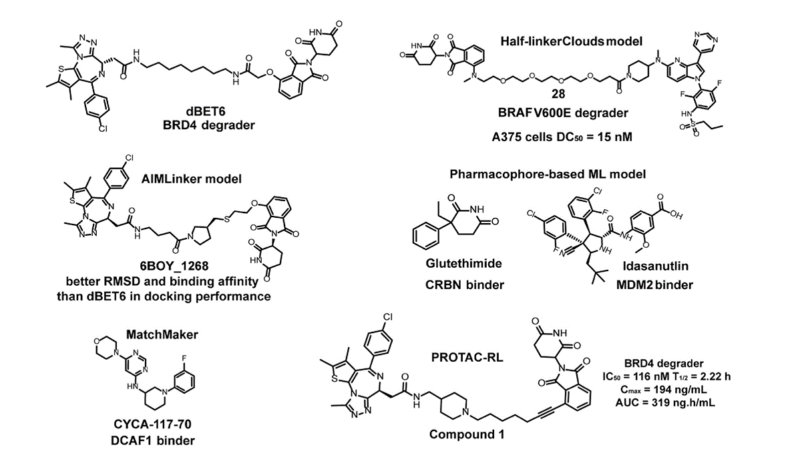

# 引言

近些年，小分子介导的靶向蛋白降解（Targeted Protein Degradation）技术得到了快速发展，特别是蛋白靶向水解嵌合体（proteolysis-targeting chimeras，PROTAC）和
分子胶降解剂（molecular glue degraders，MGD），他们靶向 POI（protein of interest） 和 E3 泛素连接酶进而诱导POI降解的独特的降解机理极大的扩展了成药空间、
克服耐药性、增强靶向选择性，提高药效，目前已有多个小分子进入临床阶段，例如ARV-471，ARV-766等。随着 AI 技术的快速发展，CADD（computer-aided drug design）和 AIDD
（artificial intelligence-driven drug discovery）也在 TPD 领域有了多项应用，例如分子对接、分子动力学模拟以及深度学习方法等。目前，CADD和AIDD在TPD中的应用
仍处于探索阶段，但已经在早期药物筛选中展现出高效性。

具体可分为以下四个方向：

- **三元复合物建模（Ternary complex modeling）**

- **连接子生成（Linker generation）**

- **降解剂靶点、活性和ADME/T性质预测（Strategies to predict degrader targets, activities and ADME/T properties）**

- **计算机辅助降解剂设计和发现（In silico degrader design and discovery）**

# 三元复合物建模

## 三元复合物晶体结构

尽管已有数百种降解剂被报道，但迄今为止，只有少量三元复合物的晶体结构被解析并存入RCSB PDB数据库。目前已报道的三元复合物晶体结构中，配体为 MGD 的占 58%，
是 PROTAC 的占 42%。最常见的降解靶点（POI）是 `CyclinK` 和 `BRD4`，最常用的E3连接酶在 MGD 中是 `DDB1`、`CRBN`、`DCAF15`，在 PORTAC 中是 `VHL`、`CRBN`、`cIAP`

## 三元复合物建模的基本流程

1. **二元复合物构象采样**：
--分别对POI-配体（POI-binder）和E3-配体（E3-binder）进行构象采样（Fig. 3A）。

2. **蛋白-蛋白相互作用（PPI）和连接子采样**：
  - 进行PPI采样，确定POI与E3之间的相互作用模式。
  - 对PROTAC降解剂或其连接子（Linker）进行构象采样（Fig. 3B）。

3. **连接子构建 & 分子比对**：
--根据PPI构象，进行连接子构建或PROTAC分子比对，以形成三元复合物（Fig. 3C）。

4. **三元复合物稳定性分析**：
  - 通过分子动力学（MD）模拟筛选出可能的稳定构象。
  - 计算相关的能量参数以评估复合物的稳定性（Fig. 3D）。

5. **泛素化转移预测**：
--计算整个泛素-E2-E3-POI复合物的泛素可及性（ubiquitin accessibility），评估目标蛋白是否可被有效降解（Fig. 3E）。

## 三元复合物建模方法

:::tip[整体采样法]
直接对整个三元复合物进行采样。计算所有可能的构象，并筛选出符合空间约束的合理模型。    
:::

:::tip[分步采样法]
先独立采样PROTAC的构象，然后加入目标蛋白（POI）和E3连接酶。通过能量计算和空间筛选，选择合理的三元复合物构象。  
:::

:::tip[固定部分结构法]
固定一个蛋白（POI或E3），并采样其结合的配体和连接子（linker）。再引入第二个蛋白，并优化其结合构象。通过构象分析，筛选合理的三元复合物模型。  
:::

:::tip[独立采样+对接]
独立采样PROTAC构象，不考虑蛋白结合。通过蛋白-蛋白对接方法，提供E3连接酶和POI的可能结合构象。将PROTAC对齐到这些构象中，并筛选合理的三元复合物模型。  
:::

:::tip[约束优化法（基于方法4改进）]
在采样PROTAC构象时，对每个结合基团施加约束，以保持已知蛋白-配体复合物的结合方式。采用构象聚类分析，筛选出与已知晶体结构最接近的模型，以提高预测准确度。  
:::

:::tip[最短路径连接法]
通过寻找蛋白结合位点之间的最短路径，确定PROTAC连接子的放置方式。结合几何扭曲、能量等筛选标准，评估PROTAC是否能够成功连接目标蛋白和E3连接酶。  
:::

:::note[代表性三元复合物建模方法]
**Model 1**：固定结合片段 + 采样PROTAC构象，**Model 2**：先进行PPI对接，再构建连接子，**Model 3**：先进行PPI对接 + PROTAC构象对齐，**Model 4**：分别采样二元复合物 + 连接子优化
:::

### 三元复合物对接方法

分子对接是通过计算机模拟预测分子相互作用和结合模式的关键方法，在PROTAC研究中具有重要意义。它可以通过筛选高亲和力的配体结构和指导连接体的选择来协助PROTAC设计；
预测三元配合物的结构，为功能研究奠定基础；基于对接参数评估PROTAC的活性并筛选候选分子；通过与靶蛋白和非靶蛋白对接来研究选择性和脱靶风险，以确保安全性；
根据结果指导PROTAC的优化和修改，以提高其性能；并模拟相互作用过程，揭示靶蛋白降解的机制，促进对其生物学功能的理解和应用的扩展。

近年来，多个研究团队基于不同计算策略开发了用于预测PROTAC介导的三元复合物结构的计算方法。这些方法主要依赖于空间兼容性评估、蛋白-蛋白对接（PPI docking）、约束优化及能量筛选等策略，提供了PROTAC合理设计的重要参考。

- **基于空间兼容性评估**  
  [Adelajda Zorba等](https://www.scopus.com/inward/record.url?eid=2-s2.0-85051711028&partnerID=10&rel=R3.0.0)提出了一种基于PROTAC构象与目标蛋白及E3连接酶的空间兼容性评估工作流程。其核心是使用评分函数计算无冲突构象的数量，以衡量PROTAC促进三元复合物形成的能力。

- **Rosetta 在三元复合物建模中的应用**  
  Rosetta凭借其丰富的构象采样方法和可扩展性，广泛应用于蛋白-蛋白对接及三元复合物建模：
  - [Radosław P. Nowak等](https://doi.org/10.1038/s41589-018-0055-y) 利用Rosetta PPI对接方法研究PROTAC三元复合物的相互作用，并指导BRD4降解剂的设计。  
  - [Daniel Zaidman等](https://ct.prod.getft.io/c2NpZW5jZWRpcmVjdF9jb250ZW50aG9zdGluZyxhY3MsaHR0cHM6Ly9wdWJzLmFjcy5vcmcvZG9pLzEwLjEwMjEvYWNzLmpjaW0uMGMwMDU4OT9zcmM9Z2V0ZnRy.AueZlhbt4csTSL_irFqYTpYJOhJpKCzsl51wruaXIfw) 开发了PRosettaC模型，结合PatchDock、RosettaDock和构象优化策略交替采样蛋白-蛋白和PROTAC构象空间，以预测三元复合物结构。  
  - [Nan Bai等](https://doi.org/10.1021/acs.jcim.0c01451) 采用Rosetta进行蛋白-蛋白对接，并结合OMEGA生成低能量连接子构象，最终利用Rosetta能量最小化优化三元复合物模型，并计算“完全匹配复合物（FFC）”比例评估交互模式。  
  - [Gaoqi Weng等](https://www.sciencedirect.com/science/article/pii/S1520480421003306) 开发PROTAC-Model，先使用FRODOCK进行初始蛋白对接，再利用Vina评分及VoroMQA筛选合理构象，最后通过RosettaDock优化最终模型。

- **其他计算工具与方法**  
  - [Evianne Rovers等](https://doi.org/10.1021/acs.jcim.4c00426) 评估了三种常用三元复合物预测工具（PRosettaC、MOE和ICM），反映了不同工具在蛋白构象空间采样策略上的差异。  
  - [Gilberto P. Pereira等](https://doi.org/10.1021/acs.jcim.3c01154) 提出了PROTACability方法，该方法结合基于约束的对接、能量重新评分及筛选最小接触表面距离的方式来优化蛋白-蛋白相互作用，但可能导致结合模式过于紧密，不完全符合PROTAC介导的复合物结构。  
  - [Paolo Rossetti等](https://ct.prod.getft.io/c2NpZW5jZWRpcmVjdF9jb250ZW50aG9zdGluZyxhY3MsaHR0cHM6Ly9wdWJzLmFjcy5vcmcvZG9pLzEwLjEwMjEvYWNzbWVkY2hlbWxldHQuM2MwMDM2Mj9zcmM9Z2V0ZnRy.9066lFtPdUyqf_F00NlMHotmNhbR5ItlsOoTXnprVq0) 提出的DegraderTCM方法采用MOE生成去新生（de novo）连接子，并将其附着到二元复合物中进行对齐，适用于刚性连接子，但可能无法准确建模具有柔性连接子的PROTAC。  
  - [José A. Villegas等](https://www.sciencedirect.com/science/article/pii/S2001037023000958/pdfft?md5=546f950d1d450de553fe84d86b945de0&pid=1-s2.0-S2001037023000958-main.pdf) 采用循环坐标下降算法（Cyclic Coordinate Descent），限制搜索空间以提高计算效率，并结合Monte Carlo方法进行全局搜索与局部优化，结合经验势能重新评分以提高预测精度。

这些方法各有优势，但在面对具有长或柔性连接子的PROTAC时，仍可能存在预测精度下降的问题。因此，未来可能需要结合多种计算方法，进一步优化三元复合物建模的准确性。

### 分子动力学（MD）在三元复合物建模中的应用

MD是一种基于牛顿力学的数值计算方法，可模拟分子体系的运动，在三元复合物建模中具有重要作用。它可以呈现复合物的动态行为、评估稳定性、精确计算分子间相互作用力，从而揭示结合机制，并辅助药物设计与优化。此外，MD还能结合实验数据解释实验现象，指导实验设计，从而加深对三元复合物生物过程与机制的理解。

- **基于 MD 的能量重评分**  
  [Wenqing Li等](https://doi.org/10.1021/acs.jcim.1c01150) 结合MD模拟和MM/GBSA方法，对PRosettaC方法生成的三元复合物进行建模。通过能量最小化和结合能计算对PRosettaC结果进行重评分，提高了三元复合物预测的准确性。

- **HAPOD 方法评估复合物稳定性**  
  [Junzhuo Liao等](https://www.sciencedirect.com/science/article/pii/S1520480422001831) 提出了加热加速姿势分离（HAPOD）方法，通过逐渐升高系统温度加速不稳定构象的解离，并测量构象占据时间及比例。这一方法通过模拟蛋白在加热过程中的动态行为，为三元复合物稳定性评估提供了新思路。

- **柔性连接子的构象行为研究**  
  [Dhanushka Weerakoon等](https://doi.org/10.1021/acs.jcim.1c01036) 结合MD模拟和核磁共振测量（NMR）表征MZ1和dBET6在溶液中的构象行为。研究揭示了PROTAC分子柔性连接子的构象多样性及其对三元复合物形成和靶蛋白降解效率的影响。

- **基于 TTMD 的稳定性评估**  
  [Ben Geoffrey A S等](https://pubs.acs.org/doi/full/10.1021/acsomega.3c07318) 在2024年提出PRODE方法，采用热滴定分子动力学（TTMD）评估PROTAC介导的三元复合物稳定性。该方法可通过TTMD区分不同Kd值的复合物稳定性，为分子设计和评估提供新思路。

- **三元复合物的解离机制研究**  
  [Rongfan Tang等](https://ct.prod.getft.io/c2NpZW5jZWRpcmVjdF9jb250ZW50aG9zdGluZyxhY3MsaHR0cHM6Ly9wdWJzLmFjcy5vcmcvZG9pLzEwLjEwMjEvamFjc2F1LjNjMDAxOTU_c3JjPWdldGZ0cg.Rd4cDKDjn98syOxkTOFKcgGX0iuelUmJDx3BYz2o8R8) 通过增强采样模拟和自由能计算，从动力学和热力学角度表征MZ1的作用机制。研究表明，MZ1更倾向于停留在VHL表面，而BRD4蛋白独立解离，无特定方向。这表明在靶蛋白-PROTAC-E3连接酶三元复合物形成过程中，PROTAC更倾向于优先结合E3连接酶，且降解效率较高的PROTAC通常会暴露更多的赖氨酸供泛素化。

- **PPI稳定剂的计算建模**  
  [Jintao Zhu等](https://ct.prod.getft.io/c2NpZW5jZWRpcmVjdF9jb250ZW50aG9zdGluZyxhY3MsaHR0cHM6Ly9wdWJzLmFjcy5vcmcvZG9pLzEwLjEwMjEvYWNzY2VudHNjaS4zYzAwNTQ1P3NyYz1nZXRmdHI.-R3VZ6m38iPTRg0-SEk8PdxjH3o9G7wtj5iW9HcJiic) 综述了基于计算机辅助药物设计（CADD）的蛋白-蛋白相互作用（PPI）稳定剂的研究现状，并介绍了四类常见PPI稳定剂：通用PPI稳定剂、MG、PROTAC和PENTAC。  
  [Shu-Yu Chen和Martin Zacharias](https://ct.prod.getft.io/c2NpZW5jZWRpcmVjdF9jb250ZW50aG9zdGluZyxhY3MsaHR0cHM6Ly9wdWJzLmFjcy5vcmcvZG9pLzEwLjEwMjEvYWNzY2VudHNjaS4zYzAwMDAzP3NyYz1nZXRmdHI.Jwq0bh-19Lukw9hqGV6i9465B5Mxb2xzcJtZSVb8jR4) 提出了基于双结合机制的PPI稳定剂计算模型，主要流程如下：
  1. 通过口袋检测工具识别PPI界面的潜在结合口袋，并通过MD模拟验证稳定性。
  2. 从化合物库筛选能够与口袋良好结合的候选分子，并利用分子对接评估结合亲和力。
  3. 采用MD模拟和MM/GBSA方法计算候选分子与两个蛋白的结合能，并筛选符合双结合机制（即与两个蛋白的结合能相近，并对结合较弱的蛋白具有较强结合力）的稳定剂。
  4. 分析和优化筛选结果，并通过实验验证其稳定作用。

该计算流程为基于结构的PPI稳定剂设计提供了一种高效、系统的方法。

### 泛素可及性在三元复合物建模中的应用

泛素可及性在PROTAC研究中具有重要意义。它直接影响靶蛋白的泛素化效率，因为靶蛋白上赖氨酸残基的不可及性（由于空间位阻）会降低泛素化效率。泛素可及性还帮助评估PROTAC设计的合理性，通过根据潜在泛素化位点的可及性指导连接子长度和结构的设计。此外，泛素可及性与PROTAC的疗效和选择性密切相关，因为较高的可及性更可能导致有效降解和选择性靶向。变化的泛素可及性可能解释PROTAC耐药机制，理解它有助于扩展PROTAC的应用范围，例如通过调节因子增加某些“难以治疗”的靶标的可及性，从而为更多潜在应用提供机会。

- **结合泛素化过程的PROTAC模型构建**  
  [Nan Bai等](https://www.sciencedirect.com/science/article/pii/S002192582200093X/pdfft?md5=4db439b9c097ebfa5b700398c6741b0e&pid=1-s2.0-S002192582200093X-main.pdf) 将泛素化过程纳入PROTAC模型的构建中，预测了由CRBN组成的PROTAC对靶蛋白的泛素化。通过使用Rosetta生成三元复合物集合，模拟了CRL4A复合物的多个构象，并基于泛素与靶蛋白上可及赖氨酸的接近度将三元复合物划分为有效和无效复合物，从而预测了泛素化效率。

- **半连接子云模型**  
  [Mikhail Ignatov等](https://doi.org/10.1021/jacs.2c09387) 提出了半连接子云模型。该方法采用基于快速傅里叶变换（FFT）的采样算法，能够高效地同时搜索蛋白质-蛋白质相互作用和连接子构象空间。在考虑泛素可及性的基础上，通过聚类分析提高了预测模型的准确性。值得注意的是，对于具有非常规连接子或特殊蛋白质-蛋白质相互作用的PROTAC，模型的预测能力可能有限。

- **结合PaCS-MD和OFLOOD方法的全面构象搜索**  
  [Genki Kudo等](https://doi.org/10.26434/chemrxiv-22024-gtvz26439) 结合PaCS-MD（并行级联选择分子动力学）和OFLOOD（离群点溢出）方法，进行PROTAC介导的三元复合物的广泛构象搜索。通过构建MSM（马尔可夫状态模型）和FEL（自由能景观）分析，提供了PROTAC的稳定构象及其分布的详细信息，并揭示了结构与活性之间的关系，为新型PROTAC的合理设计提供了参考。

- **数学建模研究三元复合物的动力学与泛素化概率关系**  
  [Hongtao Zhao等](https://doi.org/10.26689/jera.v8i6.8996) 提出了通过数学建模研究三元复合物的动力学与泛素化概率的关系。分析了多个晶体结构并构建数学模型，获得了以下重要发现：
  1. E3组装的内在流动性创造了较大的泛素化区域，使得PROTAC诱导的三元复合物表现出显著的构象动态。
  2. 三元复合物的刚性化不一定与蛋白降解增强相关。
  3. 在PROTAC诱导的三元复合物中，盐桥的存在可能有助于正向协同作用并延长半衰期。
  4. 该研究强调了在PROTAC设计中展示靠近E2酶活性位点的赖氨酸并限制三元复合物动态的重要性，以实现高效降解。

# 连接子生成

linker在TPD药物的设计中起着至关重要的作用。linker的设计需要综合考虑多种因素，包括长度、柔韧性、化学成分、水溶性和代谢稳定性等。linker的长度和柔性直接影响三元复合物的形成，从而影响PROTAC的活性和选择性。理想的linker长度有助于最大化POI和E3连接酶之间的相互作用，从而实现有效的泛素化和生物降解。linker的化学成分影响PROTAC的物理化学性质，包括细胞渗透性和溶解性，并显著影响生物降解效率。在linker的设计中，刚性linker和柔性linker都有其独特的优势。刚性linker可以提高三元配合物的溶解度和稳定性。柔性linker提供了必要的自由度，以适应POI和E3连接酶之间的空间关系。此外，linker的合成方法和优化策略也是药物设计的关键步骤。通过提高合成通量的方法，如固相合成和点击化学，可以加速linker变体的发现和优化过程。值得注意的是，linker的代谢稳定性对PROTAC的体内活性至关重要。linker需要保持足够的稳定性，同时确保PROTAC的有效细胞内递送和功能。总之，PROTAC设计中linker的合理设计和优化对药物的活性、特异性和药代动力学（PK）特性具有决定性影响，是实现靶向蛋白质降解的关键技术之一。

## 一般流程

## 基于序列的方法

近年来，基于自然语言处理（NLP）架构的序列生成方法在 PROTAC 连接子设计中得到广泛应用。这些方法利用 Transformer、LSTM 等深度学习模型，从 SMILES 序列中学习语法和结构模式，并结合强化学习（RL）优化连接子的生成质量和分子性质。然而，由于主要依赖 2D 表征，这些方法通常需要额外的后处理步骤来获取准确的 3D 分子构象。  

- **SyntaLinker 模型**  
  [SyntaLinker](https://www.sciencedirect.com/science/article/pii/S2041652023029280) 基于深度条件变换神经网络的语法模式识别方法，可自动学习化学结构中的片段连接规则，无需依赖预定义子结构或经验规则。然而，该模型在复杂 PROTAC 连接子设计中的效果尚未得到验证。  

- **DRlinker 模型**  
  [DRlinker](https://doi.org/10.1021/acs.jcim.2c00982) 结合深度生成模型与强化学习（RL），旨在优化片段连接过程中的化合物性质。模型首先在 ChEMBL 数据库上训练 Transformer 以学习 SMILES 语法模式，并通过策略梯度 RL 进一步优化目标分子。然而，其性能高度依赖于预定义评分函数的准确性。  

- **PROTAC-INVENT 模型**  
  [PROTAC-INVENT](https://doi.org/10.1093/bib/bbad323) 基于 Link-INVENT，首次在 3D 水平上进行 PROTAC 连接子的设计，使其能够生成具有三维结合构象的 PROTAC 分子。然而，对于缺乏已知 PROTAC 三元复合物结构（PTS）的系统，该模型的适用性较为有限，需依赖 PTS 结构预测方法。  

- **ShapeLinker 模型**  
  [ShapeLinker](https://arxiv.org/abs/2306.08166) 采用强化学习框架，通过自回归 SMILES 生成器设计满足特定 3D 构象的 PROTAC 连接子。模型结合理化性质评分和几何对齐评分，以同时优化药物相似性和几何约束。然而，其性能受限于构象生成的准确性，可能导致对齐结果的波动性。  

- **Link-INVENT 模型**  
  [Link-INVENT](https://doi.org/10.1039/d2dd00115b) 基于循环神经网络（RNN）并结合 ML 和 RL 技术，可高效自动生成新的连接子。模型以两个分子片段作为输入，并通过强化学习优化自定义评分函数，以同时考虑多个理化性质和用户指定的目标。然而，该方法依赖于 SMILES 序列，未显式考虑 3D 分子特性，存在一定局限性。  

SyntaLinker、DRlinker、Link-INVENT、PROTAC-INVENT 和 ShapeLinker 等方法利用 NLP 技术学习 SMILES 结构的语法模式，并通过 RL 进行优化，使其能广泛探索化学空间。然而，它们依赖 2D 表征，通常需要后处理步骤来获取准确的 3D 构象。此外，这些方法整合 RL，甚至对偶强化学习（CL），以优化多目标，如理化性质、合成可行性和生物活性预测。未来研究可通过结合 3D 结构建模方法，提高这些模型在真实化学环境中的适用性，从而进一步提升 PROTAC 连接子的自动化与精准设计能力。

## 基于图的方法  

近年来，多个研究团队开发了基于图的深度生成方法，以优化分子连接子设计，并在药物发现过程中提供更精确的结构信息。  

- **DeLinker 模型**  
  [DeLinker](https://doi.org/10.1021/acs.jcim.9b01120) 是一种基于图的深度生成方法，专注于 3D 连接子的设计。该模型首次在分子设计过程中直接整合 3D 结构信息，以提高分子设计的精准度，并增强与靶蛋白的结合亲和力。然而，DeLinker 仅利用片段间的距离和相对方向作为 3D 信息，未纳入更全面的蛋白-配体结合位点结构信息，同时未考虑合成可行性，可能影响其实验阶段的可行性。  

- **DEVELOP 模型**  
  [DEVELOP](https://www.sciencedirect.com/science/article/pii/S204165202100417X) 结合了图神经网络（GNN）和卷积神经网络（CNN）。DEVELOP 通过物理上有意义的 3D 表征，处理分子及靶点药效团信息，适用于药物发现的多个阶段，包括先导化合物生成、优化、连接子设计和骨架拓展。然而，该模型依赖于已知分子提取药效团特征，当缺乏已知活性分子时，可能需要手动指定药效团特征。此外，DEVELOP 仅生成分子的图表示，而非直接生成 3D 分子结构，仍需进一步处理以获得完整的 3D 结构。  

- **AIMLinker 模型**  
  [AIMLinker](https://doi.org/10.1021/acs.jcim.2c01287) 是一种深度学习驱动的神经网络方法，专用于 PROTAC 连接子的生成与设计。AIMLinker 通过整合生成、设计和后处理步骤，形成端到端的分子设计流程，实现药物发现自动化。同时，该模型包含后处理过滤器，有效排除非药物样结构，并保留具有良好化学性质的分子。  

- **GRELinker 模型**  
  [GRELinker](https://doi.org/10.1021/acs.jcim.3c01700) 是一种新型的生成式片段连接模型，结合了图神经网络（GGNN）、强化学习（RL）和对比学习（CL），用于优化分子连接子设计。GRELinker 具备多任务能力，包括控制 LogP、优化合成可行性、提高预测的生物活性，以及生成具有高 3D 相似度但低 2D 相似度的分子。通过结合 RL 和 CL，GRELinker 能够更有效地处理复杂的分子设计任务，特别是在生成结构复杂的连接子方面表现突出。  

DeLinker、DEVELOP、AIMLinker 和 GRELinker 等方法利用分子图表示，以捕捉分子的连接性和空间关系。其中，DeLinker 通过嵌入片段间的距离和角度信息，提升空间交互表征能力；DEVELOP 进一步结合 CNN 处理起始片段的 3D 结构信息，提高空间排列的上下文理解能力。AIMLinker 和 GRELinker 作为 DeLinker 的变体，利用 GGNN 进行特征提取和连接子生成，在连接子设计精度和可控性方面提供了更优的性能。然而，当前方法仍存在对实验可行性、蛋白结合位点结构信息整合不足的问题，未来可通过结合更全面的物理化学信息及实验验证进行优化。

## 基于扩散模型或者变分自编码器的方法

近年来，基于变分自编码器（VAE）和扩散模型的方法在 3D 连接子设计中得到广泛应用，这些方法能够同时处理分子的图结构和 3D 空间信息，提升分子生成的准确性和多样性。  

- **3DLinker 模型**  
  [3DLinker](https://doi.org/10.48550/arXiv.42205.07309) 模型采用 E(3)-等变图 VAE 技术，通过混合特征消息传递机制对分子片段进行编码，预测锚定节点，并依次生成连接子的 2D 图结构和 3D 坐标。该方法在保持旋转、平移和反射等变性的同时，提高了生成分子的准确性和恢复率。然而，该模型在预测连接子节点数量方面可能存在一定局限性，对于更复杂的分子结构可能需要进一步优化算法，以提升预测的多样性和准确性。  

- **LinkerNet 模型**  
  [LinkerNet](https://proceedings.neurips.cc/paper_files/paper/2023/file/f4821075019a058700f6e6738eea1365-Paper-Conference.pdf) 是一种 3D 各向同性扩散模型，旨在解决 PROTAC 药物设计中的挑战。该模型能够同时学习分子片段的构象和连接子的生成过程，并采用牛顿-欧拉方程预测分子片段的构象，将分子片段视为刚体，从而提供了一种统一的框架来联合设计片段构象和连接子。然而，该模型未直接整合片段旋转约束，这可能限制其在特定情况下的适用性，同时在建模过程中未明确考虑蛋白环境，可能影响其预测分子-蛋白相互作用的能力。  

- **DiffLinker 模型**  
  [DiffLinker](https://doi.org/10.1038/s42256-024-00815-9) 是一种 E(3)-等变三维条件扩散模型。该模型能够处理多个离散的分子片段，并在其间生成缺失的原子，以构建完整的分子结构。在设计连接子时，该模型不仅考虑了片段的三维空间分布，还能够自动确定连接子的长度和连接点。此外，DiffLinker 还能够基于靶蛋白口袋的结构信息生成结构相容的分子，相比于只能连接两个片段的现有方法，该模型可以连接多个分子片段，提供更大的灵活性，并减少手动干预。  

- **DiffPROTACs 模型**  
  [DiffPROTACs](https://academic.oup.com/bib/article/25/5/bbae358/7727300?login=false) 是一种新型的扩散模型，结合了 transformer 和图神经网络（GNN），用于学习和生成新的 PROTAC 连接子。该模型利用 transformer 提取节点特征，并采用 GNN 更新分子坐标，从而增强对图结构数据的处理能力。此外，引入的 O(3)-等变图 transformer 模块，确保了模型在分子旋转或反射时的特征一致性，这对于 3D 分子结构至关重要。  

LinkerNet、DiffLinker、DiffPROTACs 和 3DLinker 等方法采用迭代过程生成分子结构。基于扩散模型的方法通过 3D 扩散过程逐步构建分子构象，并通常结合基于图的模块，以确保对旋转、平移和反射等变性的保持，从而增强生成 3D 结构的稳健性。此外，3DLinker 结合了图表示和 VAE 框架，能够同时预测等变的分子图及其对应的 3D 坐标，从双重角度有效解决连接子设计难题。然而，这些方法仍面临模型灵活性、分子旋转约束及蛋白结合环境整合等方面的挑战，未来可通过更高级的物理化学约束与实验验证进一步优化。

## 连接子生成方法总结

# 降解剂靶点、活性和 ADME/T 性质预测

在整个药物开发过程中，靶点的识别和验证是一个关键方面。面对分子生物学和药理学的复杂机制，预测与药物作用相关的靶标和与病理机制相关的靶标可以为药物开发人员提供一定的研究方向和思路。人工智能（AI）可以处理和分析大量的组学数据（如基因组学、转录组学、蛋白质组学和代谢组学数据），并通过识别与疾病相关的基因和蛋白质模式来协助发现靶标。例如，通过深度学习模型，可以从复杂的基因表达数据中识别与疾病相关的基因特征，从而预测潜在的药物靶点。人工智能在提高目标预测的准确性方面也显示出巨大的潜力。通过构建预测模型，人工智能可以从历史数据中学习并预测化合物和靶标之间的相互作用，这在药物重新定位和多药理学研究中尤为重要。通过预训练和微调，它可以从数百万篇出版物中提取信息，并快速识别疾病发生和发展的生物学机制以及潜在的药物靶点。此外，药物的性质不仅包括内在的物理化学性质，还包括生物活性、可药用性（ADME/T）等。特别是对于PROTAC，其降解活性是其治疗效果的基础。然而，由于其分子量大，口服吸收带来了一定的挑战。因此，预测其类药物性质是早期研发阶段的重要方法。

## 一般流程

## 预测降解剂靶点和活性

### 靶点预测

- **Pre-PROTAC 模型** 
  [Pre-PROTAC](https://doi.org/10.1371/journal.pcbi.1010974) 模型通过机器学习预测可以被 CRBN 降解的靶点。该模型基于 Transformer 的蛋白质序列描述符和随机森林分类，并开发了 eSHAP（嵌入 SHapley 加性解释）方法，计算蛋白质序列与单残基突变序列之间特征选择的差异，从而识别在 PROTAC 活性中起关键作用的残基。研究人员利用该模型识别了超过 600 个可能被 CRBN 降解的未充分研究的蛋白质。与传统实验方法相比，PrePROTAC 可以快速筛选大量蛋白质并预测它们是否可能被 PROTAC 降解，加速了药物发现过程。然而，尽管 ESM（进化尺度模型）特征表现良好，但模型中可能存在其他未考虑的特征，如蛋白质结构特征，这些特征可能提升模型的预测能力。  

- **E3_binder 模型**
  [Reagon Karki 等](https://doi.org/10.1021/acsomega.3c02803) 提出了基于药效团的机器学习模型，用于预测配体与特定 E3 泛素连接酶的选择性结合。该模型收集了来自 PROTAC-DB 2.0 和 PROTACpedia 的已知 E3 泛素连接酶配体数据集作为训练集，使用 MOE 软件中的 ErG（扩展还原图）方案提取候选药效团，利用方差筛选增强模型的预测能力。随后，使用 XGBoost 进行训练，并利用可解释的人工智能（XAI）技术解释模型的预测结果。该模型将药效团的 3D 内容转换为 2D 表征，从而提高了模型的适用性和可解释性。  

- **MatchMaker 模型**
  [MatchMaker](https://doi.org/10.1021/acs.jcim.3c00082) 模型用于药物-靶标相互作用预测。MatchMaker 是一个经过良好训练的神经网络，能够区分生物活性药物-靶标对和随机配对。通过使用 MatchMaker 模型，作者能够在没有已知配体的情况下识别潜在的 DCAF1 配体，显著加速了药物发现的初期阶段。与传统的虚拟筛选方法相比，MatchMaker 训练了一个全球模型，能够预测广泛的药物-靶标对，从而增强了模型的普适性和泛化能力。同时，MatchMaker 模型能够根据观察结果持续学习并优化预测准确性，这是传统固定模型所不具备的特性。  

### 活性预测

- **MAPD 模型**
  [MAPD](https://www.sciencedirect.com/science/article/pii/S1672022922001498/pdfft?md5=d3d4991d6397405da5a73be57ccfd313&pid=1-s2.0-S1672022922001498-main.pdf)（无模型分析蛋白质降解性），用于预测蛋白质的降解性。该模型收集了 151 个定量蛋白质组学数据集，这些数据集测量了 85 种不同多激酶降解剂处理后蛋白质丰度的变化，并收集了与蛋白质降解相关的 KinomeScan 和 KiNativ 数据。基于这些数据，作者构建了超过 42 个固有蛋白质特征，包括翻译后修饰（PTM）、蛋白质稳定性、半衰期、蛋白质-蛋白质相互作用（PPI）、蛋白质表达、可检测性、长度等。通过训练和测试一系列机器学习模型，最终发现随机森林（RF）模型表现最佳，并用于预测所有人类蛋白质的降解性。MAPD 模型在预测激酶的降解性方面表现出高准确性，特别是在使用多激酶降解剂时。通过特征选择过程，该模型识别了预测降解性最关键的特征，如泛素化潜力。该模型结合结构建模分析了 E2 酶可接触的泛素化位点与蛋白质降解性之间的关系。值得注意的是，不准确的泛素化潜力量化可能影响模型的预测结果，且去泛素化酶（DUBs）的活性可能影响蛋白质的降解性，但该因素未在模型中考虑。尽管该模型在激酶上表现良好，但其对非激酶蛋白的泛化仍需更多实验验证。  

- **Stefano Ribes 模型**
  [Stefano Ribes 等](https://www.sciencedirect.com/science/article/pii/S2667318524000114/pdfft?md5=a7a50e5c69c6610c1e3bd55258ac09df&pid=1-s2.0-S2667318524000114-mainext.pdf) 报告了利用机器学习技术预测 PROTAC 分子降解活性的研究。作者收集并整理了来自开放源数据库 PROTAC-DB 和 PROTAC-pedia 的数据，提取了 PROTAC 化合物、细胞系标识符、E3 连接酶、POI（靶标蛋白）和降解指标（pDC50、Dmax 等）。然后，通过机器学习模型对数据进行训练和优化，采用三种不同的数据划分方法（标准划分、靶点划分、相似性划分）评估模型的性能和泛化能力。该模型结合了 PROTAC 化合物、E3 连接酶、POI 和细胞系的多维特征，为全面理解和预测 PROTAC 降解活性提供了新的视角。该方法首次同时考虑了 DC50 和 Dmax 两个指标，用于预测 PROTAC 的降解活性，这两个指标对确定 PROTAC 的治疗效果至关重要。  

- **PCM-based 模型**
  [Francis J. Prael等](https://www.sciencedirect.com/science/article/pii/S2667318524000072/pdfft?md5=74a4c064cfb576ff403180c61ffdc97f&pid=1-s2.0-S2667318524000072-main.pdf) 报告了应用机器学习技术预测 CRBN 分子胶活性的研究。由于三元复合物的复杂性，分子胶的理性设计十分具有挑战性。作者首先使用 Orionis Biosciences 的 Allo-Glue™ 筛选技术收集了超过 25,000 种 CRBN 胶粘剂与 161 个靶蛋白之间相互作用的数据，并将筛选数据（二元化为招募者或非招募者）进行处理。随后，使用扩展连接指纹（ECFP4）和 RDKit Daylight 指纹作为化合物的数值表征。对于蛋白质，特别是与 CRBN 分子胶活性密切相关的 G-loop 序列，采用 T-scale 描述符、准序列顺序描述符、氨基酸计数和独热编码提取特征。接下来，构建了单任务（ST）模型和蛋白质计量（PCM）模型，并使用朴素贝叶斯和随机森林两种分类算法进行训练，调整、验证并评估模型。最终，利用训练好的模型预测未知化合物在特定靶蛋白上的活性，即预测它们是否能作为 CRBN 胶粘剂招募靶蛋白。PCM 模型通过结合化合物和蛋白质描述符提高了预测准确性，反映了 CRBN 分子胶活性涉及蛋白质-蛋白质相互作用的复杂性。  

- **ErG-based 模型**
  [Reagon Karki 等](https://www.sciencedirect.com/science/article/pii/S2352914823002708/pdfft?md5=3a6191ea10b734a7fa6d8a7e103780b2&pid=1-s2.0-S2352914823002708-main.pdf) 提出了基于药效团的机器学习方法，用于筛选潜在的 E3 连接酶配体并预测其与 E3 连接酶的结合概率。通过分析功能化 E3 连接酶配体并将其与经过良好训练的机器学习模型结合，研究人员能够快速筛选化合物库或集中于库设计，从而提高 E3 连接酶配体的筛选和优化效率。这是首个基于机器学习的 E3 连接酶配体预测模型，为 E3 连接酶配体的发现提供了新工具。此外，使用的 ErG 药效团指纹提供了一种直观且可解释的方式来描述分子结构，便于识别关键药效团特征。

## 预测降解剂 ADMET 性质

- **Vasanthanathan Poongavanam 模型**
  [Vasanthanathan Poongavanam 等](https://doi.org/10.1021/acsomega.2c07717) 提出了基于机器学习的二分类模型，用于预测 PROTAC 的细胞渗透性，该模型基于 CRBN 和 VHL 泛素连接酶配体。值得注意的是，由于 CRBN 相关的 PROTAC 数据集高度不平衡，该模型在预测低渗透性化合物时表现不佳。这表明，在处理此类数据集时，可能需要更复杂的方法。此外，尽管所有 17 个描述符对模型有贡献，但模型的复杂性可能使得从结构特征到预测结果的直接解释具有挑战性。  

- **Giulia Peteani 模型**
  [Giulia Peteani 等](https://www.nature.com/articles/s41467-024-49979-3) 开发并评估了机器学习模型在预测 TPD 分子 ADME 及理化性质方面的表现。研究人员开发了用于预测 TPD 多个性质的机器学习模型，包括被动渗透性、代谢清除率、细胞色素 P450 抑制、血浆蛋白结合性和脂溶性等。作者首先从 Novartis 数据库中提取了 25 个不同 ADME 测定数据，包括渗透性、代谢稳定性、血浆蛋白结合性、脂溶性和 CYP 抑制等，并设计了四个多任务图神经网络（MT-GNN）模型。MT-GNN 能够同时预测多个相关的 ADME 性质，有助于捕捉不同性质之间的相关性并提高预测效率。此外，通过迁移学习策略，该模型能够适应特定化学领域，尤其是在异二功能 TPD 的微调方面，增强了该模型对这些复杂分子的预测准确性。同时，通过创建一个包含大量化合物的公共替代数据集，研究扩展了该模型的适用性，特别是在 TPD 数据有限的情况下。  

药物和靶标的特征表示必须捕获广泛的信息，以便有效的模型学习，包括生物学、拓扑学和理化数据。将这些异构数据类型整合到一个统一的模型中，提出了显著的挑战。随着各种药物和靶标数据集的可用性增加，如何将这些多样化数据转化为高维特征以供深度学习方法使用，将变得更加复杂。与小分子药物相比，PROTAC 和 MGD 的结构-活性关系（SAR）定义不够明确，这使得活性预测尤其困难。此外，由于 PROTAC 分子的分子量较大，代谢位点较多，其药代动力学（PK）本身更为复杂。POI 配体和 E3 配体的存在，引入了比单价小分子更多的安全性问题。成功预测降解剂的性质将依赖于结构-活性关系的坚实基础和高质量的数据集。因此，未来研究的一个关键方向是开发方法，在目前有限的数据基础上训练准确的模型。

# 计算机辅助降解剂设计和发现

在药物研发的早期阶段，基于人工智能的药物设计、筛选和优化是最有前景的方向之一，因为传统的药物设计，筛选和优化通常会消耗大量的时间和资源，从而导致高昂的成本。人工智能介导的药物发现的最终目标是在尽可能短的时间内以最少的资源开发出最安全、最有效的临床前候选化合物。这对于像PROTAC这样的化学实体尤为重要，与传统的小分子药物相比，PROTAC的分子量更大，因此开发成本更高。如前所述，构建三元复合物模型是PROTAC药物开发过程中的关键步骤。一个理想的PROTAC分子需要仔细的靶点选择和鉴定、分子生成、筛选、优化，以及关于合成可及性和可药用性的预测。

## 一般流程

## 近年 TPD 设计和发现方法

- **Ben Geoffrey A S 模型**
  [Ben Geoffrey A S 等](https://www.biorxiv.org/content/10.1101/2022.07.11.499663v1) 提出了一个新颖的 PROTAC 设计流程。首先，通过蛋白质-蛋白质对接确定靶蛋白和 E3 连接酶的复合物姿势。然后，使用已有的深度生成模型（DeLinker）设计连接子，并生成多个 PROTAC 候选分子。其次，采用基于 PDBbind 数据集的预训练深度学习模型，预测 PROTAC 构象与口袋之间的相互作用和亲和力。最后，选取排名较高的候选分子进行分子动力学（MD）模拟，使用自由能扰动-热力学积分（FEP-TI）方法计算三元和二元复合物的自由能，并选择三元自由能低于二元复合物的分子作为候选化合物。

- **PROTAC-RL 模型**
  [PROTAC-RL](https://doi.org/10.1038/s42256-022-00527-y) 基于深度学习和分子模拟的理性 PROTAC 设计策略。首先，除了使用开源 PROTAC-DB 数据集外，还利用 ZINC 数据库中与 PROTAC 分子性质相似的分子作为扩展数据集，并通过数据增强形成模型数据集。然后，使用 proformer 模型作为先验网络，并采用强化学习框架（PROTAC-RL）指导 PROTAC 分子的生成，以获得理想的性质。采用记忆经验机制和重复评分惩罚来提高 RL 过程中的采样多样性，避免陷入局部最优。通过 RL 策略和经验奖励函数，生成具有较好 PK 性质的 PROTAC 分子，针对特定的 PK 分数目标。最后，对生成的 PROTAC 分子进行了多项筛选，包括新颖性筛选、PAINS 滤除不利子结构、聚类分析、降解活性预测和物理驱动的模拟，以筛选出候选化合物。

- **DGMs 模型**
  [DGMs](https://arxiv.org/abs/2211.02660) 是一个基于图的深度生成模型（Graph-based Deep Generative Models, DGMs），用于设计新型 PROTACs。该模型构建了一个增强树模型，用于预测 PROTAC 的降解活性，并使用基于图的自回归深度生成模型（GraphINVENT）进行分子优化。然后，采用策略梯度强化学习引导模型生成具有更高降解潜力的高分子。该模型能够处理较大分子量的分子，这在传统的小分子药物设计中较为罕见。

- **DeepPROTACs 模型**
  [DeepPROTACs](https://www.nature.com/articles/s41467-022-34807-3) 提出了一个基于深度神经网络的 DeepPROTACs 模型，用于预测 PROTAC 分子的降解能力。该模型使用图卷积网络（GCN）和双向长短时记忆网络（Bi-LSTM）提取特征，并使用多层感知机（MLP）进行最终的降解效率预测。利用深度学习技术，尤其是 GCN 和 Bi-LSTM，能够有效处理非欧几里得数据，提取蛋白质结合口袋和连接子的特征。由于 PROTAC 的结构-活性关系（SAR）不明确，DeepPROTACs 提供了一种有效的方法，通过学习大量数据集中的模式来预测 PROTAC 的效能。通过 PRosettaC 和 MD 模拟，进一步研究了 PROTACs 的三元复合物结构，为理解连接子长度与降解能力之间的关系提供了依据。值得注意的是，该模型在处理配体的图表示时未考虑立体化学，这可能会影响 PROTAC 的降解效果。

- **PROTACable 模型**
  [PROTACable](https://doi.org/10.1021/acs.jcim.3c01878) 模型结合了 3D 建模和深度学习技术，用于自动化设计 PROTACs。首先，该模型利用 PROTAC-pedia 数据库进行数据准备，进行二元复合物对接并进行能量最小化。然后进行蛋白质-蛋白质对接，生成多个构象，并通过计算配体中心点之间的距离筛选与 PROTAC 生成相关的构象。此外，开发了一种脚本来自动重新连接配体和连接子，生成多个构象。接下来，进行能量最小化以优化复合物的结构。然后，采用 SE(3) 等变图变换器网络（Graph Transformer Network）训练模型，对选定的三元复合物构象进行评分。最后，应用 CatBoost 分类器和 SHAP 算法，识别影响 PROTAC 活性的关键特征，最终实现 PROTAC 活性的预测。该模型有效处理了 3D 空间中的旋转和位移不变性，这对于理解和预测分子间相互作用至关重要。

构建一站式分子生成筛选和靶向蛋白质降解性能预测的全过程模型具有挑战性。这不仅与其复杂的生物学机制有关，还与此类分子的大分子量等固有物理化学性质有关。一站式过程需要整合众多模型，如分子生成、三元络合物建模和性质预测，从而给端到端模型带来了一定的困难。未来的模型可能会更加关注生成具有高结合亲和力的3D分子，尤其是那些可以结合特定蛋白质口袋的分子。此外，未来可能需要更多关注基于口袋的分子扩散模型[PMDM](https://www.nature.com/articles/s41467-024-46569-1)等模型，该模型使用双扩散策略和等变动态核来模拟分子几何系统的刚体变换，如平移、旋转、反射和排列，以学习条件数据分布，从而能够一站式有效地生成具有高结合亲和力和药理活性的精确分子。

# 案例研究

近年来，多种计算模型成功应用于 TPD 设计。以下是一些具有代表性的成功案例：  

- **dBET6**  
  已报道的 BRD4 降解剂。  

- **化合物 28**  
  由 *Half-linker Clouds* 模型设计，可有效降解 BRAFV600E 蛋白（$$DC_{50} = 15 \text{ nM}$$），验证了该模型的有效性。  

- **6BOY_1268**  
  由 *AIMLinker* 模型生成，该模型通过优化 dBET6 的连接子（linker），设计出新型 BRD4 降解剂。相比 dBET6，该化合物在分子对接和分子动力学模拟方面表现更优。  

- **Glutethimide 和 Idasanutlin**  
  由 *E3_binder 模型* 预测得出，分别具有 CRBN 和 MDM2 结合活性。该模型可高效筛选出与参考化合物活性相似的分子，大幅减少高通量筛选（HTS）所需的资源。  

- **CYCA-117-70**  
  由 *MatchMaker* 药物-靶点相互作用预测模型预测为 DCAF1 结合剂，并通过 X 射线共晶结构分析验证了其与 DCAF1 的结合，为 DCAF1 在 TPD 领域的应提供了重要参考。  

- **化合物 1**  
  由 *PROTAC-RL* 一体化 PROTAC 生成与筛选平台设计的新型 BRD4 降解剂，并通过湿实验验证。相比 dBET6，该化合物具有更强的体外活性（$$IC_{50} = 116 \text{ nM}$$），同时展现出更优的药代动力学（PK）性质和成药性。  

尽管目前已有越来越多 TPD 相关的计算模型被提出，但这些模型的真实有效性仍需更多实践案例进行验证和优化。  
 
- $$DC_{50}$$：半数降解浓度  
- $$IC_{50}$$：半数抑制浓度  
- $$RMSD$$：均方根偏差  
- $$T_{1/2}$$：半衰期  
- $$C_{max}$$：最大血药浓度  

# 结论
  
随着 AlphaFold 和 RoseTTAFold 等革命性人工智能模型的出现，蛋白质结构预测领域取得了重大突破。这些模型能够提供接近实验精度的预测，极大地加速了研究人员对蛋白质结构与功能的理解，并在结构生物学、药物发现和蛋白设计领域展现出广泛的应用前景。自 2001 年 Crews 和 Deshaies 实验室提出 PROTAC 概念以来，靶向蛋白降解领域迅速发展。基于这一技术的临床研究药物数量不断增加，适应症范围也在扩大，显示出该技术在临床应用方面的巨大潜力。  

## 现存挑战

TPD 依赖细胞泛素-蛋白酶体系统降解靶蛋白，其作用机制与传统单价药物不同。这一过程涉及多组分相互作用，计算建模面临以下挑战：  

> **结构解析难度大**：  
>  多组分蛋白结构具有较高的自由度，特别是 **三元复合物（POI-PROTAC-E3）** 的共晶结构较为稀缺。  
>
> **机制研究复杂**：  
>  泛素化降解是一个动态过程，难以通过静态计算进行全面建模，数学建模仍面临困难。  
>
> **筛选体系构建困难**：  
>  由于多组分降解机制的复杂性，体外筛选实验难以高效发现新型降解剂。  

目前，计算建模主要集中在三元复合物模型的构建。从二元复合物到三元复合物，再通过分子动力学模拟和自由能计算，最终建立稳定模型用于虚拟筛选和机制研究。然而，现有方法存在以下局限：  

> **难以模拟熵效应**：  
>  三元复合物的动态模拟涉及熵变化，传统的静态能量计算或打分方法无法准确预测其形成。  
>
> **低亲和力 warhead 解释困难**：  
>  目前的模型难以解释某些低亲和力 warhead 仍能实现高效降解的现象。  
>
> **模型过于静态**：  
>  目前大多数研究仅考虑 POI-PROTAC-E3 复合物及泛素可及性，但未能模拟整个动态降解过程。  

近年来，与 TPD 相关的分子生成技术取得了长足进展，但仍面临以下挑战：  

> **兼顾亲和力与药物性质**：  
>  设计降解剂不仅需考虑其靶蛋白结合亲和力，还需满足可合成性、药代动力学（PK）及毒性要求，增加了模型复杂度。  
>
> **多靶点设计欠缺**：  
>  现有分子生成模型主要针对单靶点药物，忽略了多靶点策略在抗肿瘤及抗耐药性药物中的重要性。  
>
> **模型优化难度大**：  
>  深度生成模型在化学空间集成、分子多样性、合成可行性及疗效预测方面仍面临挑战。  

目前，大多数 PROTAC 分子生成主要聚焦于 linker 设计，而对 warhead 作用机制的研究较少，未来仍需进一步探索全局分子生成策略。  

## **未来方向**  

1. **高质量数据获取**：  
   - 需建立大规模、高质量的数据集，包括降解剂复合物晶体结构、构效关系（SAR）、ADME/T 数据及多组学数据（基因组、转录组、蛋白质组、代谢组）。  

2. **扩展 E3 及配体库**：  
   - 目前研究多集中在 CRBN 和 VHL，未来应整合更多数据，探索和鉴定新型 E3 连接酶及相关配体。  

3. **优化合成可行性和药物性**：  
   - 由于 TPD 分子结构复杂、分子量大，需发展高质量模型预测合成可行性及药物性，降低开发成本。  

4. **提高靶点安全性预测能力**：  
   - TPD 分子降解整个蛋白质，可能影响蛋白框架功能。因此，需构建更精确的可降解靶点范围及程度预测模型，以早期评估安全性风险。  

5. **应对药物耐受性问题**：  
   - 目前关于 TPD 药物耐药性研究较少，但这一问题不可避免。需结合生物数据建模研究耐药机制，并提出应对策略。  

6. **AI+实验平台的一体化整合**：  
   - 未来应探索 AI 模型 与湿实验平台的深度结合，推动端到端计算模型在 TPD 研发中的应用。  

7. **优化 MGD 分子设计**：  
   - MGD 研究目前主要集中在 E3 配体优化，未来应利用晶体结构数据与预测结构数据建立更精准的 PPI 交互模型，指导新型 MGD 设计。  

综上，尽管 TPD 研究仍面临诸多挑战，但借助人工智能、高性能计算及大规模数据集，未来有望加速降解剂药物的研发进程，并推动新型蛋白降解策略的发展。 

# 参考文献

[ In silico modeling of targeted protein degradation, 2025-02](https://doi.org/10.1016/j.ejmech.2025.117432)