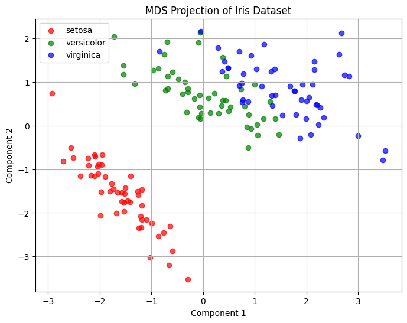

# 简要介绍

**多维尺度变换（Multidimensional Scaling，简称 MDS）** 是一种降维方法，用于将高维数据中的点映射到低维空间（通常是二维或三维），以便可视化样本之间的相对距离关系。它的核心目标是：保持原始数据点之间的“相对距离（或相似度）关系”不变或尽可能保留。

`一句话理解: MDS 就是“根据距离还原坐标”的技术 —— 如果你只知道所有城市之间的距离，它可以帮你画出一张地图。`

多维尺度变换最早起源于心理学领域，在20世纪50年代至60年代，研究人员开始尝试使用MDS来解决心理学实验中的数据分析问题，主要用于分析个体之间的相似性和差异性。随着研究的深入和方法的完善，MDS逐渐被广泛应用于社会科学、生物学、信息科学等多个领域。MDS算法的核心思想是使用**距离矩阵**来表示数据点之间的相似性或关联性。在实际问题中，我们可能需要分析不同类型的数据，通过将这些数据转换为距离矩阵，我们可以利用MDS算法来挖掘数据中的结构信息和潜在关系。

## 常见的 MDS 类型

| 类型            | 简介                                      | 特点                           |
|-----------------|-------------------------------------------|--------------------------------|
| Classical MDS   | 又叫“距离几何”，基于线性代数和特征值分解 | 适用于欧氏距离                 |
| Metric MDS      | 保留距离的线性关系                        | 优化目标是保留距离结构         |
| Non-metric MDS  | 保留距离的顺序而非具体值              | 适用于主观评分等非线性数据     |
| Isomap          | 一种基于图的 MDS 变体，保留流形结构       | 适用于非线性分布的数据         |

---

## MDS 与其他降维方法对比

| 方法   | 保留的结构         | 适用情况                     |
|--------|--------------------|------------------------------|
| MDS    | 样本之间的距离关系 | 可视化距离或相似度结构       |
| PCA    | 数据的方差结构     | 数据是线性分布时效果较好     |
| t-SNE  | 局部相似度         | 强调局部结构，可视化聚类     |
| UMAP   | 局部拓扑结构       | 表达能力强，适合非线性结构   |

# Classical MDS（经典 MDS）的数学原理

1. **从距离转换为内积矩阵**

   Classical MDS 的第一步是将距离矩阵 $$\mathbf{D}$$ 转换为**中心化的内积矩阵** $$\mathbf{B}$$：

   $$
   B = -\frac{1}{2} H D^{(2)} H
   $$

   - $$D^{(2)}$$ 表示每个元素平方后的距离矩阵（即 $$d_{ij}^2$$）
   - $$H = I - \frac{1}{n}\mathbf{1}\mathbf{1}^\top$$ 是中心化矩阵（用来去除均值）

2. **特征分解**

   对矩阵 $$B$$ 做特征值分解：

   $$
   B = Q \Lambda Q^\top
   $$

   - $$Q$$ 是特征向量矩阵
   - $$\Lambda$$ 是特征值对角矩阵

3. **构建低维坐标**

   取最大的 $$k$$ 个正特征值和对应的特征向量，构造低维坐标矩阵：

   $$
   X = Q_k \Lambda_k^{1/2}
   $$

   - $$X$$ 就是每个样本在 $$k$$ 维空间中的坐标
   - 这些坐标的欧氏距离会尽可能逼近原始距离 $$d_{ij}$$

---

# 简单示例

```python
import numpy as np
import matplotlib.pyplot as plt
from sklearn.datasets import load_iris
from sklearn.manifold import MDS
from sklearn.preprocessing import StandardScaler

# 加载鸢尾花数据集
iris = load_iris()
X = iris.data      # 特征：150 x 4
y = iris.target    # 标签：0, 1, 2（Setosa, Versicolor, Virginica）
labels = iris.target_names

X_std = StandardScaler().fit_transform(X)

# 创建 MDS 实例（使用欧氏距离）
mds = MDS(n_components=2, dissimilarity='euclidean', random_state=42)
X_mds = mds.fit_transform(X_std)  # 输出：150 x 2

# 可视化二维结果
plt.figure(figsize=(8, 6))
colors = ['red', 'green', 'blue']
for i, label in enumerate(labels):
    plt.scatter(X_mds[y == i, 0], X_mds[y == i, 1], 
                color=colors[i], label=label, alpha=0.7)

plt.title("MDS Projection of Iris Dataset")
plt.xlabel("Component 1")
plt.ylabel("Component 2")
plt.legend()
plt.grid(True)
plt.show()
```



# 参考

[多维尺度变换（MDS）快速理解，及MATLAB实现](https://zhuanlan.zhihu.com/p/618906910)

[wiki](https://en.wikipedia.org/wiki/Multidimensional_scaling)
