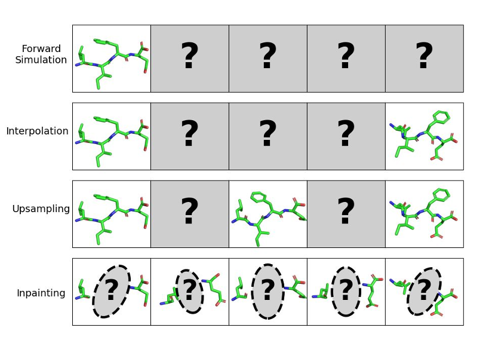
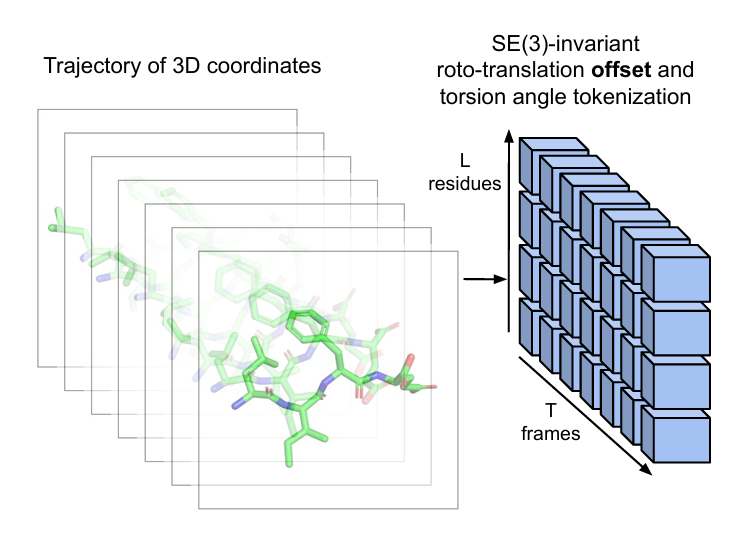
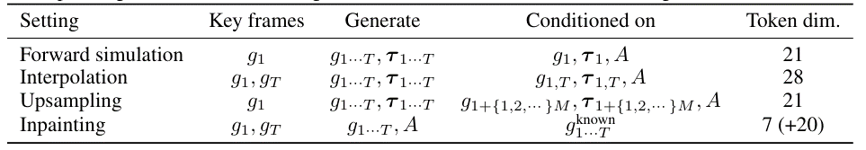
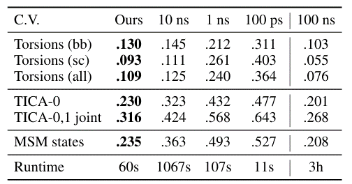
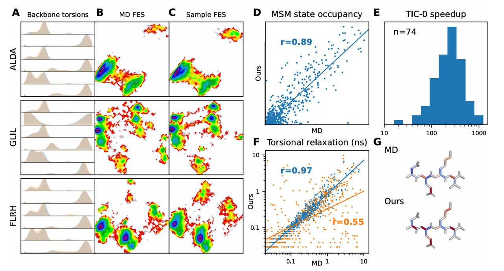
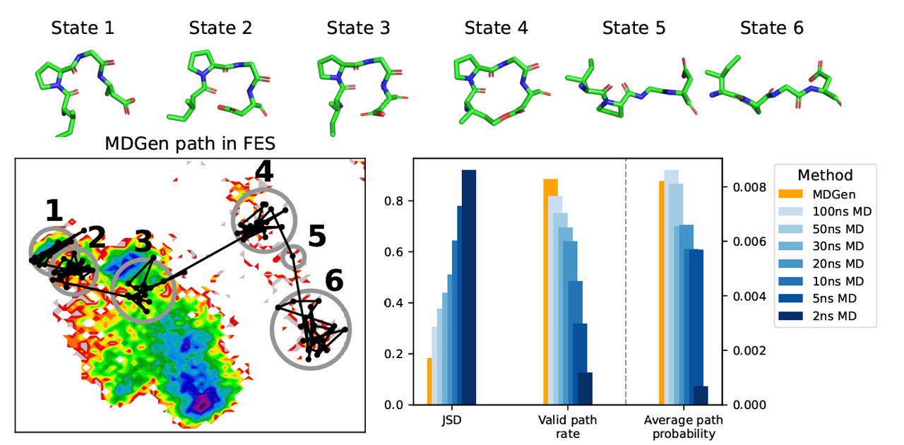
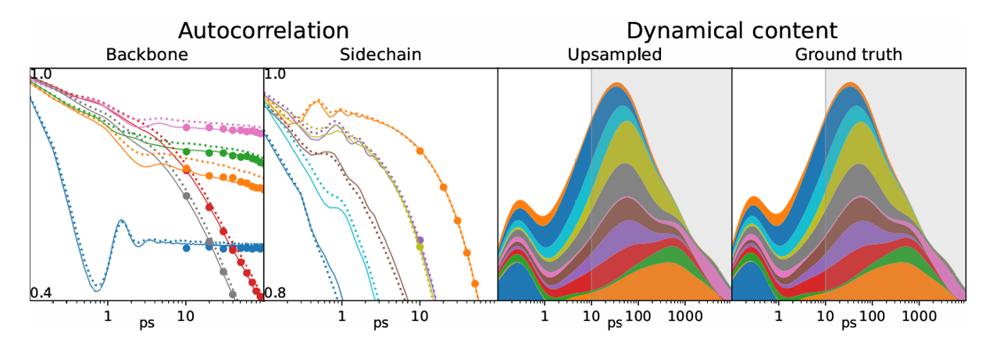
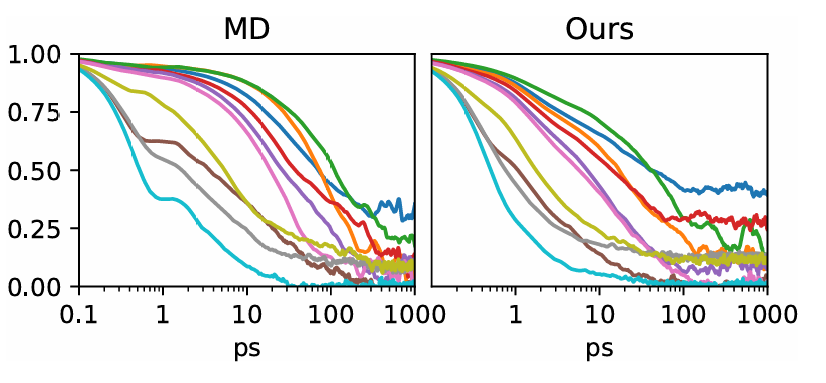
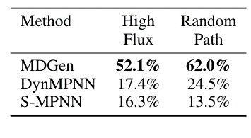
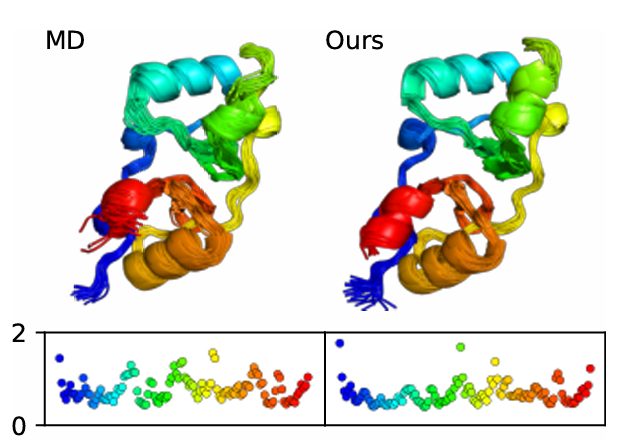

# 引言

牛顿运动方程在原子尺度上的数值积分，即**分子动力学（MD）**，是一种广泛用于研究化学、生物学和其他分子科学中各种分子现象的技术。
这篇工作中提出了MDGEN，一种基于模拟轨迹直接生成建模的MD快速通用代理建模的新范式，与之前学习MD自回归跃迁密度或平衡分布的工作不同，
该方法制定了全轨迹的端到端生成建模，将其视为3D分子结构的时间序列。

具体功能有：
- **正向模拟**
——给出轨迹的初始框架，给出分子系统的潜在时间演化示例。

- **插值**
——给定一个位于两个端点的框架，我们给出一个连接两者的可信路径示例。在化学上，这被认为是一种迁移通路采样，对于研究反应和构象转变非常重要。

- **上采样**
——给定帧之间的时间步长为`∆t`的轨迹，我们将“帧速率”上采样一个系数`M`，以获得时间步长为`∆t/M`的轨迹。这从以较不频繁的间隔保存的轨迹中推断出快速运动

- **重绘**
——给定分子的一部分及其轨迹，我们生成分子的其余部分（及其时间演化），使其与轨迹的已知部分一致。这种能力可以应用于设计分子以构建所需的动力学

# 数据和架构

四肽模拟数据集：显示溶剂，隐式溶剂全原子模拟 3000 训练，100 验证，100 测试，都是 100ns

蛋白模拟数据集：使用**ATLAS**数据集

我们在小肽和蛋白质的分子动力学 (MD) 模拟上展示了我们的框架。为此，我们对全原子分子轨迹进行参数化，
使用**相对于条件关键帧的残基偏移和侧链扭转角**，而不是基于残基框架或点云的方法，从而将其转化为一个 2D 数组上的 **SE(3)** 不变 生成建模任务。

在这种参数化方式下，我们采用 **可扩展插值变换器 (Scalable Interpolant Transformer, SiT)**（Ma 等，2024）作为基于流的生成骨干网络，避免了通常用于蛋白质结构的昂贵的残基对和框架结构。
此外，我们用 **Hyena** 长上下文架构（Poli 等，2023）替换了 SiT 中的时间注意力机制，证明了该方法可扩展到 10 万帧的轨迹，使得单个模型样本能够捕捉更广泛的时间尺度和动态过程。

# 背景

## 分子动力学（Molecular Dynamics, MD）  

从高层次来看，**分子动力学** 的目标是 **积分运动方程**：  

$$
M_i \ddot{x}_i = -\nabla_{x_i} U(x_1, \dots, x_N)
$$

其中，每个粒子 $$i$$ 的位置为 $$(x_1, \dots, x_N) \in \mathbb{R}^{3N}$$，$$M_i$$ 是其质量，$$U$$ 是势能函数（或 **力场**），其形式为 $$ U: \mathbb{R}^{3N} \to \mathbb{R} $$。  

然而，在实际应用中，这些运动方程通常会被 **修改以包含温控器（thermostat）**，从而模拟特定温度下系统与环境的接触。例如，**广泛使用的朗之万温控器（Langevin thermostat）** 会将运动方程转换为 **随机扩散过程**：  

\[
dx_i = \frac{p_i}{M_i} dt
\]

\[
dp_i = -\nabla_{x_i} U dt - \gamma p_i dt + \sqrt{2 M_i \gamma kT} \, dw
\]

其中，\( p_i \) 是动量，\( \gamma \) 是阻尼系数，\( kT \) 是热能，\( dw \) 是布朗噪声项。通过这一设计，该过程会 **收敛到系统的玻尔兹曼分布（Boltzmann distribution）**：

\[
p(x_1, \dots, x_N) \propto e^{-U/kT}
\]

在生物化学中，**溶剂分子** 的相互作用至关重要，因此可以通过两种方式建模溶剂影响：
1. **显式溶剂（Explicit Solvent）**：将溶剂分子作为分子系统的一部分，直接模拟其动力学行为。
2. **隐式溶剂（Implicit Solvent）**：修改力场 \( U \) 以近似描述溶剂的影响，而不直接模拟溶剂分子。  

无论哪种方法，研究者 **关注的重点** 仅在于 **非溶剂原子的位置 \( x_i \) 的演化**，而这些随时间变化的数据即构成 **MD 轨迹**。

## 用于分子动力学的深度学习 

近年来，越来越多的研究致力于使用深度生成模型来近似分子构象分布\( X = (x_1, \dots, x_N) \)。  

- **基于转移密度建模的工作**：  
  例如，Timewarp 和 ITO 通过学习 **转移密度** \( p(X_{t+\Delta t} | X_t) \)，并利用 **模型模拟回放（simulation rollouts）** 来近似 MD 轨迹。  

- **玻尔兹曼生成器（Boltzmann Generators）**：  
  另一类方法则直接近似 **平衡玻尔兹曼分布**，完全不对动力学过程进行显式建模。  

  特别是，**基于 MD 轨迹帧训练的玻尔兹曼目标扩散模型**（Boltzmann-targeting diffusion models）在蛋白质系统上展现了良好的可扩展性和泛化能力。  

然而，现有工作主要关注前向模拟（forward simulation），而尚未探索对整个轨迹 \( (X_t, \dots, X_{t+N\Delta t}) \) 的联合建模，也未涉及在此框架下可解的逆问题。

## 随机插值（Stochastic Interpolants）

我们基于随机插值框架（stochastic interpolants framework）构建MD 轨迹生成模型。给定一个Rn 空间中的连续分布 \( p_1 \equiv p_{\text{data}} \)，
随机插值方法提供了一种学习连续流模型（flow-based models）的方式，用于将先验分布 \( p_0 \)（例如 \( p_0 \equiv N(0, I) \)）转换为目标数据分布 \( p_1 \)。

为此，我们定义 **中间分布** \( x_t \sim p_t \)（其中 \( t \in (0,1) \)），通过以下插值方式构造：

\[
x_t = \alpha_t x_1 + \sigma_t x_0
\]

其中 \( x_0 \sim p_0 \)，\( x_1 \sim p_1 \)，且插值路径满足边界条件：
- \( \alpha_0 = \sigma_1 = 0 \)
- \( \alpha_1 = \sigma_0 = 1 \)

我们训练神经网络 \( v_{\theta} : R^n \times [0,1] \to R^n \) 来近似轨迹演化的流场：

\[
v_{\theta}(x_t, t) \approx v(x_t, t) \equiv E_{x_0, x_1 | x_t} \left[ \dot{\alpha}_t x_1 + \dot{\sigma}_t x_0 \right]
\]

该流场满足**传输方程（transport equation）**：

\[
\frac{\partial p_t}{\partial t} + \nabla \cdot (p_t v_t) = 0
\]

因此，当训练收敛后，我们可以从先验分布采样 \( x_0 \sim p_0 \)，并利用 \( v_{\theta} \) 演化样本以获得目标分布 \( x_1 \sim p_1 \)。

当该方法与 Transformer 结合时，在图像生成任务中表现出最先进的效果（state-of-the-art）。
在本工作中，我们采用 **可扩展插值 Transformer（Scalable Interpolant Transformer, SiT）**（Ma et al., 2024）的符号表示、架构和训练框架，并推荐该研究以获取更详细的介绍。

# 方法

## 3.1 分块分子轨迹（Tokenizing Molecular Trajectories）

给定一个由N 个原子组成的分子系统的化学描述，我们的目标是学习一个生成模型，用于建模时间序列 \( \chi \equiv [X_1, ..., X_T] \)，
其中每个分子结构 \( X_i \in \mathbb{R}^{3N} \) 代表某个轨迹长度 \( T \) 内的状态。

在本研究中，我们专注于：
- **短肽（short peptides）**的 MD 轨迹。
- **单链蛋白（single-chain proteins）**的 MD 轨迹。

因此，我们的化学描述采用 **氨基酸序列** 表示：  
\[
A = \{1...20\}^L
\]
其中 \( L \) 为序列长度。

我们采用 **基于 SE(3) 变换的参数化方法**，其中每个氨基酸残基的全原子坐标由旋转-平移变换（roto-translation，即 SE(3) 元素）以及七个扭转角描述：

\[
\chi_l^t = ((R, t), (\psi, \phi, \omega, \chi_1, ..., \chi_4))
\]

其中：
- 下标 \( t \)代表时间步。
- 上标 \( l \)代表氨基酸残基索引。
- \( \chi \) 属于 SE(3) \times T^7_{L,T}，即：
  - 旋转 \( R \) 和平移 \( t \) 共同描述刚体变换。
  - 主链扭转角（\( \psi, \phi, \omega \)）和侧链扭转角（\( \chi_1 ... \chi_4 \)）刻画分子结构。

对于那些未定义的扭转角（即某些氨基酸的侧链可能少于 4 个扭转角），我们采用 **随机化处理**，并在训练时不对其施加监督约束。

我们的目标是**条件轨迹生成（conditional trajectory generation）**，这意味着在轨迹中至少有一个帧的旋转平移是未加噪的，
我们无需生成它，而是可以在建模过程中直接引用它。受视频压缩的启发，我们将这些帧称为**关键帧（key frames）**，并将其余结构的旋转平移参数化为相对于关键帧的偏移量。

给定 \( K \) 个关键帧 \( t_1, ..., t_K \), 我们将第 \( t \) 帧的残基 \( j \) 进行标记（tokenization）如下：

\[
\chi_j^t = [g_j^{t_1}]^{-1} g_j^t, ..., [g_j^{t_K}]^{-1} g_j^t, \tau_j^t \in SE(3)^K \times T^7 \equiv (\hat{Q}^+ \oplus R^3)^K \times (S^2)^7 \subset R^{7K+14}
\]

其中 \( g_j^t \in SE(3) \) 表示旋转平移变换 \( \tau_j^t \) 表示残基 \( j \) 在 \( t \) 帧时的扭转角。

具体来说：

- **转换相对旋转平移偏移量** \( [g_j^{t_i}]^{-1} g_j^t \) 为单位四元数（unit quaternion），要求其实部为正，即 \( \hat{Q}^+ \subset R^4 \)，用于表示旋转信息。
- **转换平移信息** 为 \( R^3 \) 中的平移向量。
- **转换扭转角度** 为单位圆上的点，得到一个\( (7K + 14) \)-维的标记（token）。

## 还原轨迹

为了将这些标记解码回全原子帧\( X_t \in R^{3N} \)，我们执行以下操作：

1. 从单位圆中读取扭转角度。
2. 应用关键帧旋转平移变换 \( g_j^{t_i} \) 到生成的偏移量，获得绝对旋转平移 \( \hat{g}_j^t \)。

由于偏移量和扭转角度对 SE(3) 变换不变，因此我们可以将分子轨迹表示为一个 \( (T \times L) \) 形状的SE(3)-不变标记数组。

### 该表示方法的优势

1. **减少冗余计算**：避免了直接对所有帧进行建模，而是利用关键帧进行高效参数化。
2. **提升建模能力**：由于该表示方式对 SE(3) 变换不变，可以在不同的神经网络架构中更广泛地使用。
3. **简化生成任务**：通过学习偏移量而不是绝对坐标，模型可以更高效地生成新的轨迹。

## 流模型结构（Flow Model）

我们的基础建模任务是生成一个对一个或多个关键帧及其氨基酸信息相关的\( R^{T \times L \times (7K+14)} \) 的分布

### 采用的建模方法

使用随机插值框架（SiT）进行建模，并通过以下方式学习流模型：

1. **参数化速度网络（velocity network）**：
   \[
   v_{\theta}(\cdot | g_{t_1}, ..., g_{t_K}, A) : R^{T \times L \times (7K+14)} \times [0,1] \to R^{T \times L \times (7K+14)}
   \]
2. **条件输入**：
   - 关键帧的旋转平移信息 \( g_{t_1}, ..., g_{t_K} \)
   - 氨基酸序列 \( A \)

### 关键帧和氨基酸条件的处理

- 首先，我们将序列嵌入输入到多个 IPA（Invariant Point Attention）层（Jumper et al., 2021）。
- 这些 IPA 层用于嵌入关键帧的旋转平移信息。
- 这些条件表示被广播到时间轴上，并加到输入嵌入中。

### 网络架构

- 主干网络由交替注意力块组成：
  1. 沿着残基索引计算注意力
  2. 沿着时间轴计算注意力
  3. 每个块的构造类似于 DiT（Peebles and Xie, 2023）

- 额外的条件信息：
  1. 侧链扭转角
  2. 旋转平移偏移量
  3. 若可用，则直接提供给模型作为条件标记

---

### 分子重绘任务（Molecular Inpainting）

在分子重绘任务中，我们还需要生成氨基酸，因此，我们还需要一个针对这些离散变量的生成框架。
在离散扩散或流匹配的多种方案中我们选择 Dirichlet 流匹配，因为它最适用于我们用于位置的连续空间、连续时间的随机插值框架。

1. **氨基酸表示**：
   - 放置在 20 维概率单纯形上（每种氨基酸一个维度）
   - 将这些变量与标记表示一起作为输入

2. **回归目标**：
   - 训练一个 \( T \times L \times (7K+14+20) \) 维的向量场

### 各种条件生成方法

# 实验

## Forward Simulation

### Distributional Similarity

Jensen-Shannon divergence (JSD)

1. Torsions
2. TICA
3. MSM states

### Dynamical Content

- (A) 主链扭转角分布
展示 6 个主链扭转角的分布情况，对比 MD 轨迹（橙色）和采样轨迹（蓝色）。

- (B, C) 自由能表面
基于主链和侧链扭转角，计算沿前两个 TICA 组件的自由能表面。

- (D) 马尔可夫状态模型（MSM）占据度
计算 MD 轨迹和采样轨迹的 MSM 状态占据度，数据汇总自所有测试肽段，共 1000 个状态。

- (E) 壁钟时间去相关
比较 MD 模拟和模型生成轨迹的 TICA 第一主成分去相关时间。

- (F) 扭转角弛豫时间
对比 MD 轨迹与采样轨迹的扭转角弛豫时间，包括 508 个主链扭转角和 722 个侧链扭转角。

- (G) AAAA 四肽的扭转角去相关时间
上图基于 MSM 计算的去相关时间，下图基于模型采样轨迹计算的去相关时间。

## Interpolatioon

(顶部)
展示测试肽段 IPGD 在两个稳态之间的 1 纳秒插值轨迹中的中间状态。

(左下角)
对应轨迹在前两个 TICA 组件的 2D 自由能表面上的投影。

(右下角)
统计数据取自 100 个测试肽段，每个肽段 1000 条路径的平均结果。包括：

- JSD（Jensen-Shannon 散度）
- 有效跃迁路径的比例
- 在参考 MSM 下的离散跃迁路径的平均似然度

与从参考 MSM 或基于不同长度副本模拟构建的 MSM 抽取的离散跃迁路径进行比较。

## Upsampling

(左侧)
每个扭转角的自相关函数，分别来自：

- (——) 原始 100 fs 时间步轨迹
- (•) 采样率降低至 10 ns 时间步的轨迹
- (...) 重建的 100 fs 时间步轨迹

(右侧)
不同时间尺度上的动力学信息，对比上采样轨迹与真实轨迹。

颜色堆叠表示所有扭转角的数据，采样轨迹仅包含阴影区域，模型成功恢复了未遮蔽区域

## Inpainting

我们希望在四肽的两侧残基动力学的条件下采样轨迹，具体来说，模型需要确定两个内部残基的种类和动力学。我们关注动态支架 (dynamic scaffolding) 作为 inpainting 任务的一个高阶目标：

给定观察到的残基构象转换，我们希望设计支持对应马尔可夫状态间跃迁的肽段。
因此，对于每个测试肽段，我们选择一个 100 ps 的跃迁路径（从最具连通性的两个马尔可夫状态之间），
然后 遮盖内部残基的种类和动力学，并使用我们的模型进行 inpainting。

### 评估方法
计算生成的残基类型中，与已知发生目标跃迁的四肽一致的比例。
对比基线方法 DynMPNN，它在设计肽段时仅参考两个端点状态（即两个完全观察到的 MD 轨迹帧），从而生成支持这两种模式的肽段，而不会参考部分观察到的跃迁路径。
DynMPNN 采用与 MDGEN 相同的架构和超参数设置。
MDGEN 在高通量跃迁路径或随机路径的情况下，比 DynMPNN 更频繁地恢复出真实的肽段。

## 蛋白模拟

6uof_A, (Pearson r = 0.74)

# 讨论

## 限制

我们的实验验证了模型和架构在肽段模拟中的有效性；然而，一些限制为未来改进提供了机会。主要的限制在于依赖关键帧，这意味着模型无法实现无条件生成或对残基旋转平移进行 inpainting。
相对于肽段，蛋白质上的表现较弱表明该架构可能不适合处理更大范围的运动。

对单一结构模型进行微调以实现关键帧和轨迹 token 的联合生成（类似于视频扩散模型中内容-框架分解的方法）可能会带来改进。
除此之外，对于更一般和多样化的系统（例如有机配体、材料或显式溶剂）的轨迹建模，将需要采用其他的 token 化策略。
未来的应用可能要求模型能够对不是预定义原子集合的区域进行建模，而是对一个原子可以进出区域进行建模。因此，我们预期未来在 token 化方法和架构上的进一步改进将是一个富有前景的方向。

## 机遇

类似于视频生成模型在理解宏观世界中的基础作用，MD 轨迹生成有望成为一个多任务、统一的深度学习范式，用于微观世界的建模。
插值可以更广泛地被看作是一种生成假设，用于解释任意分子现象的机制，特别是在仅提供部分终态信息的情况下。

分子 inpainting 有望成为一种通用技术，通过搭建更精细和复杂的动力学框架来设计分子机械系统，例如重新设计蛋白质以增强那些在模拟中仅偶尔观察到的稀有跃迁，
或利用 ab initio 轨迹进行酶机制和结构元件的全新设计。其他本研究未涉及的条件信息（例如基于文本或实验描述符的条件）也可能带来更多应用。
未来如果能够获得大量针对多样化化学系统的真实 MD 轨迹数据，这将成为推动相关研究的重要动力。
最后，分子轨迹所特有的问题，例如平衡与非平衡过程、马尔可夫性，以及微观世界的可逆性与宏观世界之间的对比，都可能为理论探索提供丰富的研究领域。

# 参考文献

[ Generative Modeling of Molecular Dynamics Trajectories, 2024-09](https://arxiv.org/abs/2409.17808)