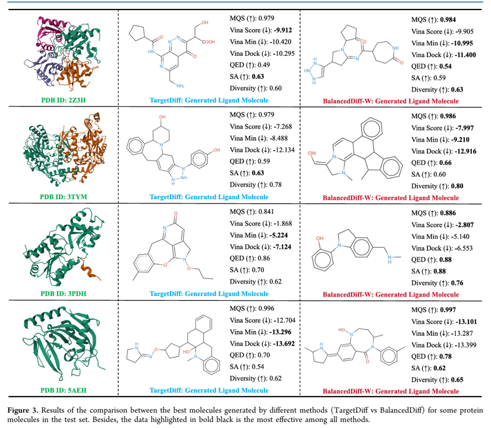

# 引言

传统药物研发过程耗时且昂贵，深度学习技术正通过加速分子优化与识别，提高研发效率。尤其是三维分子生成模型，近年来成为结构导向药物设计的重要研究方向。扩散模型因其强大的生成能力，在分子生成领域展现出巨大潜力。例如 TargetDiff 模型首次结合 SE(3) 等变网络生成具有靶点结合能力的三维药物分子，取得了显著成果，但仍存在如药物性（QED）、合成可行性（SA）与分子多样性不足等问题。

为解决这些挑战，本文提出一种改进模型 BalancedDiff，其主要创新点包括：

1. BalancedLoss 损失函数：缓解样本偏差对模型训练的影响。

2. KBFF 模块：基于功能团的结构特性，平衡分子空间信息，过滤与蛋白结合无关的干扰团。

3. ADME 预测与筛选机制：引入 QikProp 工具，评估吸收、分布、代谢、排泄等关键药物属性。

4. 分子质量评分 MQS（Molecule Quality Score）：统一评价标准，全面衡量生成分子的质量。

# 模型

## Training

**训练部分**

1. 对于每一个药物分子及配对的蛋白结构作为一个 data，小分子提取其坐标信息 $lx_0$ 以及种类信息 $lv_0$，然后首先对其添加噪声得到 t 时刻的加噪 $lx_t$ 和 $lv_t$，然后提取蛋白初始信息 $px_0$ 和 $pv_0$

2. 过一个 Single-step Denoising Network (SDN) 层：

$$
F^x_0, F^v_0 = \text{MLP}\big(T\big(KBFF(\text{emb}(p^x_0, l^x_t), \ \text{emb}(p^v_0, l^v_t))\big)\big)
\tag{1}
$$

其中，$\text{emb}()$ 表示嵌入层，$KBFF()$ 表示基于 KAN 的平衡特征过滤模块，$T()$ 为多层 Transformer 结构，$\text{MLP}()$ 为多层感知机。$F^x$ 和 $F^v$ 分别表示两类分子在嵌入后的原子位置数据与类别数据。  

- **KBFF** 模块设计：

考虑到官能团（functional groups）对分子性质有关键作用，我们希望设计一种能够高效且稳定建模分子结构的网络结构。受分子生物学特征启发，我们提出了基于 KAN 的平衡特征过滤（KBFF）模块，以满足上述需求。依赖 **Kolmogorov–Arnold Networks (KAN)** 的强大灵活性与适应性，该模块能够高效建模高维数据中的复杂关系，并挖掘元素间潜在的生化关系（即官能团建模）。  

同时，我们借鉴了多种成功方法的优点，设计了 **平衡特征过滤（BFF）模块**，结合了两种模式的特征，帮助滤除不相关官能团的负面干扰。后续消融实验结果也验证了该设计的有效性。  

KBFF 模块的计算细节如下：

$$
\begin{aligned}
F^w_v &= fc\big(cat(F^x, F^v)\big) \\
F'_v &= US\big(KAN(DS(fc(F^w_v)))\big) \\
F^x, F^v &= KBFF(F^x, F'_v)
\end{aligned}
\tag{2}
$$

其中：
- $cat()$ 表示拼接操作，  
- $fc()$ 表示全连接层，  
- $\tau()$ 表示 ShiftedSoftplus 激活函数，  
- $\otimes$ 表示逐元素相乘，  
- $DS()$ 表示下采样操作，  
- $US()$ 表示上采样操作。  

最终，$F'^v$ 和 $F^x$ 为 KBFF 模块的输出。

3. Balance Loss：

为了平衡不同样本（配体−蛋白分子对）对模型的影响，我们提出了一种新的评分函数，用于基于分子性质计算样本的影响因子 $W_i$：

$$
W_i = z_Q^{T_Q}(QED_i) \times z_S^{T_S}(SA_i) \times z_V^{T_V}(Vina_i)
\tag{3}
$$

其中，$r()$ 表示对所有样本的分子性质进行排序，$t()$ 表示阈值。当阈值为 0.7 时，$T_Q$ 表示 70% 的样本 QED 值小于 $T_Q$，其余 30% 大于 $T_Q$。$T_S$ 和 $T_V$ 的计算方式相同。参数 $\alpha$ 是一个可调的平衡系数，我们设置为 0.3。最终，$W_i$ 的值通常在 0 到 1.5 之间，用于控制每个样本对模型的贡献。  

Balance Loss 的计算公式如下：  

$$
\mathcal{L} = \frac{1}{n} \sum_{i=1}^n W_i \cdot \Big[ 
MSE(l^x_i, l^x_0) + KL(l^v_i, l^v_0) \Big]
\tag{4}
$$

其中：  
- $MSE()$ 表示原子位置（连续数据）的均方误差；  
- $KL()$ 表示原子类别（离散数据）的 Kullback–Leibler 散度；  
- $Mean()$ 表示对 $x$ 和 $v$ 取平均。 

## Sampling

1. 初始化配体分子为均匀随机噪声 $(\hat{l}^x_t, \hat{l}^v_t)$；  
2. 在生成过程中，逐步对噪声进行去噪，得到生成的配体分子 $(\hat{l}^x_0, \hat{l}^v_0)$；  
3. 在整个过程中，蛋白分子 $(p^x_0, p^v_0)$ 始终作为条件输入；  
4. 具体实现上，遵循 TargetDiff 的处理方式，即将 $(\hat{l}^x_t, \hat{l}^v_t)$ 通过SDN 去噪 1000 次；  
5. 在每次去噪后，计算后验概率分布（Post in Sampling of Fig.1），并用其替换原始数据。  

最终，对于测试集中的 100 个样本，总共生成 $100 \times 100$ 个配体分子 $(\hat{l}^x_0, \hat{l}^v_0)$。  

## Evaluation

分子评估过程如图的 Evaluation 部分所示。现有方法提出了一些简单的分子评估标准，例如分子重建与完整性检查，但这些方法并未深入考虑药物性质（ADME：吸收、分布、代谢和排泄）。同时，过于复杂的评估指标也难以全面反映分子质量。  

因此，我们引入了 **Schrödinger 软件的 QikProp 模块** ，用于预测分子的 ADME 性质，包括溶解度、渗透性、血脑屏障穿透性等。这些性质对评估分子作为药物候选物的潜力至关重要。通过这些预测，研究者可以筛选出具有良好药物性质的分子，从而加速药物发现过程。  

在评估过程中：  
- 我们过滤掉 **Stars > 5** 的分子（即安全性不足、与已知药物差异过大、药物性质较差的分子）；  
- 同时保留足够的分子，以体现其结构多样性。  

此外，我们提出了一种新的评估指标：**Molecule Quality Score (MQS)**，可直接反映生成分子的整体质量。 

# 结果

## 数据集

遵循主流方法，采用 **CrossDocked2020** 数据集来训练和评估模型。  
与 TargetDiff 类似，我们对原始2250 万个对接的蛋白-配体复合物进行了筛选，只保留：  
- 位姿偏差小于 **1 Å** 的分子，  
- 序列相似度低于 **30%** 的蛋白。  

最终得到：  
- **100,000 个配体−蛋白分子对** 作为训练集；  
- **100 个新的配体−蛋白分子对** 作为测试参考集。  

## 评估指标

1. **Vina Score**  
   用于评估配体-蛋白复合物的能量与稳定性，反映结合亲和力。  

2. **QED (Quantitative Estimate of Drug-likeness)**  
   药物相似性指标，取值范围 $[0,1]$，越接近 1 表示药物相似性越高。  

3. **SA (Synthetic Accessibility)**  
   衡量分子合成难度，原始分数范围 $[1,10]$，通过归一化处理到 $[0,1]$：  
   - 0 表示易于合成；  
   - 1 表示难以合成。  

4. **Diversity**  
   衡量生成分子与参考分子的差异性，范围 $[0,1]$，越大表示差异越大，有助于设计新药物。 

### MQS（分子质量评分）

为了直接反映生成分子的整体质量，我们提出了一个统一指标：**Molecule Quality Score (MQS)**。  
其计算公式如下：  

$$
MQS = \text{Mean}(V_s, V_m, V_d) \times e \;+\; \text{Mean}(QED, SA, Div) \times k
\tag{5}
$$

其中：  
- $V_s, V_m, V_d$ 分别表示三种分子对接打分：**VinaScore, VinaMin, VinaDock**；  
- $QED, SA, Div$ 分别表示 **药物相似性、合成可行性、多样性**；  
- $\text{Mean}()$ 表示取平均；  
- $e, k$ 为缩放系数。  

MQS 综合了对接能量与分子性质，从而能够更全面地衡量生成分子的药物潜力。  

## 分子性质的进一步评估

为了更全面地反映生成分子的特性，我们对比了不同方法生成分子的更多性质。  
为保证公平性，本节完全遵循 TargetDiff 的评估流程，**不引入 QikProp 模块**，即比较 **其他方法 vs BalancedDiff-W**。

---

### 环结构分布

- **Table 2** 展示了参考分子与不同方法生成分子的 **环大小分布百分比**。  
- 括号中的数值表示与参考分子的 **绝对误差**，而 **AAE**（Average Absolute Error）表示该方法的平均绝对误差。  

结果显示：  
- 我们的方法在最后一行取得了 **最佳表现（粗黑体）**；  
- 即生成分子的环分布与真实分子最接近；  
- 这表明 BalancedDiff-W 能生成更符合实际分子特性的结构。  

---

### 键长分布

- **Table 3** 报告了参考分子与生成分子之间 **键长分布的 Jensen−Shannon 散度 (JSD)**。  
- JSD 越小，说明生成分子的键长分布与真实分子越接近。  

结果表明：  
- 我们的方法在各个对比方法中均取得了 **最佳（粗黑体）** 或 **次佳（灰底）** 的结果；  
- 并且次佳结果与最佳值非常接近，说明模型的稳定性和可靠性较强。  

---

### 刚性片段一致性

- **Figure 2** 展示了刚性片段在 **力场优化前后** 的 **中位 RMSD**。  
- RMSD 越低，说明生成的分子结构与参考分子越接近，结构更合理。  

结果显示：  
- 在大多数情况下，我们的方法生成的刚性片段更为一致；  
- 证明 BalancedDiff 能生成更加合理的分子几何结构。  

---

### 可视化对比

- 对测试集中的部分蛋白分子（如 **2Z3H, 3TYM, 3PDH, 5AEH**），我们展示了 **TargetDiff** 与 **BalancedDiff** 生成分子的可视化对比（见 **Figure 3**）。  
- 同时，我们也报告了部分关键评估指标。  

结果表明：  
- 我们的方法能够生成 **几何结构更优** 的分子；  
- 并且在某些指标上显著优于现有方法。  

## 消融实验以及参数设置

# 结论

本文提出了一种更合理、更高效的网络结构 BalancedDiff，能够生成高质量分子。为了让数据集更适合高质量三维分子的生成任务，我们设计了 Balance Loss，用于平衡样本偏差带来的负面影响。此外，受分子生物学特性启发，我们提出了基于 KAN 的 平衡特征过滤模块（KBFF），它能够在分子特征信息与空间位置信息之间实现平衡，并有效过滤掉无关基团。最后，我们对现有的分子生成评价体系进行了完善，提出了一个统一标准——分子质量评分（MQS），可以综合评估生成分子的质量。
在公开数据集 CrossDocked2020 上的大量实验结果证明了 BalancedDiff 的优越性。

# 参考文献

[ BalancedDiff: Balanced Diffusion Network for High-Quality Molecule Generation, 2025-06](https://doi.org/10.1021/acs.jcim.5c00837)

