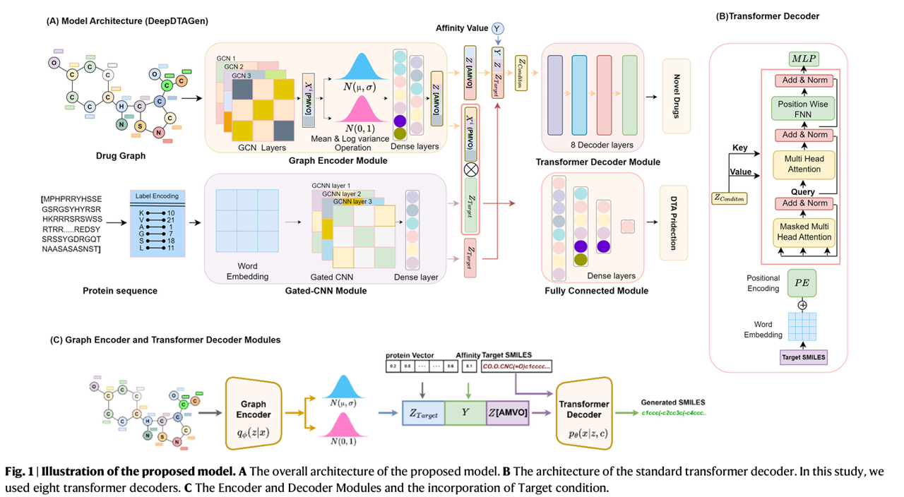
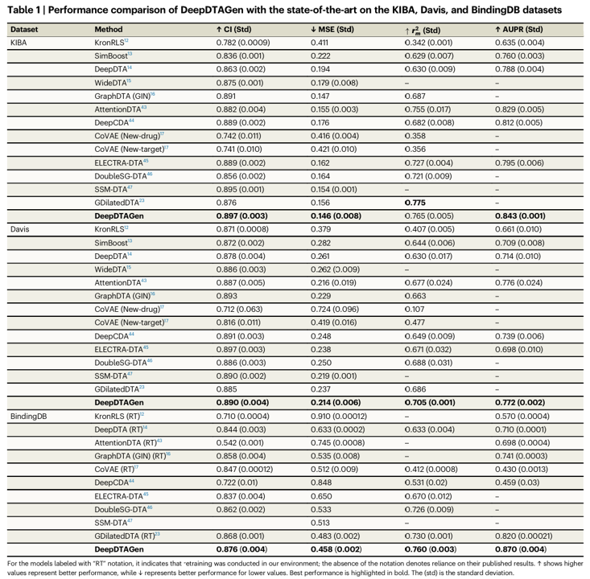
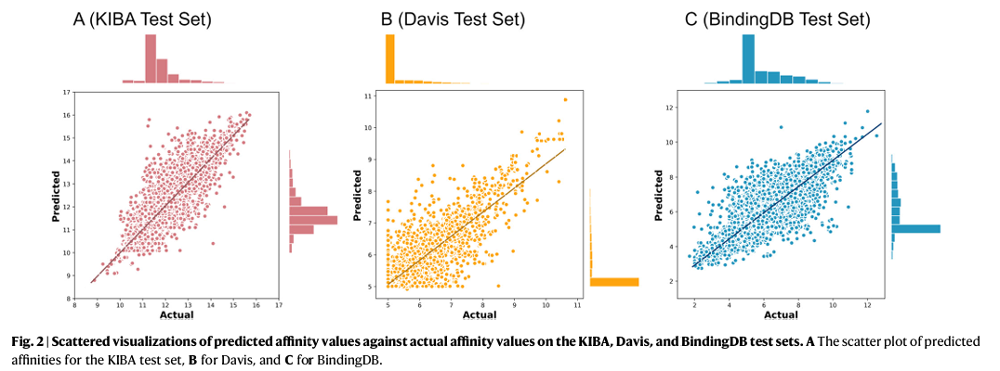
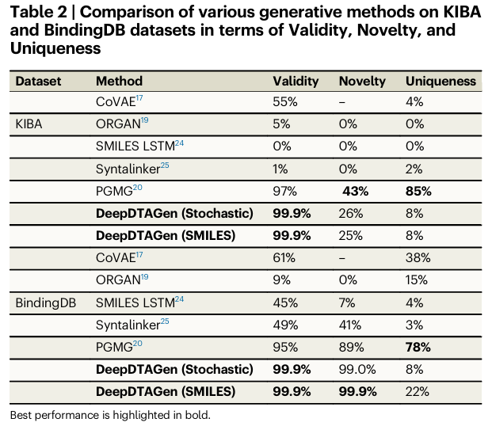
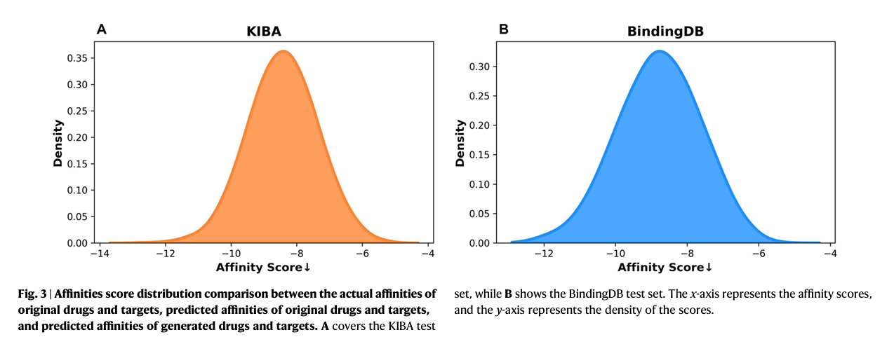
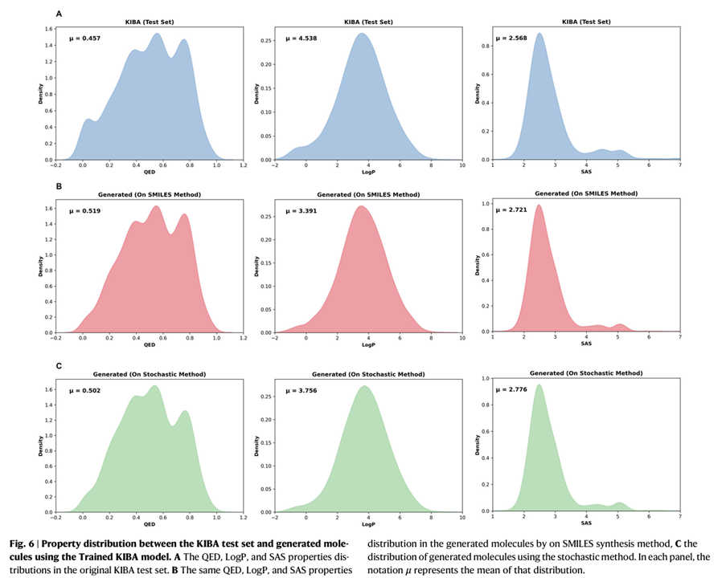
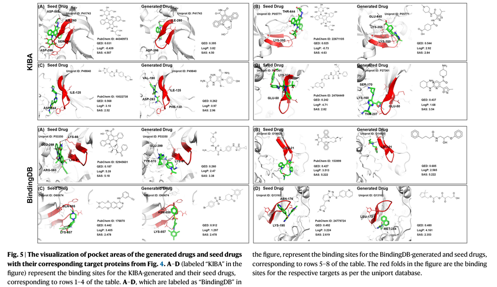
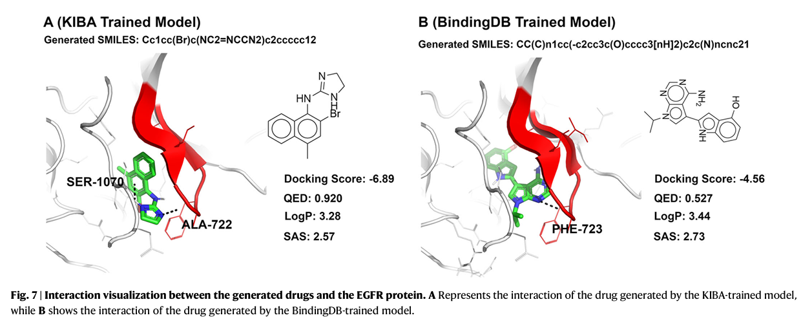

# 引言

在药物发现与开发领域，识别能够与靶标蛋白相互作用的新型药物是一项极具挑战性、耗时且成本高昂的任务。近年来，大量基于机器学习的模型被用于加速药物研发进程。然而，现有方法多为单一任务型——要么专注于预测药物-靶标相互作用（DTI），要么用于生成新药物。从药理学研究视角来看，这些任务本质上相互关联，对高效药物开发至关重要。因此，必须通过统一的学习模型来掌握药物分子结构特性、蛋白质构象动力学以及药物与靶标间的生物活性。

为此，本研究构建了一个创新的多任务学习框架，能够利用两组任务共享的特征，同步预测药物-靶标结合亲和力并生成靶标感知的新型药物变体。此外，针对多任务学习中因任务间梯度冲突导致的优化难题，我们开发了FetterGrad算法进行有效化解。在三个真实数据集上的综合实验表明，该模型为预测药物-靶标结合亲和力及生成新药物提供了高效机制，从而显著推进了药物发现流程。

# 模型



## Dataset

数据集使用了 KIBA, Davis, BindingDB 三个经典的 DTA 数据集

## Encoder

1. 对于药物分子：将小分子转化成图表示，然后过 GCN Layer 得到小分子 embedding，然后过一个 Normalization 接一个 Dense Layer 得到小分子最终的 $$Z[AMVO]$$ 即特征

2. 对于蛋白序列，采用了一个简单的线性对应编码（Label Encoding）得到 word embedding，然后将这个过一个 Gated CNN 接一个 Dense Layer 得到蛋白的编码特征 $$Z_{Target}$$

3. 因为使用的是 KIBA, Davis, BindingDB 是有 Label 的，所以把 Label 直接拿来用设为 Y

## Prediction Head

有了小分子和蛋白的特征之后就可以做预测和生成，共用的就是这个空间，预测的话就是将 $$Z[AMVO]$$ 和 $$Z_{Target}$$ 拼接起来作为特征输入到一个 Fully Connected Module，预测 Y 求 Loss（MSE）

## Generation Head

生成方面就是把 $$Z[AMVO]$$ 和 $$Z_{Target}$$ 再加 Y 全部拼接起来，得到 $$Z_{Condition}$$，将 Target SMILES 作为 q，$$Z_{Condition}$$ 作为 k 和 v，输入到一个 Transformer 的 Decoder，预测每一步下 predicted SMILES tokens 和 target SMILES token 的 loss（CE），还有就是求了一个 KL Loss，对中间小分子的那个 embedding 分布也求了 Loss，生成过程的 Loss 是这两部分的总和

## FetterGard model（梯度优化策略）

因为 DTA 预测任务和生成任务在梯度优化的方面可能存在冲突或者是对某一个方向的优化明显侧重的问题，为了解决这个问题提出了 Fetter Gradients algorithm，他的核心思想是检测梯度是否冲突，然后通过梯度投影修正更新方向，避免任务间竞争。

### 关键思想

1. **检测任务间是否存在梯度冲突**：
   - 使用欧几里得距离（ED）计算梯度差异；
   - 将其转换为归一化相似度分数 ESS，范围 `[0, 1]`；
   - 当 `ESS < 0.5` 时，认为两个任务梯度存在冲突。

2. **判断主导梯度方向**：
   - 使用梯度幅度相似度 MSS（Magnitude Similarity Score）判断哪个任务具有主导权；
   - 当 `MSS` 接近 1，两个梯度相似；接近 0，表明梯度幅度差异大。

3. **梯度修正策略**：
   - 将主导梯度投影到另一任务梯度的法向平面中，避免任务间相互干扰。

### 定义

#### Definition 1: Euclidean Similarity Score (ESS)

设两个任务的梯度为 $g_i$ 和 $g_j$，定义 ESS 为：

$$
\text{ESS}_{i,j} = \frac{1}{1 + \|g_i - g_j\|}
$$

- 范围为 `[0, 1]`；
- 阈值设为 `0.5`，小于该值视为冲突。

#### Definition 2: Magnitude Similarity Score (MSS)

设两个梯度的方向单位向量分别为 $\hat{g}_i$ 和 $\hat{g}_j$，定义为：

$$
|g_i, g_j| = \frac{1}{1 + \left\| \hat{g}_i - \hat{g}_j \right\|^2}
$$

- 如果接近 1，梯度大小一致；
- 如果接近 0，某一梯度主导。

### 两任务联合损失函数表示：

我们有两个损失函数：

$$
L_{\text{MSE}}: \mathbb{R}^n \rightarrow \mathbb{R}, \quad L_{\text{Gen}}: \mathbb{R}^n \rightarrow \mathbb{R}
$$

整体目标函数为：

$$
L_{\text{MSE+Gen}}(\theta) = L_{\text{MSE}}(\theta) + L_{\text{Gen}}(\theta)
$$

分别记：

$$
g_1 = \nabla_\theta L_{\text{MSE}}(\theta), \quad g_2 = \nabla_\theta L_{\text{Gen}}(\theta)
$$

### FetterGrad 更新规则（Algorithm 1）

```text
Algorithm 1: FetterGrad Update Rule

Input:
- 模型参数 θ
- 当前任务小批量 βmini = {Tn}

步骤：
1. 对每个任务 n，计算梯度 gn = ∇θLn
2. 初始化每个任务的 FetterGrad 梯度 gFG_n = gn
3. 对每一对任务 Ti 和 Tj:
   a. 如果 ESS(g_i, g_j) < 0.5:
       i. 如果 g_j 方向主导：
          gFG_i = gFG_i + ||g_i - g_j|| * g_j
      ii. 如果 g_i 方向主导：
          gFG_j = gFG_j + ||g_j - g_i|| * g_i
4. 最终更新参数：Δθ = ∑ gFG_n
```

# 结果

## 预测任务上的结果





## 生成任务上的结果







## 对接例子





# 讨论

在本研究中，我们提出了一个新颖的多任务学习（Multitask Learning, MTL）框架，同时包含两个目标函数：
1. **预测药物–靶点亲和力（Drug–Target Affinity, DTA）**
2. **生成新药分子**

该框架的主要目标是在统一模型中同时执行这两个任务，从而使模型能够学习药物与靶点之间的生物学关系。在所提出的模型中，两个任务均基于共享特征空间进行，表明所学习的表示同时与药物和靶点高度相关。

尽管 DeepDTAGen 在两个任务上均表现良好，但仍存在以下不足：

1. **缺乏化学属性约束**：
   - 如 **QED**、**LogP**、**SA** 等重要化学性质未被纳入条件生成中。

2. **忽略了分子立体化学信息**：
   - 立体化学在药物发现中具有重要作用，但当前模型未对其建模。

3. **未使用非结合样本数据**：
   - 训练中未引入非交互（非结合）样本，限制了模型在选择性生成方面的能力。

# 参考文献

[ DeepDTAGen: a multitask deep learning framework for drug-target affinity prediction and target-aware drugs generation, 2025-05](https://doi.org/10.1038/s41467-025-59917-6)
