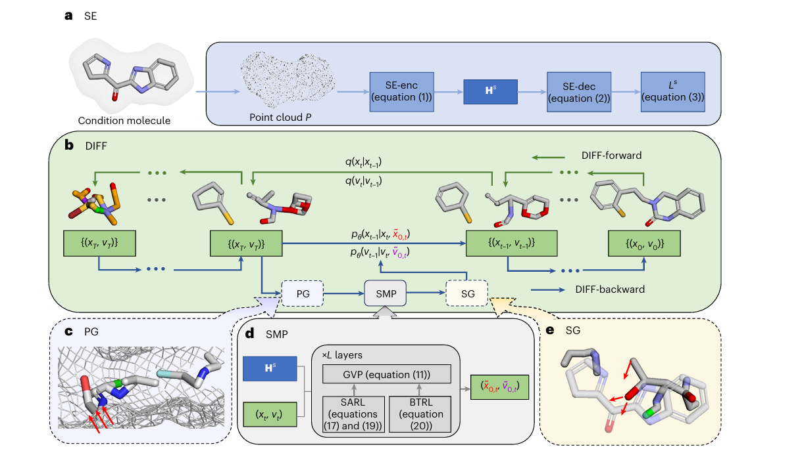
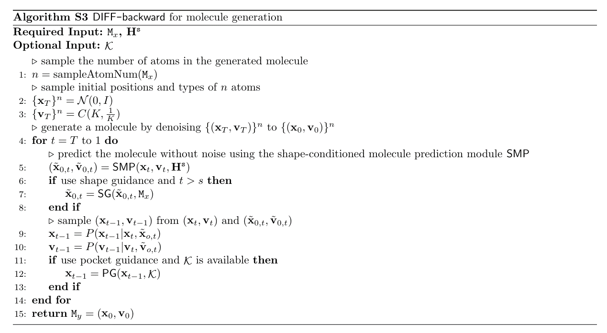
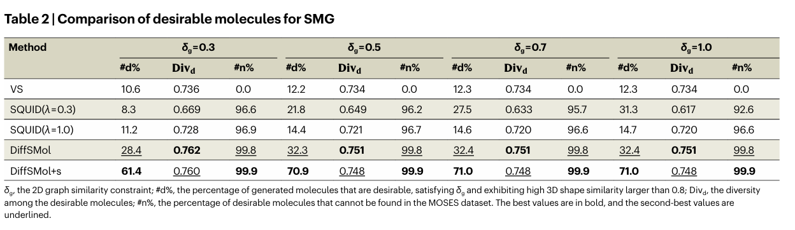
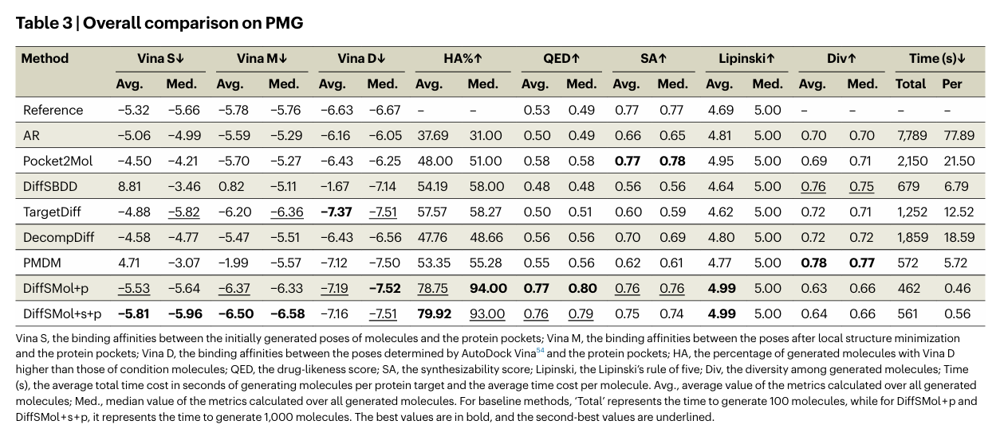

# 摘要

药物开发是一项耗时且资源密集的过程，传统方法如高通量筛选通常依赖机会主义的试错机制，难以实现精准设计。为解决这一问题，我们提出了一种生成式人工智能方法 DiffSMol，能够基于已知配体的三维形状信息，生成具有理想结合性质的小分子结构。DiffSMol 首先通过预训练模型获得高表达力的形状嵌入向量，并利用扩散模型（Diffusion Model）生成初始的分子结构。该方法引入两个核心引导机制：形状引导（Shape Guidance）：通过迭代优化，使生成的3D分子结构更贴合参考配体的形状；蛋白口袋引导（Pocket Guidance）：引导分子朝向更高的预测结合亲和力方向生成。在基准数据集上的实验表明，DiffSMol 的表现显著优于现有最先进方法。在生成与目标配体形状相似的结合分子任务中，使用形状引导的 DiffSMol 成功率高达 61.4%，而最佳对比方法仅为 11.2%。在结合亲和力方面，DiffSMol 相较于最佳基线方法提升 13.2%，当结合形状引导时提升幅度达到 17.7%。此外，DiffSMol 能够生成全新的分子图结构（de novo graph structures），有助于提升化学多样性。我们在两个关键药物靶点上进行了案例分析，结果表明所生成分子具有良好的理化性质和药代动力学特性，充分展示了 DiffSMol 在新药候选分子设计中的巨大潜力。

# 引言

现有的计算药物设计方法主要可分为两类：基于配体的药物设计（LBDD）和 基于结构的药物设计（SBDD）。前者通过在分子库中搜索与已知配体相似的分子，后者则侧重于寻找能结合到蛋白靶点已知结合位点的分子。尽管这些方法已取得显著进展，但由于分子库规模有限，依赖于机会主义的试错策略，其设计效率和精度仍受到限制，并且结果高度依赖于实验操作者的专业经验，严重影响了新靶点药物设计的可扩展性和自动化水平。与传统的筛选式方法不同，生成式方法可直接生成满足指定属性（如脂溶性、药物相似性等）的小分子，通过从大规模分子数据中学习潜在的化学规律，自动构建新的分子图结构或三维结构。其强大的生成能力有望根本性地转变传统药物开发流程，实现更加聚焦、高效、精准和可持续的设计方式。在此背景下，我们提出了一种全新的生成式方法——DiffSMol，用于生成具有真实化学结构（如合理键角、键长）并能有效结合蛋白靶点的三维小分子。为了简洁起见，文中所述“分子”均指小分子。DiffSMol 受到 LBDD 启发，通过已知配体的形状信息引导小分子的生成，遵循“形状相似 → 活性相似”的基本原理。具体而言，DiffSMol 首先通过预训练的形状嵌入模型提取配体的几何形状特征，并在扩散过程中生成小分子的原子类型与三维坐标。整个生成过程基于分子图表示学习（graph-based representation learning），使得生成的分子既具备类似形状，又在结构上具有多样性（de novo）。

# Model

## SE

1. generate Point cloud P
  - `point_mesh` = Open Drug Discovery Toolkit.generate_mesh(`Molecule`, mol)
  - `point_cloud` = PyTorch3D.uniform_sample_points(`point_mesh`)
  - `P` = centralized(`point_cloud`)
2. SE-enc
  - input = $$\mathcal{P} = \{z_1, z_2, ..., z_n\}$$, 每个 $$ z_i \in \mathbb{R}^3 $$ 表示分子表面上的一个 3D 坐标点。
  - 使用 **VN-DGCNN**（基于 Vector Neuron 的 DGCNN）对每个点进行等变编码：
    $$
    \{H_1^p, H_2^p, \dots, H_{|\mathcal{P}|}^p\} = \text{VN-DGCNN}(\{z_1, z_2, \dots, z_{|\mathcal{P}|}\})
    $$
    对所有点的嵌入做平均池化，得到整体形状嵌入:
    $$
    H_s = \frac{1}{|\mathcal{P}|} \sum_{j=1}^{|\mathcal{P}|} H_j^p \in \mathbb{R}^{3 \times d_p}
    $$
3. SE-dec 
  $$
  o_q^{\text{gt}} = \text{MLP}\left(\left[\langle z_q, H_s \rangle,\ \|z_q\|_2,\ \text{VN-In}(H_s)\right]\right)
  $$

  -  $$z_q, H_s$$：点与表面嵌入之间的点积交互（等变性保证）。
  -  $$\|z_q\|_2$$：查询点的模长（与旋转无关）。
  -  $$\text{VN-In}(H_s)$$：将等变嵌入 $$H_s \in \mathbb{R}^{3 \times d_p}$$ 转换为不变嵌入（$$\in \mathbb{R}^{d_p}$$）的模块，由 VN 构造。

  -  $$o_q^{\text{gt}}$$：预测的 signed distance：
  -  $$> 0$$：表示 $$z_q$$ 在分子表面之外。
  -  $$< 0$$：表示 $$z_q$$ 在分子表面之内。

4. SE pretraining
  - 使用均方误差回归预测 signed distance：
    $$
    \mathcal{L}_s = \sum_{z_q \in \mathcal{Z}} \|o_q - o_q^{\text{gt}}\|^2
    $$

    - $$\mathcal{Z}$$：从 3D 空间中随机采样的查询点集合。
    - $$o_q^{\text{gt}}$$：查询点 $$z_q$$ 的真实有符号距离（通过算法计算）。
    - 该损失可优化 SE-enc 中的 VN-DGCNN 网络参数，使得 $$H_s$$ 能有效捕捉表面几何结构。

  - points的选择：
    1. 在包围盒内采样 $$3k$$ 个随机点，确保采样足够密集，以获取足够的内部点。
    2. 使用 Trimesh 库提供的表面网格判断每个点是否处于分子内部。
      - 得到在分子表面内部的点数记为 $$n_w$$。
    3. 从这些内部点中随机选取：

      $$
      n = \min(n_w, k/2)
      $$

      - 即：最多选择 $$k/2$$ 个内部点（但如果实际不足，则取全部）。
    4. 剩余的 $$k - n$$ 个点从表面外部的点中随机选取。

## DIFF

### SMP

SMP（Shape-conditioned Molecule Predictor），输入是 Hs 和 (xt, vt)，信息传播采用了比 EGNN 更好的 GVP 层，SARL（ Shape-aware atom representation learning）为了确保分子生成满足特定的形状条件 Hs，分别更新标量特征和向量特征，BTRL（Bond-type representation learning）则是为了更好地建模原子间关系，建模 bond embedding

### (optional) PG

PG（Pocket Guidance）, 加入蛋白口袋条件约束的版本 `DiffSMol+p`，因为在基于蛋白口袋（PMG）生成分子时，模型生成的原子可能过于靠近口袋原子（记为𝒦），导致空间位阻（steric clashes），进而削弱结合能力。因此在扩散过程的每一步（时间步t）动态调整原子位置，确保与蛋白原子保持安全距离。有`pocket_guidance2` 和 `pocket_guidance` 两种版本的代码，基本思想是对每个 ligand 原子，找它附近的 k 个 pocket 原子；如果某个 ligand 原子与 pocket 原子的距离小于对应元素阈值 → 判定为“过近”；迭代修正位置，方向为远离最近的口袋原子。

### (optional) SG

SG（Shape Guidance）, 加入形状条件约束的版本 `DiffSMol+s`，将超出 mesh 或者点云的点拉回来，形状引导仅作用于扩散过程的高噪声阶段（t≥S），而在低噪声阶段（接近生成完成时）不干预，避免过度约束导致分子失真。有`pointcloud_shape_guidance` 和 `mesh_shape_guidance` 两种版本的代码，基本思想是找到离点云中心点较远的 ligand 原子；迭代最多 5 次尝试将它们“拉回”点云；使用最近邻的方向进行插值，并更新位置。

## DiffSMol

## forward

输入：训练分子中原子位置和特征 {(xt, vt)}，分别对原子位置（连续变量）和原子特征（离散变量）添加噪声。原子位置采用马尔科夫链的转移分布，原子特征采用Categorical（分类）扩散，

## backward

# Conclusion

# 参考文献

[ Generating 3D small binding molecules using shape-conditioned diffusion models with guidance, 2025-05](https://doi.org/10.1038/s42256-025-01030-w)
[ Supplementary information, 2025-05](https://static-content.springer.com/esm/art%3A10.1038%2Fs42256-025-01030-w/MediaObjects/42256_2025_1030_MOESM1_ESM.pdf)
[ Shape-conditioned 3D Molecule Generation via Equivariant Diffusion Models, 2023-08](https://arxiv.org/abs/2308.11890)

