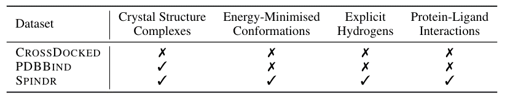
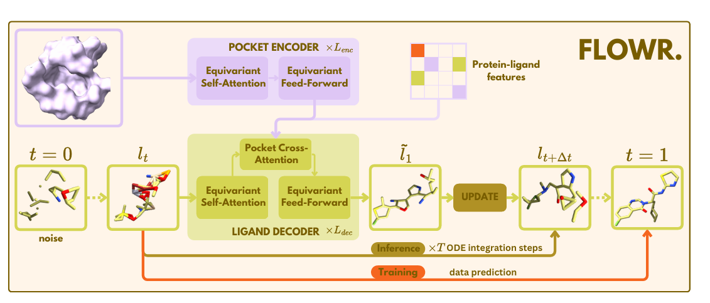
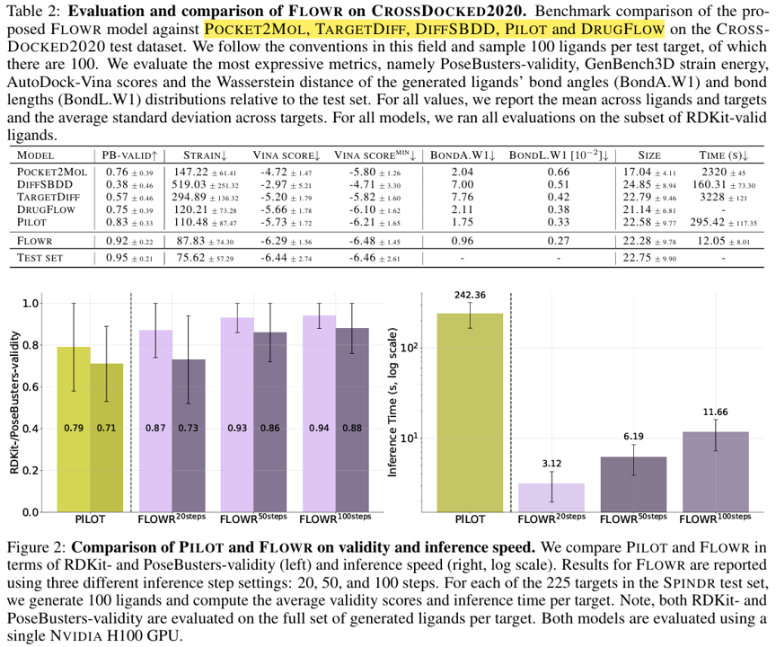
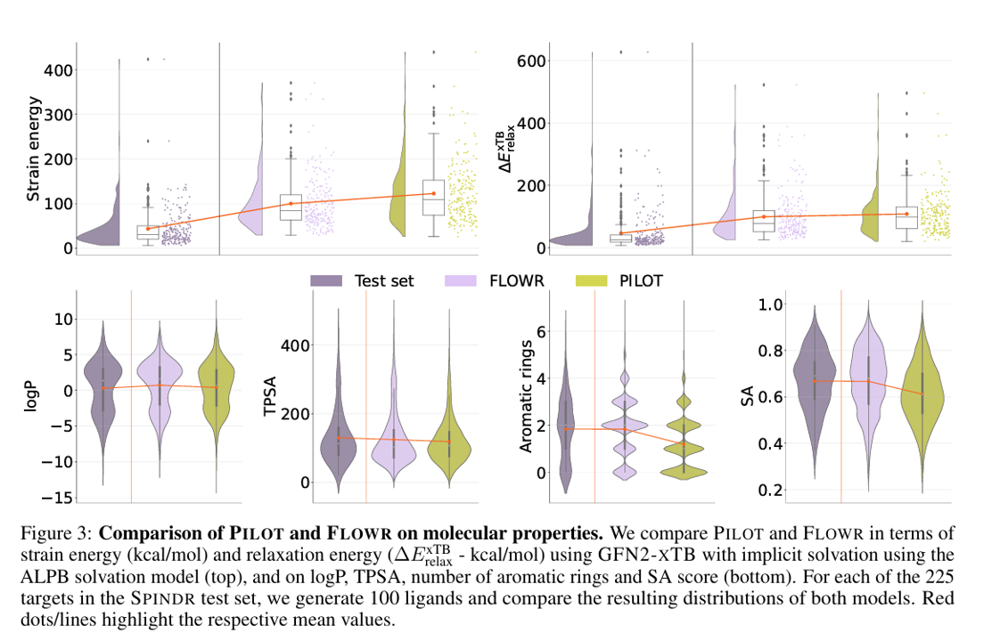
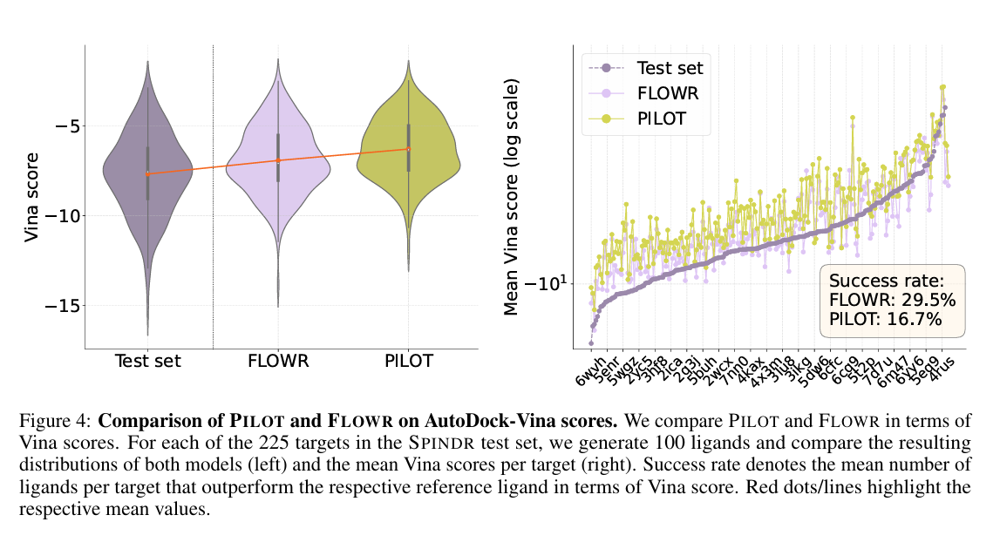
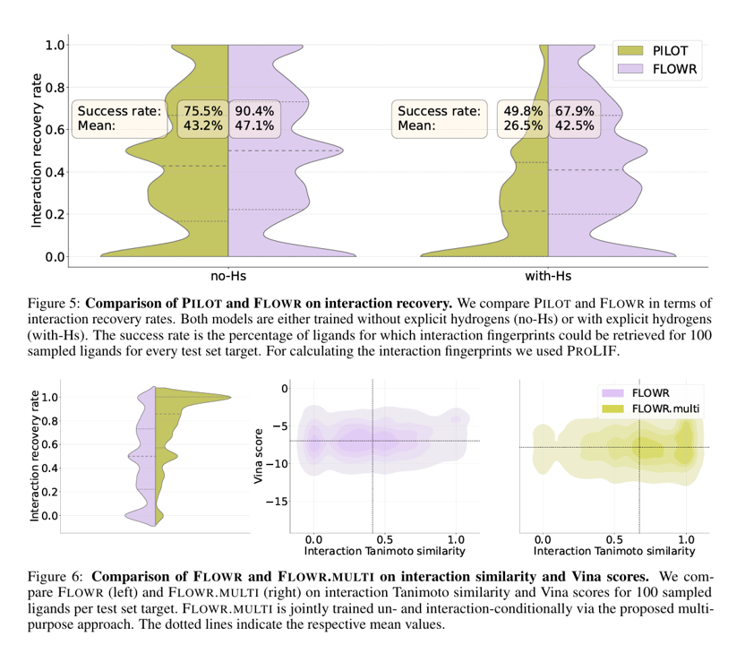
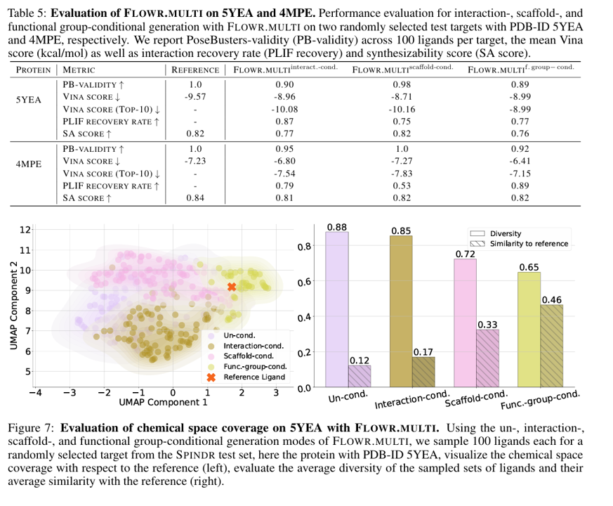

# 引言

我们介绍了FLOWR，这是一种基于结构的新型框架，用于生成和优化三维配体。FLOWR将连续和分类流匹配与等变最优传输相结合，并通过有效的蛋白口袋条件化调节得到增强。除了FLOW，我们还介绍了SPINDR，这是一个经过精心策划的数据集，由配体口袋共晶复合物组成，专门用于解决现有的数据质量问题。实证评估表明，FLOWR在PoseBusters有效性、姿势准确性和交互恢复方面超越了当前最先进的基于扩散和流的方法，同时提供了显著的推理加速，性能提高了70倍。此外，我们还介绍FLOW.MULTI是一种高度精确的多用途模型，允许对新配体进行靶向取样，这些配体符合预定义的相互作用产物和化学子结构，用于基于片段的设计，而不需要重新训练或任何重新取样策略。总的来说，我们的结果表明FLOW和FLOW.MULTI代表了人工智能驱动的基于结构的药物设计的重大进步，大大提高了基于从头、相互作用和片段的配体生成在现实世界药物发现环境中的可靠性和适用性。

## 存在问题

1. 传统方法瓶颈

  - 分子互作复杂性：力场简化导致结合姿态/亲和力预测不准（如打分函数局限性）。
  - 化学空间爆炸：虚拟筛选耗时且覆盖率低（化学空间约10^60分子）。
  - 数据质量缺陷：晶体结构噪声、质子化状态不确定（如PDB数据需人工修正）。

2. 深度学习方法

  - 扩散模型：通过迭代去噪生成3D配体（如TargetDiff、DiffDock），但存在采样慢（百步迭代）、构象应变（键角失真）问题。
  - 流匹配：直接学习概率路径（如Equivariant Flow Matching），速度提升10-100倍，但缺乏蛋白口袋的精准条件控制。

3. 现有数据集的根本问题

  - 数据质量缺陷：共价键配体（非可逆结合）、原子缺失（如侧链不完整）、立体冲突（配体-口袋原子重叠）、非物理构象（如配体穿透疏水核心）
  - 数据泄露：时间划分（Temporal Split）失效：训练集与测试集的蛋白结构相似性高，如激酶家族（EGFR等）的不同晶体结构在训练/测试集中共存

# SPINDR 数据集 (基于PLINDER)

| 步骤      | 操作              | 解决的问题               |
|----------------|-----------------------|------------------------|
| 初始过滤       | 剔除多配体、离子、共价复合物（如NAD⁺）、DNA片段（1mvm） | 避免非典型结合模式的噪声干扰      |
| 结构优化     | Schrödinger OPLS2005力场优化：补全缺失原子、质子化状态修正（如His的ε/δ-NH⁺） | 纠正晶体结构分辨率限制导致的原子缺失          |
| 相互作用标注 | ProLIF生成13类相互作用矩阵（如氢键、π-π堆积、卤键）   | 提供原子级结合模式解析，支持条件生成      |
| 质量过滤 | 仅保留{H,C,N,O,F,P,S,Cl,Se,Br}元素，配体≥5重原子   | 确保化学空间覆盖药物类分子      |
| 数据去重 | 两个数据去重策略（RMSD，SEQID）   | 避免结构冗余      |

**规模**: `35,666`个复合物，两去重策略后 `20462`

# FLOWR 模型架构

模型的输入是一个tuole，(l, P, I)，l 是配体， P 是蛋白口袋，I 是蛋白配体特征矩阵。输出 l1，主要由两个模块构成：

1. `POCKET ENCODER`
2. `LIGAND ENCODER`

## Pocket Encoder

- 作用：将蛋白口袋中的原子信息（位置 + 类型）编码为一组有用的表示，用于指导配体的生成。

- 输入：蛋白原子坐标（3D 空间位置），原子类型、残基类型等特征

- 特点：使用 E(3)-等变注意力机制：保证无论蛋白的旋转或平移如何，编码器输出都能保持物理一致性。每一层包含两个部分：

  - Equivariant Self-Attention Layer：捕捉结构中远近关系与相互作用

  - Gated FeedForward Network：处理和融合每个原子的特征信息

- 输出：一组每个原子对应的不变特征（invariant features）一组等变的空间表示（equivariant features）这两部分会一起提供给解码器，作为生成配体的条件。

## Ligand Decoder

- 作用：根据蛋白口袋编码信息，从随机噪声逐步反演出一个合理的配体分子结构。

- 输入：配体当前状态（加噪后的原子坐标 + 原子类型）编码后的蛋白口袋信息（来自 Pocket Encoder）可选的 bond embedding（用于建模化学键的分布）

## Flow Matching

对于坐标（连续变量）：使用 ODE（常微分方程）向量场建模器，表示从高斯噪声“流动”到真实结构的路径。用 vector field 学习反向流动（从噪声还原出真实分子）。

对于原子类型（离散变量）：使用离散版本的 normalizing flow 来建模，从高斯分布映射到真实的原子类别。

# FLOWR.MULTI

 FLOWR.MULTI 是一个多用途的分子生成模型，它同时支持：

- **de novo 生成**（从噪声开始生成全新分子）
- **基于片段的采样**，如：
  - Scaffold Hopping（骨架跳跃）
  - Scaffold Elaboration（骨架扩展）
  - Fragment Linking（片段连接）
  - Fragment-Based Generation（基于片段的生成）

这对于 hit 扩展与 lead 优化阶段尤为关键。

假设给定：

- 一个蛋白口袋 $\mathcal{P}$
- 一个蛋白-配体特征矩阵 $\mathcal{I}$
- 一个被预定义方式分割的配体分子 $l$，其包含 $N$ 个原子，坐标表示为 $l_1 \in \mathbb{R}^{N \times 3}$

将其分为两个片段，分别含有 $n_1$ 和 $n_2$ 个原子（$n_1 + n_2 = N$）

## 插值构造与建模目标

设 $t_1, t_2 \sim \mathcal{U}(0, 1)$ 分别为两个片段的时间步长，定义插值表示：

$$
l^{t_1 t_2} = t_1 \cdot l^{(1)}_{t_1} + (1 - t_1) \cdot l^{(1)}_0 + 
              t_2 \cdot l^{(2)}_{t_2} + (1 - t_2) \cdot l^{(2)}_0
$$

目标是学习联合分布：

$$
p_\theta(l_1 \mid l^{t_1 t_2}, t_{12}; \mathcal{P}, \mathcal{I})
$$

从中采样得到：

$$
\tilde{l}_1 = \tilde{l}_1^{(1)} \cup \tilde{l}_1^{(2)} \in \mathbb{R}^{N \times 3}
$$

并构造向量场：

$$
f(l^{t_1 t_2}, t_{12}; \mathcal{P}, \mathcal{I}) = \tilde{l}_1 - l_0
$$

## 推理步骤（Euler 更新）

定义：

- $\Delta t_1 = t_1 + s_1$
- $\Delta t_2 = t_2 + s_2$
- $\Delta t_{12} = \Delta t_1 \cdot \Delta t_2$

推理更新为：

$$
l^{t_1 + \Delta t_1, t_2 + \Delta t_2} = l^{t_1 t_2} + \Delta t_{12} \cdot f(l^{t_1 t_2}, t_{12}; \mathcal{P}, \mathcal{I})
$$

或写作：

$$
= l^{(1)}_{t_1} + \Delta t_1 \cdot (\tilde{l}_1^{(1)} - l_0^{(1)}) +
  l^{(2)}_{t_2} + \Delta t_2 \cdot (\tilde{l}_1^{(2)} - l_0^{(2)})
$$

# 结果

# 结论

本研究介绍了FLOWR这一创新的基于结构的配体生成框架，它通过整合连续与分类流匹配、等变最优传输以及高效的蛋白口袋条件化技术，在生成式药物设计领域实现了重大突破。实验结果表明，FLOWR在配体有效性、结合姿态准确性、相互作用恢复等关键指标上显著优于当前最先进的扩散模型和流式方法，同时实现了高达70倍的推理速度提升。

针对现有基准数据集存在的缺陷，我们同时提出了经过严格筛选的SPINDR数据集。该数据集通过修正结构缺陷、精确推断原子级相互作用和质子化状态，并严格控制数据泄露，为基于结构的药物发现研究建立了更可靠的评估基准。研究结果凸显了高质量数据集对模型性能评估的重要性，我们建议将SPINDR作为未来研究的新标准。

此外，我们开发的FLOWR.MULTI扩展模型能够根据预定义的相互作用模式或化学子结构进行定向配体生成。实验证明该模型显著提升了相互作用恢复率和配体质量，特别适用于基于片段的药物设计任务，如骨架跃迁、骨架优化和片段连接。通过在两个随机选择的测试靶点上进行验证，我们展示了FLOWR.MULTI在苗头化合物扩展中的应用价值，其生成的配体能够精确匹配预期的相互作用模式和化学约束。

这些成果共同代表了AI驱动的基于结构药物发现领域的重要进展。FLOWR和FLOWR.MULTI将最先进的生成建模技术与严格的数据筛选相结合，为配体生成提供了强大、高效且可靠的工具，可广泛应用于苗头化合物发现、骨架优化和基于片段的设计等药物研发场景。我们期待SPINDR数据集能成为评估未来SBDD模型的稳健基准，并推动生成模型在早期药物发现中的更广泛应用。

# 参考文献

[ FLOWR: Flow Matching for Structure-Aware De Novo, Interaction- and Fragment-Based Ligand Generation, 2025-04](https://arxiv.org/abs/2504.10564)

