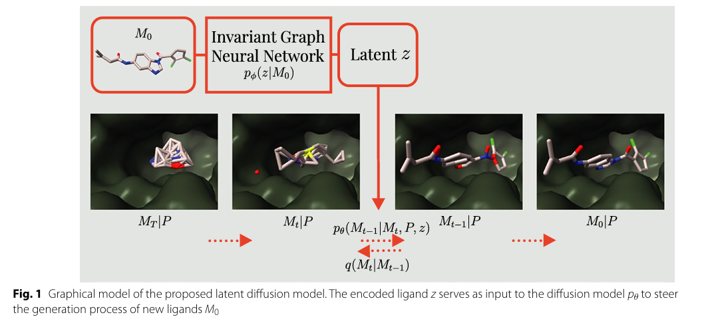
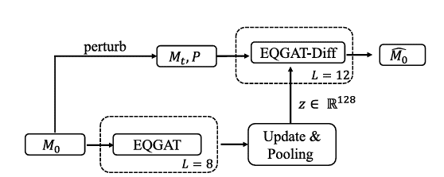
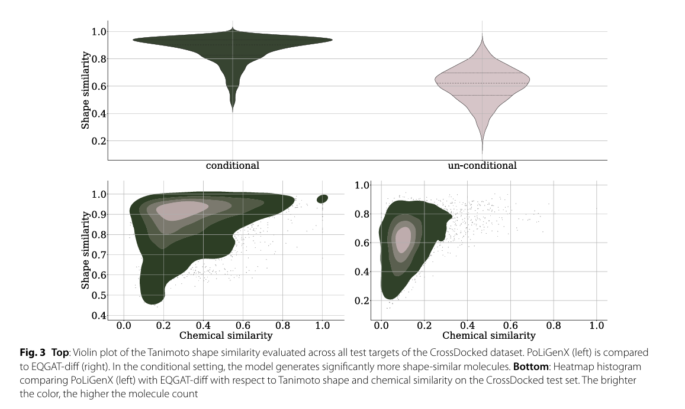
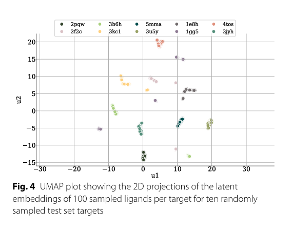
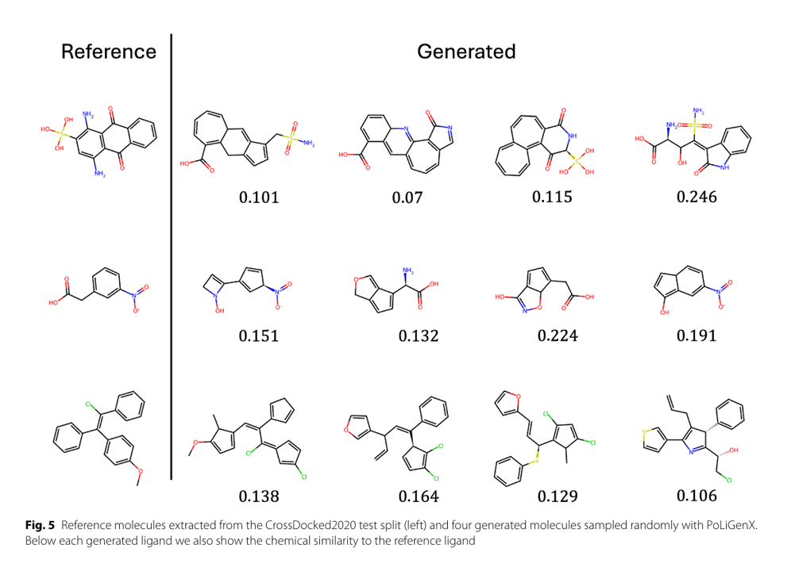
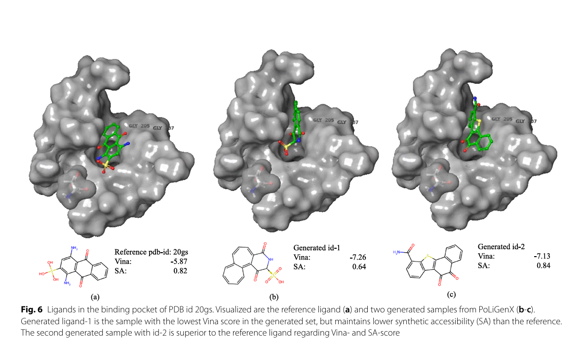
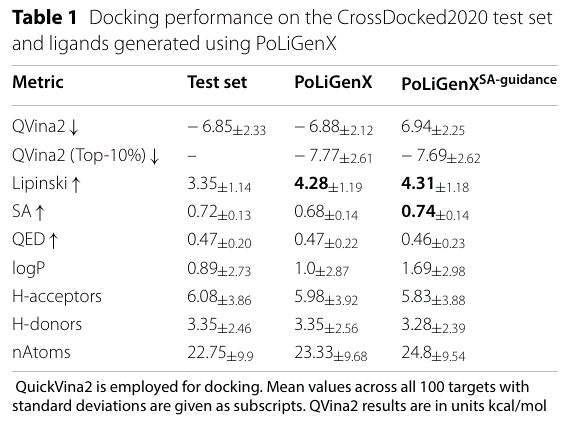
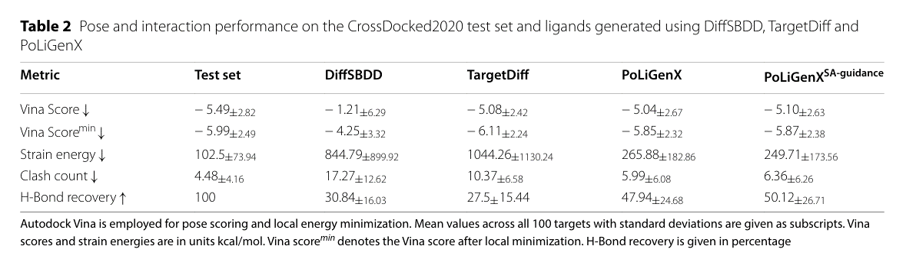
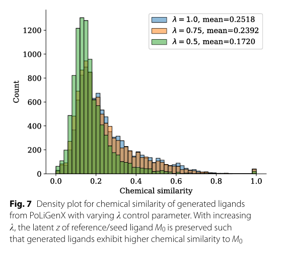

# 引言

近年来，人工智能（AI）与药物发现的交叉融合展现出革新治疗性化合物研发范式的潜力。基于AI的结构化药物发现已成为备受关注的研究方向，其中等变靶点感知扩散模型表现尤为突出。这类模型通过将受体结构作为扩散过程的调控条件，已展现出生成具有更高亲和力的全新配体的能力。然而，若忽略靶点结合的关键化学特性，将导致药物候选分子特异性不足而失效。此外，候选分子还需具备良好的吸收、分布、代谢、排泄（ADME）特性及低毒性特征。若在从头设计配体时未考量这些核心属性，可能产生生物利用度低下或潜在毒性的分子，从而制约其治疗价值。由于可用于开发有效生成式深度学习模型的数据往往稀疏且含噪声，这一挑战更趋严峻。

在药物发现的苗头化合物扩展阶段，该技术展现出独特优势。这一关键阶段旨在对通过高通量筛选等成熟方法获得的先导化合物进行化学空间拓展与优化。本研究提出的**PoLiGenX**（基于蛋白口袋的苗头化合物扩展配体生成器），能够在蛋白结合口袋内从头生成配体分子。与常规方法不同，PoLiGenX以苗头化合物或初始骨架等种子分子作为引导，通过改进的生成流程提升分子效能。我们在现有等变扩散模型 EQGAT-diff 基础上进行增强，采用与生成器联合训练的不变图神经网络来学习种子分子的潜变量编码。该架构确保新生成配体既能保持种子分子的结构特征，又可进行必要的化学修饰与多样化改造。

# 模型

本文旨在构建一个 条件生成模型 p_θ(M | P)，能够在已知蛋白质口袋 $P$ 的条件下生成合理的小分子结构 M，即 de novo 分子生成。该方法在 EQGAT-diff 模型的基础上进行扩展。输入的小分子还是原子坐标，原子类型和键类型，同样的坐标采用高斯分布，类型采用分类分布，不同的是，为了在生成过程中考虑性质和分子相似性的信息，引入了一个潜变量 $z$ :

- 由图神经网络编码器 q_φ(z|M0) 得到

- $z$ 表示形状和组成信息

- 编码器具有旋转、平移和原子排列不变性

其中化学相似度：通过 RDKit 计算的 ECFP4 指纹的 Tanimoto 相似度，形状相似度：基于原子中心的高斯体积重叠（参考 [Adams 和 Coley](https://arxiv.org/abs/2210.04893) 的定义）

## 训练细节

1. 每个 batch 中仅选取一个扩散时间步 t ∈ {1, ..., 500} 来训练，提升效率

2. 潜变量 $z$ 的先验分布为标准正态分布 p(z) ~ N(0, I)

3. 为保持 $z$ 空间的平滑性，使用 最大均值差异（MMD）损失 代替传统 KL 散度

构建蛋白-配体（PL）复合体采用类似 DiffSBDD 的方法，以 5 Å 截断距离从蛋白中筛选与配体有接触的残基，构建一个大图，堆叠配体与口袋的节点与边特征：配体边特征为实际化学键（单键、双键等），口袋边特征全部设为“无键”，配体-口袋之间通过半径图（radius graph）连接，噪声策略也改进了一下使用了一个Vignac的噪声调度器，针对不同模态取不同的噪声衰减指数 νr = 2.5, νy = 1.5, νx = 1.0，使得坐标、化学键、原子类型的信号在扩散过程中衰减更缓慢，保留更多结构信息

## z encoder (G-不变图编码器)

编码器基于 EQGAT（Equivariant Graph Attention Network）, 然后经过 message passing，Gated Equivariant Transformation + SoftmaxAttention-Pooling 得到 $z$ 进入到扩散

每层 message passing 后，将潜变量 z 融入节点表示：使用 自适应层归一化（Adaptive LayerNorm，AL） 技术，类似风格迁移中的 Adaptive Instance Normalization（AdaIN）

## Loss function

$$
\mathcal{L}_{t-1} = w_s(t) \cdot x \cdot \|X_0 - \hat{X}_0\|^2 + h \cdot \text{CE}(H_0, \hat{H}_0) + e \cdot \text{CE}(E_0, \hat{E}_0)
$$

$\text{CE}$ 表示交叉熵损失（Cross Entropy Loss）

$X_0$ 为真实原子坐标，$\hat{X}_0$ 为去噪预测坐标

$H_0$ 为真实原子类型，$\hat{H}_0$ 为预测原子类型

$E_0$ 为真实键类型，$\hat{E}_0$ 为预测键类型

权重项如下：

$x = 3$（坐标回归损失系数）

$h = 0.4$（原子类型交叉熵损失系数）

$e = 2$（键类型交叉熵损失系数）

$w_s(t)$ 是根据时间步 $t$ 动态调节的信噪比权重（参考 Le 等人的 SNR 权重设计）

# 结果

# 结论

1. 定向分子生成能力：PoLiGenX 是一种基于扩散模型的配体生成框架，能根据特定蛋白质结合位点进行控制生成，保持种子分子的结构和化学信息。

2. 多目标优化能力：模型在特异性、多样性和药物可行性之间实现了良好平衡，适用于 hit expansion 和药物优化。

3. 可调节参数：引入了可调的潜在影响参数，允许用户根据需要在生成分子的化学相似性和结构多样性之间进行权衡（如图7所示，参数越高，生成分子与参考分子化学相似度越高）。

4. 优越的评估结果：生成分子在 Vina 打分 上可与种子配体相媲美（无需重新对接）；应变能（strain energy）更低，优于如 DiffSBDD 等无条件扩散方法；符合Lipinski 五规则，具有良好的药物性状。

5. 化学空间的广泛探索：即使在结构受限的前提下，仍保持较高的分子多样性，增加了发现新颖药物候选分子的可能性。

6. 拓展性强：潜变量框架已扩展以支持合成可行性等其他属性的控制；借助[1]中的重要性采样算法实现了这些拓展；可进一步拓展至处理动态蛋白质构象，用于柔性结合位点的配体设计；有望通过引入更高级的采样技术，挖掘稀有而具有治疗潜力的骨架结构。

# 参考文献

[ Equivariant diffusion for structure-based de novo ligand generation with latent-conditioning, 2025-05](https://doi.org/10.1186/s13321-025-01028-x)
