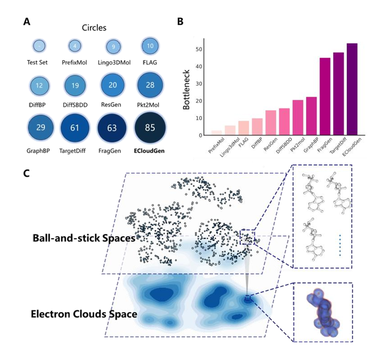

# 引言

基于结构的分子生成代表了人工智能辅助药物设计（AIDD）的重大进步。然而，这一领域的进展受到蛋白质配体复合物结构数据稀缺的限制，我们将这一挑战称为稀疏化学空间生成悖论。为了解决这一局限性，我们提出了一种新的潜在变量方法，弥合了仅配体和蛋白质配体复合物之间的数据差距，使靶向感知生成模型能够探索更广阔的化学空间，并提高分子生成的质量。从量子分子模拟中汲取灵感，我们引入了ECloudGen，这是一种利用电子云作为有意义的潜在变量的生成模型，将物理原理创新地整合到深度学习框架中。ECloudGen融合了现代技术，包括潜在扩散模型、Llama架构和新提出的对比学习任务，该任务将化学空间组织成结构化和高度可解释的潜在表征。基准研究表明，ECloudGen通过产生具有优异理化性能的更强效粘合剂和覆盖更广泛的化学空间，优于最先进的方法。如设计V2R抑制剂的案例研究所示，将电子云作为潜在变量不仅可以提高生成性能，还可以引入模型级的可解释性。此外，ECloudGen对化学空间的结构有序建模使其能够开发一种与模型无关的优化器，将其效用扩展到分子优化任务。这种能力已经通过单目标预言基准和涉及内源性BRD4配体重新设计的复杂多目标优化场景得到了验证。总之，ECloudGen通过整合理论见解、先进的生成技术和现实验证，有效地解决了稀疏化学空间生成的悖论。新提出的在深度学习框架内利用物理实体（如电子云）作为潜在变量的技术可能对AIDD以外的计算生物学领域有用。

# 介绍

药物开发是人类对抗疾病最有效的手段之一。分子生成作为人工智能药物发现(AIDD)的核心技术，旨在设计新颖有效的治疗分子。早期的分子图生成方法主要关注非靶向生成，而近期研究已转向约束性分子生成，特别是基于结构的分子生成(SBMG)。

## 分子生成范式的转变

- 传统方法：建模 $$p(G)$$
- SBMG方法：建模 $$p(G|p)$$

目前的 SBMG 方法主要包括：

| 方法类型       | 代表模型              | 技术特点               |
|----------------|-----------------------|------------------------|
| 一步生成       | DiffBP, DiffSBDD, TargetDiff | 直接三维分子去噪      |
| 自回归生成     | Pkt2Mol, ResGen, SurfGen | 原子序列添加          |
| 基于Transformer| Lingo3DMol, PrefixMol   | 增强的p(G|p)学习      |

尽管取得了一定成果，但存在一个关键限制即稀疏化学空间生成悖论 (Figure A)：

因此为了解决生成数据的稀缺空间问题，提出了 **ECloudGen** (Figure B): 

- ECloudGen方法：将 $$p(G|p)$$ 分解为：
  - p(G|C,p)：从蛋白-配体对以及电子云潜变量学习 (C = 电子云潜变量)
  - p(C|p)：从纯配体数据学习

电子云提供了：**分子相互作用的基本描述**，**统一的电磁相互作用视角**以及**增强的可解释性**

# 模型架构

## 电子云生成模块 (p(C|p))

- **3D 条件潜在扩散模型**：ECloudGen 首先使用一个蛋白质条件自动编码器 (P-CAE) 将蛋白质结合位点的电子云 ρₚ 和配体的电子云 ρₗ 分别编码到低维潜在空间中​。这个 P-CAE 包括 3D-CNN 编码器和解码器，在潜在空间中保留了配体电子云的关键信息。

- **ECloud Latent Diffusion (ECloudDiff)**：在上述潜在空间中，对配体电子云进行条件扩散建模​。具体而言，ECloudGen 在潜在空间对配体电子云噪声注入与去噪，使模型学会从纯噪声中重构出符合蛋白质结构约束的电子云​。这种潜在扩散方法相对于直接在原始 3D 网格上扩散更高效，也更容易捕捉语义信息​。

- **正则化设计**：除了标准的扩散重构损失外，模型引入特殊正则项来提高生成质量。例如，添加蛋白-配体碰撞损失 (L_clash)，通过惩罚蛋白电子云与配体电子云的重叠来避免结构冲突​。

## 分子生成模块 (p(G|C,p))

- **电子云编码与解码**：此模块首先使用3D-Unet (ECloudNet) 对生成的电子云进行特征提取，将 3D 电子密度转化为潜在化学特征​。然后采用基于Transformer 的解码器（类似大型语言模型 Llama 结构，这里使用 RoFormer）将这些特征逐步生成分子表示（如SMILES 序列）​。RoFormer 的旋转位置编码保留了3D结构信息与分子拓扑关系，增强了三维到序列生成的准确性​。

- **序列化生成**：生成过程中，解码器以序列方式逐字预测分子串的下一个字符，使得整个电子云→分子转换过程类似于“3D 图像描述”任务​。模型通过最大化下一个符号的条件概率来进行训练（交叉熵损失）。

- **联合条件控制**：在译码过程中，蛋白质信息可以通过电子云间接影响分子生成，从而实现结构条件下的分子设计。

## 关键技术实现

- **电子云表征**：ECloudGen 使用电子云（从薛定谔方程得到的电子密度分布）作为分子潜变量，物理上统一了分子内部的所有作用力​。与原子坐标不同，电子云是连续的三维分布，更能捕捉分子的量子化学特性。

- **3D 条件潜在扩散**：创新性地在潜在空间（由P-CAE构建）执行扩散过程，使生成的电子云高保真且符合蛋白质结构约束​。相比直接在体素空间中扩散，该方法计算效率更高，同时减轻了学习难度。

- **类Llama 解码器 (RoFormer)**：采用带旋转位置编码 (RoPE) 的 Transformer 解码器（RoFormer），在生成分子时同时考虑了电子云的三维结构和分子序列拓扑关系​。这种设计使得生成过程能够处理复杂的空间关系，类似于将三维“图像”描述为分子序列。

- **对比预训练 (CEMP)**：提出了电子云-分子对比预训练 (Contrastive ECloud-Molecule Pre-training)。该方法在训练过程中让属于同一分子对的电子云表示和分子表示靠近，而不同分子的表示相互分离​。具体采用 InfoNCE 损失，使电子云与对应分子的潜在向量对齐​。CEMP 构建了有序的化学空间，有助于后续可控生成和梯度优化。

# 结果

## 1. 在基准任务中生成高质量药物分子

- **评价指标**：
  - **LBE**（Ligand Binding Efficiency，配体结合效率，越低越好）
  - **QED**（Quantitative Estimate of Drug-likeness，药物相似度，越高越好）
  - **SA**（Synthetic Accessibility，可合成性，越高越好）
  - **Lipinski规则符合度**
  - **LogP**（脂溶性指标）

- **对比方法**：
  - Pkt2Mol, ResGen, GraphBP
  - FragGen, FLAG
  - DiffBP, DiffSBDD, TargetDiff
  - Lingo3DMol, PrefixMol

| 类别  | 方法        | LBE (↓) | QED (↑) | SA (↑) | Lipinski (↑) | LogP (-2~5) |
|:-----|:------------|:--------|:--------|:-------|:-------------|:------------|
| 参考 | Test Set     | -0.34   | 0.56    | 0.73   | 4.89         | 0.10        |
| AR-A | Pkt2Mol      | -0.42   | 0.57    | 0.34   | 4.93         | 0.76        |
| AR-A | ResGen       | -0.41   | 0.55    | 0.32   | 4.95         | 1.64        |
| AR-A | GraphBP      | -0.33   | 0.56    | 0.48   | 4.77         | 1.29        |
| AR-F | FLAG         | -0.31   | 0.52    | 0.58   | 4.87         | 0.45        |
| AR-F | FragGen      | -0.36   | 0.57    | 0.72   | 4.86         | 1.27        |
| Diff | DiffBP       | -0.33   | 0.49    | 0.43   | 4.78         | 0.45        |
| Diff | DiffSBDD     | -0.35   | 0.55    | 0.50   | 4.85         | 0.11        |
| Diff | TargetDiff   | -0.33   | 0.57    | 0.48   | 4.78         | 0.62        |
| Chem-L | Lingo3DMol | -0.28   | 0.47    | 0.65   | 4.50         | 0.74        |
| Chem-L | PrefixMol  | -0.36   | 0.51    | 0.69   | 4.83         | 0.08        |
| -     | **ECloudGen (Ours)** | **-0.42** | **0.70** | **0.79** | **5.00** | **0.09** |

- **主要结果**：
  - ECloudGen在所有关键指标上全面超越其他基线方法。
  - 特别是：
    - **LBE**指标最优（结合效率最高）
    - **QED** 达到 **0.70**，高出第二名约 **19%**
    - **SA** 达到 **0.79**，高出第二名约 **9.7%**

- **原因分析**：
  - 传统扩散模型在一次性生成结构时容易丢失化学依赖关系。
  - 自回归方法受限于碎片定义，生成范围有限。
  - ECloudGen通过电子云潜变量，自然建模了原子间复杂关系，生成分子更加合理。

---

## 2. 扩展化学空间能力

- **新指标引入**：
  - **Circles**（最大排斥圆指标）
  - **Bottleneck**（瓶颈指标）

- **实验结果**：
  - Circles得分最高（85 vs 次高63）
  - Bottleneck得分最高（1200 vs 次高1063）

- **意义**：
  - 生成分子覆盖更广且结构多样性更高。
  - 归因于电子云桥接无结构数据，克服了化学生成空间悖论。

---

## 3. 模型级可解释性分析

- **实验案例**：V2R (Vasopressin 2 Receptor) 靶点
- **流程**：
  1. ECloudDiff生成候选电子云
  2. 用户依据E-Confidence得分筛选
  3. 基于选定电子云生成分子

- **结果**：
  - 筛选并验证了2个微摩尔级活性的新分子。

- **优势总结**：
  - 支持人工干预选择潜在电子云。
  - 提升了分子设计过程的透明度与可控性。

---

## 4. 分子优化能力（单目标优化）

- **任务设定**：
  - 目标：QED提升（>0.9或提升>0.1）
  - 初始分子QED范围：[0.7, 0.8]

- **对比方法**：
  - JTNN、HierG2G、Modof-pipe、Modof-pipe(m)

| 方法             | QED > 0.9 成功率 (%) (↑) | QED 提升 > 0.1 成功率 (%) (↑) |
|:-----------------|:------------------------|:------------------------------|
| JTNN              | 66.7                    | 82.2                          |
| HierG2G           | 75.1                    | 87.1                          |
| Modof-pipe        | 74.1                    | 86.6                          |
| Modof-pipe (m)    | 74.6                    | 87.6                          |
| **ECloudGen (Ours)** | **79.2**                | **89.2**                      |

- **优化结果**：
  - QED>0.9成功率：**79.2%**（高于HierG2G的75.1%）
  - QED提升>0.1成功率：**89.2%**（高于Modof-pipe(m)的87.6%）

- **原因分析**：
  - 有序潜空间（CEMP预训练）支撑连续分子优化。
  - 无需训练属性预测器，优化过程更轻便高效。

---

## 5. 多目标分子优化示例（BRD4案例）

- **优化任务**：
  - 重新设计乙酰赖氨酸（Acetylated Lysine）为BRD4抑制剂。
- **五个优化目标**：
  1. QED > 0.6
  2. SA > 0.6
  3. 分子量 > 250
  4. Lipinski规则满足
  5. 氢键受体数 ≥ 1

- **优化流程**：
  - 使用EPSO模块（基于粒子群优化）
  - 多目标同时优化

- **最终结果**：
  - 生成大量满足5项约束的优化分子。
  - 经对接筛选，最终选出2个分子并进行生物实验，均显示微摩尔级活性。

- **意义**：
  - 展示了ECloudGen在真实药物设计场景中进行复杂、多目标优化的潜力。

---

# 结论

ECloudGen 针对结构引导的分子生成（SBMG）中存在的 **Sparse Chemical Space Generation Paradox（化学空间稀疏生成悖论）**，提出了创新性解决方案。

通过引入电子云作为物理上有意义的潜变量，并结合3D潜在扩散模型、Llama-like解码器和对比预训练（CEMP），ECloudGen实现了以下关键突破：

- **扩大化学空间**：成功打破传统依赖有限蛋白-配体数据的限制，广泛整合无结构分子数据。
- **提升生成质量**：在结合亲和力、药物相似性（QED）、可合成性（SA）等指标上全面优于现有主流模型。
- **实现模型可解释性**：电子云作为中介变量，使得分子生成过程可被人类理解与干预。
- **支持高效分子优化**：在有序潜空间中实现单目标与多目标的分子性质定向优化，无需额外训练属性预测器。

综合基准测试、单目标优化、多目标优化与实际药物设计案例（如V2R、BRD4），ECloudGen 展现了强大的分子生成、优化与应用潜力。

展望未来，ECloudGen 所采用的理念 —— 将物理知识引入深度生成模型 —— 有望在更广泛的计算生物学、药物发现、分子性质预测乃至新材料设计领域发挥重要作用。

# 参考文献

[ ECloudGen: Leveraging Electron Clouds as a Latent Variable to Scale Up Structure-based Molecular Design, 2024-06](https://www.biorxiv.org/content/10.1101/2024.06.03.597263v2)