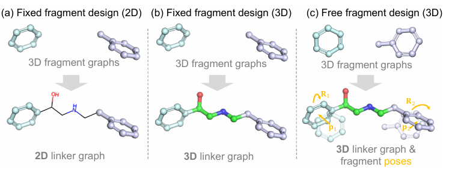
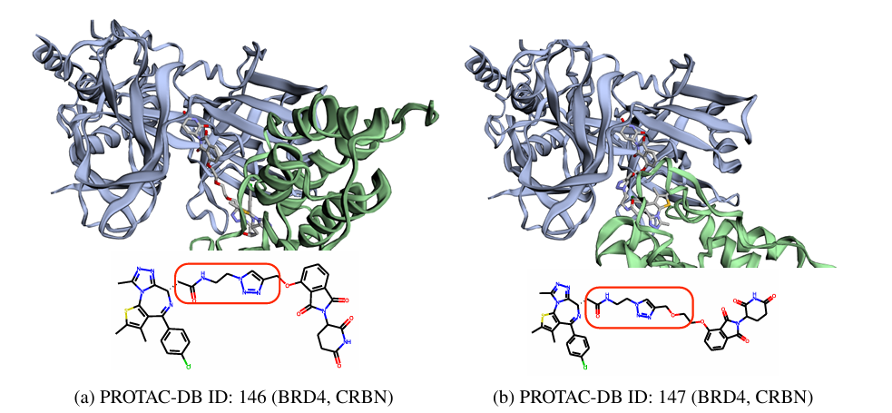

# 引言

靶向蛋白质降解技术，如PROteolysis靶向嵌合体（PROTACs），已成为选择性去除致病蛋白质的有力工具。该领域的一个挑战性问题是设计一个连接子，将不同的分子片段连接起来，形成稳定的候选药物分子。现有的链接子设计模型假设片段的相对位置是已知的，但在实际场景中可能并非如此。在这项工作中，我们解决了一个更普遍的问题，即碎片在3D空间中的姿态是未知的。我们开发了一个3D等变扩散模型，该模型联合学习了片段**姿态的生成过程和链接子的3D结构**。通过将碎片视为刚体，我们设计了一个受刚体力学中牛顿-欧拉方程启发的碎片姿态预测模块。对ZINC和PROTAC-DB数据集的实证研究表明，我们的模型可以在无约束和约束的生成设置下生成化学有效、合成可及和低能的分子。

例如，在 warhead 和 e3ligand 都相同的情况下，linker 的不同可能导致完全不同的 3D 相互作用结构：

最近的一些方法采用3D结构信息，例如：
- Delinker: 给定两片段的分子图，根据锚原子的相对距离和角度作为结构信息生成 2D linker
- 3DLinker: 使用 VAE 和 Diffusion 直接在 3D 空间处理分子片段和产生 linker
- **linkernet**: 共设计片段姿势和 linker

# 模型

## 符号和问题定义

`分子片段表示`：$$G_F = \{v_F, b_F, \tilde{x}_F\}$$, 原子特征数，键类型数，片段原子数分别是 $N_a$, $N_b$, $N_F$, 其中：

- $$v_F \in \mathbb{R}^{N_F \times N_a}$$ 是 one-hot 的原子类型
- $$b_F \in \mathbb{R}^{N_F \times N_F \times N_b}$$ 是 one-hot 的键类型
- $$\tilde{x}_F \in \mathbb{R}^{3N_F}$$ 是原子坐标，是一个不变量，改变的是 $R$ 和 $p$, i.e.$$x_F = R\tilde{x}_F + p$$

`linker表示`: $$G_L = \{v_L, b_L, x_L\}$$, linker原子数是 $N_L$，总原子数是 $$N = N_L + N_{F_1} + N_{F_2}$$, 其中：

- $$v_L \in \mathbb{R}^{N_L \times N_a}$$ 是 one-hot 的原子类型
- $$b_L \in \mathbb{R}^{N_L \times N \times N_b}$$ 是 one-hot 的键类型
- $$x_L \in \mathbb{R}^{3N_L}$$ 是linker坐标

`问题定义`: 给定两个片段 $$(G_{F_1}, G_{F_2})$$, 学习设计 linker $G_L$ 和 $(R_1, p_1)$，$(R_2, p_2)$, 即学习 $$p_{\theta}(R,p,G_L \mid G_{F_1}, G_{F_2})$$

## Diffusion Process

`位置扩散 (xL, p)`: 将 $x_L$ 和 $p$ 视作 $x$，则符合 DDPM，即：

$$
q(x_{t-1} \mid x_t,x_0) = \mathcal{N}(x_{t−1}; \tilde\mu_t(x_t,x_0), \tilde\beta_t(\mathbf{I}))
$$

`片段旋转扩散 (R)`: 

$$
q(R_{t-1} \mid R_t,R_0) = \mathcal{IG_{SO3}}(\tilde\mu_t(R_t,R_0), \tilde\beta_t)
$$

`原子和键类型扩散 (vL, bL)`: 

$$
q(v_{t-1} \mid v_t,v_0) = \mathcal{C}(v_{t-1}\mid\tilde c_t(v_t,v_0))
$$

## Equivariant and Physics-Inspired Neural Network

3D 等变图神经网络

前向网络就是图编码加注意力计算力（force）然后应用到 x, v, b, R, p

## Equivariant Linker Denoising Process

$$
e_{ij} = \phi_d \left( e_{ij}^l, \left\| x_i^l - x_j^l \right\| \right)
$$

$$
h_i^{l+1} = h_i^l + \sum_{j \in \mathcal{V}_M \setminus \{i\}} \phi_h \left( h_i^l, h_j^l, \tilde{e}_{ij}, t \right)
$$

$$
e_{ij}^{l+1} = e_{ij}^l + \sum_{k \in \mathcal{V}_M \setminus \{i\}} \phi_h \left( h_k^l, h_i^l, \tilde{e}_{ki}, t \right) + \sum_{k \in \mathcal{V}_M \setminus \{j\}} \phi_h \left( h_j^l, h_k^l, \tilde{e}_{jk}, t \right)
$$

$$
x_i^{l+1} = x_i^l + \sum_{j \in \mathcal{V}_M \setminus \{i\}} \left( x_i^l - x_j^l \right) \cdot \phi_x \left( h_i^{l+1}, h_j^{l+1}, e_{ij}^{l+1}, t \right) \cdot \mathbf{1}_{\text{linker}}
$$

其中 $$h_i^{0}$$ 和 $$e_{ij}^{0}$$ 是通过两个 embedding 层编码的 v, b

## Physics-Inspired Fragment Pose Prediction

通常我们希望预测从当前的旋转和平移 $(R_t, p_t)$ 到 denoised pose 的相对变换 $(R_{t \rightarrow 0}, p_{t \rightarrow 0})$，问题在于：这种方法“忽略了当前几何结构的信息”，因为预测的是全局不变的变换。这部分受物理中“刚体运动”的启发，将结构片段视作刚体，不再预测全局不变的变换，而是预测每个原子受到的力和力矩（torque），然后通过刚体动力学计算出整个结构的旋转和平移。

# 参考文献

[ LinkerNet: Fragment Poses and Linker Co-Design with 3D Equivariant Diffusion, 2023-11](https://openreview.net/forum?id=6EaLIw3W7c)