# DiffMC-Gen

## 引言

长期以来，精确有效地设计具有不同物理化学性质的潜在药物分子一直是一个关键挑战。近年来，各种基于深度学习的从头分子生成算法的出现为这一问题提供了新的方向，其中去噪扩散模型显示出巨大的潜力。然而，以前的方法往往无法同时优化候选化合物的多种性质，这可能是由于直接使用非几何图神经网络（GNN），使其无法准确捕获分子拓扑和几何信息。在这项研究中，开发了一种用于多条件分子生成的双去噪扩散模型（DiffMC-Gen），该模型集成了离散和连续特征，以提高其感知3D分子结构的能力。此外，它还涉及一种多目标优化策略，以同时优化靶分子的多种特性，包括结合亲和力、药物相似性、可合成性和毒性。从2D和3D分子生成的角度来看，DiffMC-Gen生成的分子在新颖性和独特性方面表现出最先进的（SOTA）性能，同时在药物相似性和合成性方面取得了与以前方法相当的结果。此外，生成的分子对三种靶蛋白——LRRK2、HPK1和GLP-1受体——具有良好的生物活性和药物样特性，同时保持了高标准的有效性、唯一性和新颖性。这些结果强调了其在药物设计中的实际应用潜力。

## 数据

- `QM9` : 134k 小分子，包含 C,H,O,N,F 五类元素，有量化性质的一个小分子库
- `CSD` : CSD 基本上包括所有已发表的具有晶体结构的有机和金属有机化合物。60K 有 3D 构象的分子。
- `MOSES` : 包含由 ZINC 清洗得到的 1.9m 先导化合物分子。每个分子平均含有 29 个原子。使用 RDKit 生成 3D 构象用 UFF 立场优化

## 架构

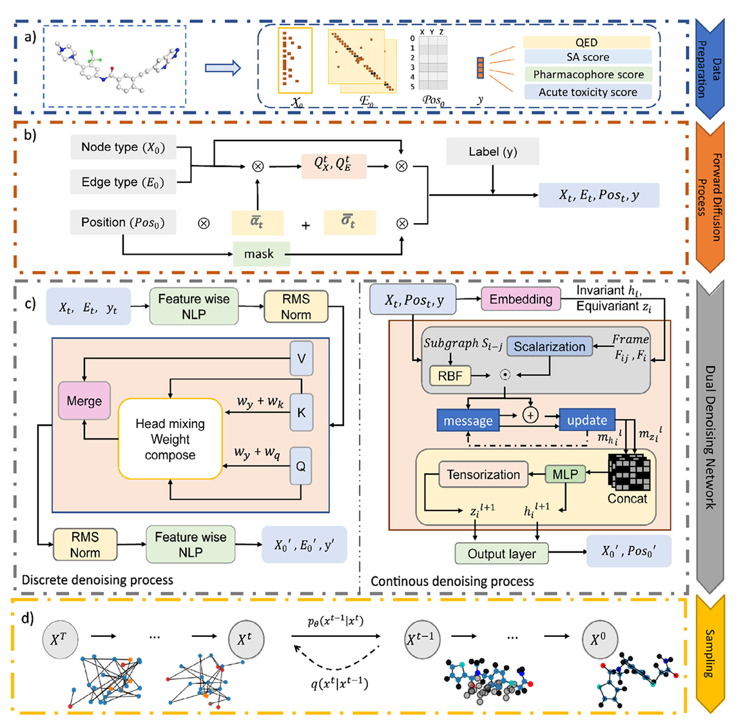

### 扩散模型

- (a): 输入包括，节点 X 表示为 one-hot 向量，边 E 表示为 one-hot 向量，全局特征 y 分为四个分别是 **Pharmacophore matching score**，**Acute Oral Toxicity**，**QED**，**SA**，以及每个原子 3D 坐标信息
- (b): 加噪过程：节点和边的输入进行 cat 然后添加噪声，位置信息单独添加噪声，之后聚合求再添加 y 信息得到（X，E，Pos，y）
- (c): 去噪过程：  
    - `Discrete denoising process`: （X，E，y）--> 图 transformer Feature wise NLP -->  Dynamically Composable Multi-Head Attention (DCMHA) --> （X'，E'，y'）
    - `Continuous denoising process`: （X，Pos，y）--> SE(3)-equivariant local isomorphism --> （X'，Pos'）
- (d): 采样

### 约束性质

- `Pharmacophore matching score`: 0(unfavorable)-1(favorable) 
- `Acute Oral Toxicity`: 0(favorable)-1(unfavorable) 
- `QED`: 0(undrug-like)-1(drug-like) 
- `SA`: 0(favorable)-1(unfavorable) 

### 结合扩散模型与约束性质

- 条件扩散模型中，离散模型明确地嵌入了条件分布，该分布在企业中具有四种不同的约束，同时采用了一种用于隐式控制的注意机制。同时，连续模型仅考虑药效团匹配系数。
- 非条件扩散模型训练侧重于不包含全局特征的离散模型。在采样中采用回归器引导的扩散方法，其中 $$ϕ_𝜃$$ 在每个采样步骤调节预测的分布，将其引导到具有所需特性的分子图。

## 评价指标

- `Glide score` : 估计配体和靶标之间的结合亲和力
- `Success rate` : QED ≥ 0.6 且 SA 评分 ≤0.4
- `Novelty` : 代表了模型生成与训练集中的分子或现有已知分子结构不同的分子的能力
- `Uniqueness` : 生成的分子的化学图在生成的样品中是否唯一
- `Validity` : 遵守常见化学规则（如化合价）的生成分子
- `Diversity` : 1.内部多样性（IntDiv），通过揭示生成分子之间的结构差异来评估生成集合内的多样性，2.Fréchet ChemNet距离（FCD），衡量生成分子和真实分子分布之间的相似性，包括结构和化学相似性。
- `energy ratio` : 评估生成分子的可靠性

## 结果

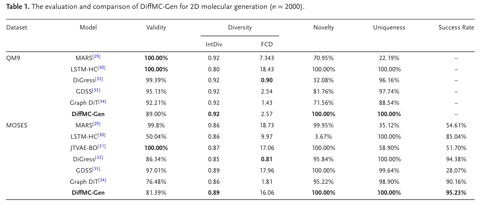

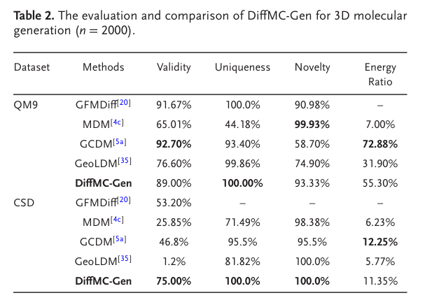

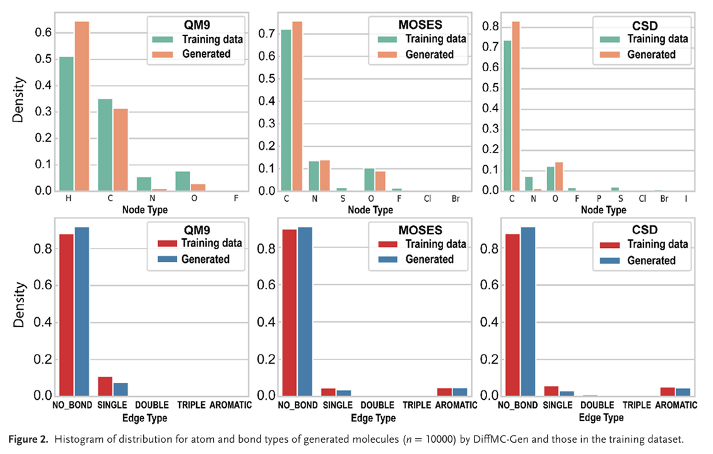

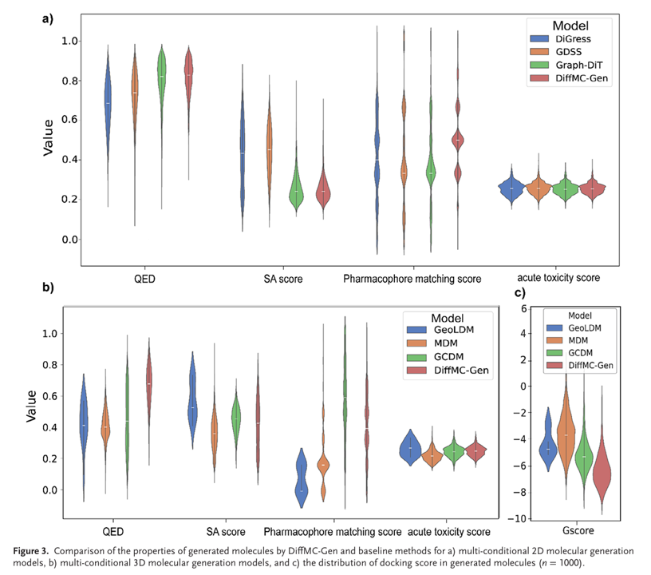

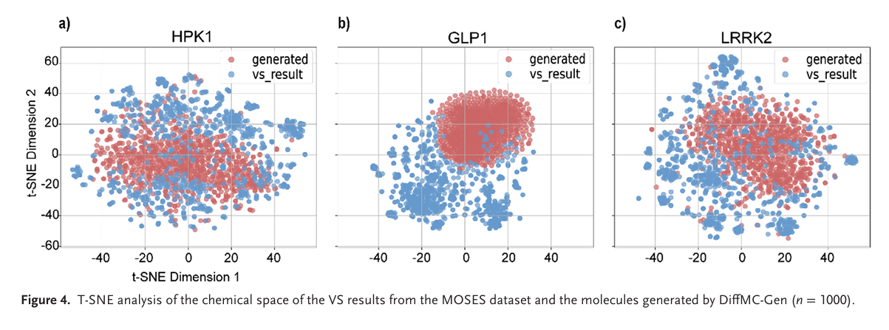

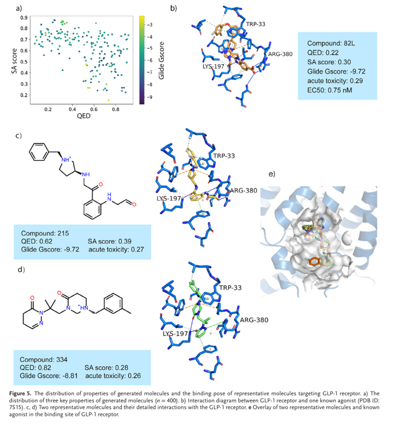

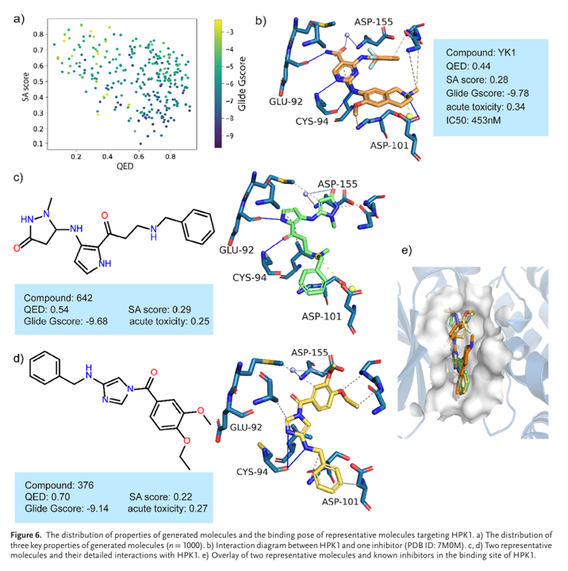

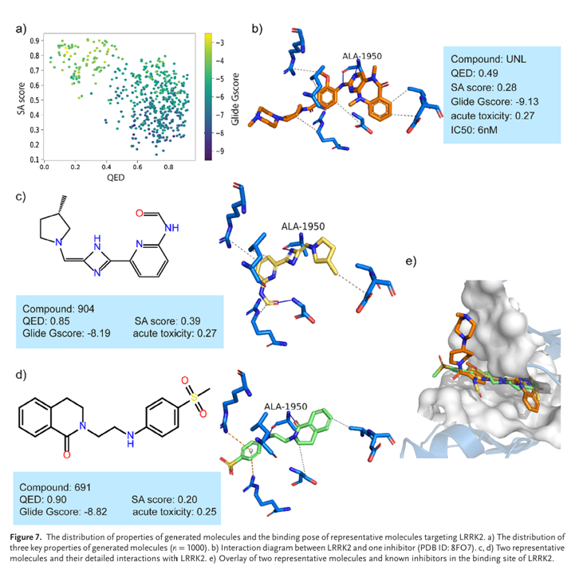

## 结论

在这篇论文中，我们开发了一种新的分子生成模型DiffMC-Gen，用于多条件分子生成，通过整合离散和连续扩散模型来增强其感知3D分子结构的能力。在离散图扩散网络中，采用了一种动态可组合的多头注意力机制，将注意力得分和条件权重矩阵相结合，以降低计算成本，同时增强扩散步骤中条件信息的影响。在连续图扩散网络中，不仅使用SE（3）-等变局部同构的新层次来评估局部结构相似性，还使用局部帧转换块来捕获局部几何的全局变化。此外，它还涉及一种多目标优化策略，以同时优化所生成分子的多种特性，包括结合亲和力、药物相似性、可合成性和毒性。DiffMC-Gen和基线模型之间的比较验证了DiffMC-Gen在一般生成性能和生成分子的预期特性分布方面始终优于或匹配基线模型。通过使用HPK1、LRRK2和GLP-1受体三个靶点的案例研究，获得的结果表明，基于DiffMC-Gen生成的分子不仅具有良好的生物活性，而且保持了良好的药物样特性、结构多样性和新颖性，突出表明我们的方法可以生成具有预期特性的高质量候选物，并将成为一种有用的从头开始的药物设计工具。

# KinGen

## 引言

激酶是许多细胞过程中的关键调节因子，它们的失调与包括癌症在内的各种疾病有关。因此，蛋白激酶已成为目前主要的药物靶点，全球药物开发工作的三分之一到四分之一主要集中在激酶上。基于深度学习的分子生成方法在探索大化学空间和提高药物发现效率方面显示出明显的优势。然而，许多当前的分子生成模型在考虑特定靶标和生成具有所需特性（如靶标相关活性）的分子方面面临挑战。在这里，我们开发了一个专门的、增强的基于深度学习的分子生成框架KinGen，它是专门为高效生成小分子激酶抑制剂而设计的。通过整合强化学习、迁移学习和一个专门的奖励模块，KinGen将亲和力预测模型FusionDTA作为奖励函数，使其能够准确地将生成过程引导到具有高靶活性的生物相关分子。这种方法不仅确保了生成的分子具有理想的指向性，而且提高了分子优化的效率。结果表明，KinGen可以生成结构有效、独特和多样的分子。生成的分子抑制结合亲和性，与目前的抑制剂相当，平均结合能为-9.5kcal/mol，这突显了该模型设计化合物的能力，这些结果表明，KinGen有可能为加速激酶靶向药物的发现提供一种有效的方法。

## 数据

- `ChEMBL` : 2.3m，清洗完之后约 2.1m
- `Davis` : 包含 30,056 条数据，涵盖 442 蛋白 68 配体。
- `KIBA` : 467 蛋白 and 52,498 配体（原始论文包含 118,254 条数据，涵盖 229 蛋白 2111 配体）
- `BindingDB` : 19 具体靶点的激酶

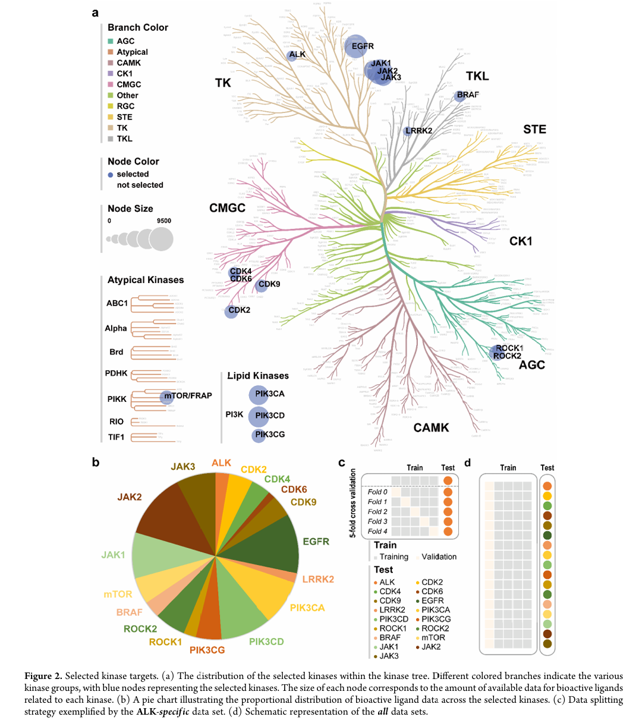

## 架构

### Generator

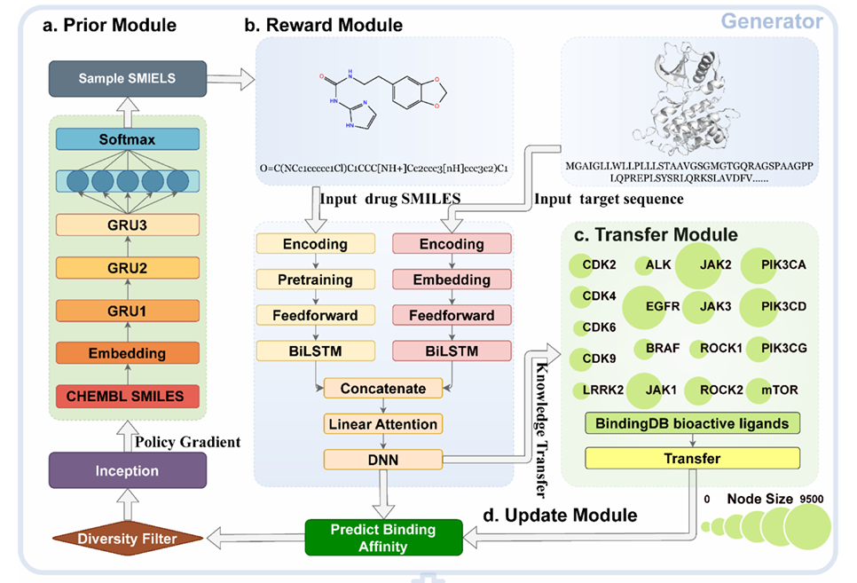

- **RNN-Based Prior Generation Model:** 基于GRU的循环神经网络，用于预训练并捕获SMILES序列的化学知识，使用 ChEMBL SMILES 训练
- **Reward Module：** 结合强化学习（Reinforcement Learning, RL）来优化分子生成过程，Reward Module 用于评估生成的分子并引导模型生成更优的化合物。奖励函数（Reward Function）由 结合亲和力预测模型（FusionDTA） 和 多样性过滤器（Diversity Filter）组成，两者结合确定一个打分，损失函数定义如下：

    $$
    \text{Loss} = \left[\log P(A)_{\text{augmented}} - \log P(A)_{\text{agent}}\right]^2
    $$

    其中：

    $$
    \log P(A)_{\text{augmented}} = \log P(A)_{\text{prior}} + \sigma \cdot \text{Score}(A)
    $$

    - $$ \log P(A)_{\text{prior}} $$：Prior Model 给出的分子生成概率  
    - $$ \text{Score}(A) $$：由 Reward Module 计算的总得分  
    - $$ \sigma $$：缩放因子，平衡 Prior Model 与 Reward 的影响
- **Transfer Learning and update module:** 用于将预训练的通用药物-靶标亲和力预测模型（FusionDTA）适配到特定激酶靶标，Davis 测试集 CI = 0.911，KIBA 测试集 CI = 0.850，但对单个激酶（如 ALK） 的预测性能较差（CI ≈ 0.5，接近随机猜测）。通过整合激酶数据集得到激酶特定数据集（Specific）和混合数据集（All），例如 ALK 抑制剂数据（1,943 个样本），按 5:1 划分为训练集和测试集，其他 16 个激酶类似处理（如 EGFR、JAK1 等），混合数据集合并所有 17 个激酶的训练数据（共 72,920 个样本），用于训练通用适配模型。加载预训练的 FusionDTA 权重冻结底层保留 ESM-1b 蛋白质编码器和 BiLSTM 的权重（通用特征提取能力）。微调顶层仅更新注意力层和全连接层的参数，适配特定激酶数据。

### Evaluator

使用分子对接和药效团匹配进行验证

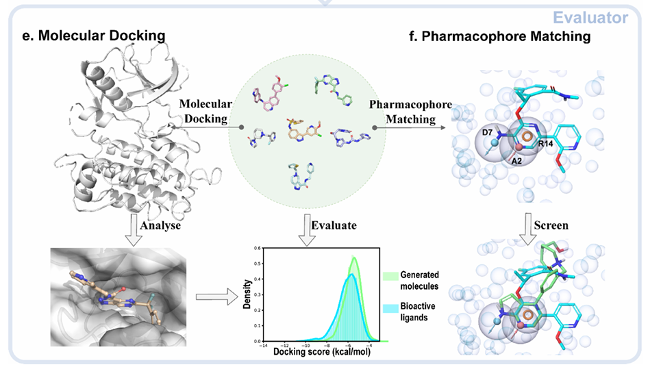

## 评价指标

- `Glide score` : 估计配体和靶标之间的结合亲和力
- `Success rate` : 同时满足结合亲和力（pIC50 > 5）和结构新颖性（Tanimoto相似性<0.7）的分子比例
- `Novelty` : 代表了模型生成与训练集中的分子或现有已知分子结构不同的分子的能力
- `Uniqueness` : 生成的分子的化学图在生成的样品中是否唯一
- `Validity` : 遵守常见化学规则（如化合价）的生成分子
- `Diversity` : 基于Bemis-Murcko骨架的多样性
- `Recovery` : 保留已知配体关键片段的比例

## 结果

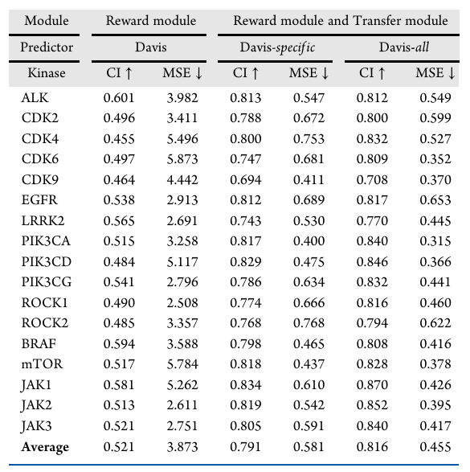

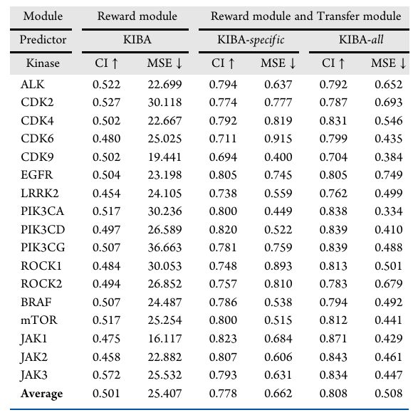

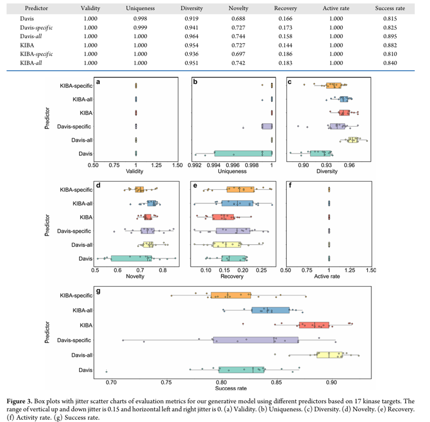

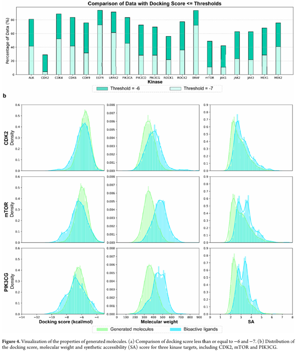

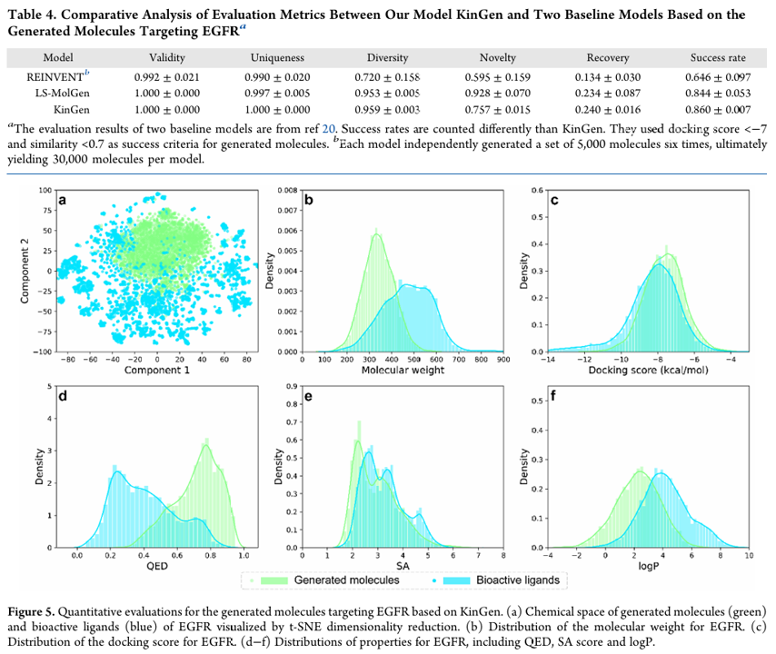

# 参考文献

[DiffMC-Gen: A Dual Denoising Diffusion Model for Multi-Conditional Molecular Generation, 2025-04](https://doi.org/10.1002/advs.202417726)

[A Specialized and Enhanced Deep Generation Model for Active Molecular Design Targeting Kinases Guided by Affinity Prediction Models and Reinforcement Learning, 2025-04](https://doi.org/10.1021/acs.jcim.5c00074)
